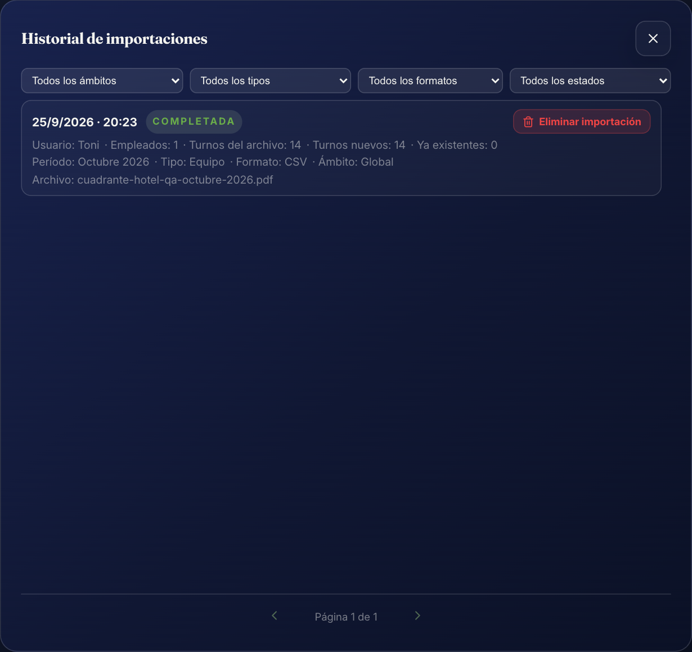
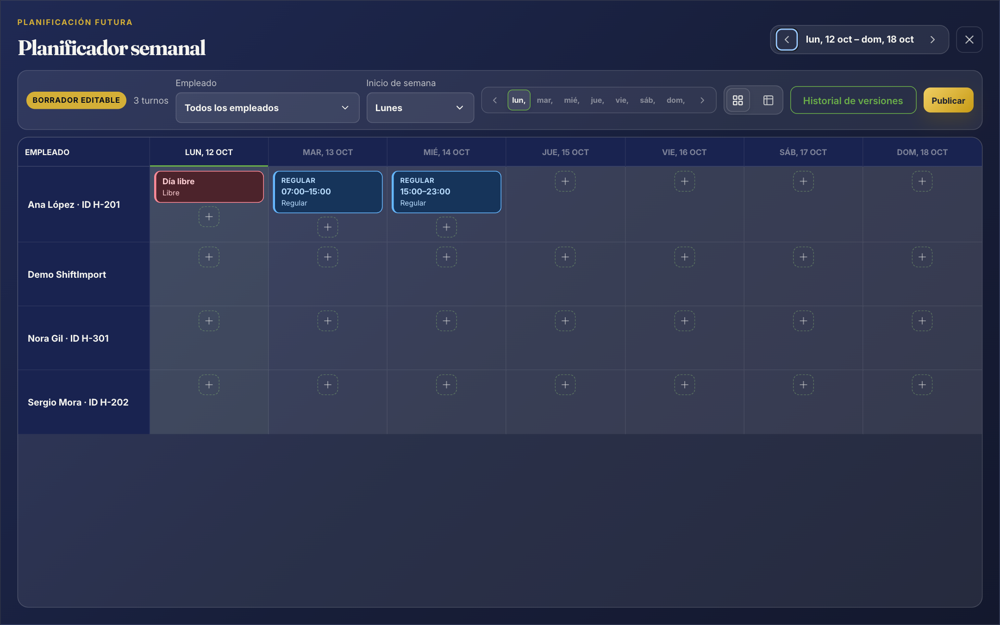
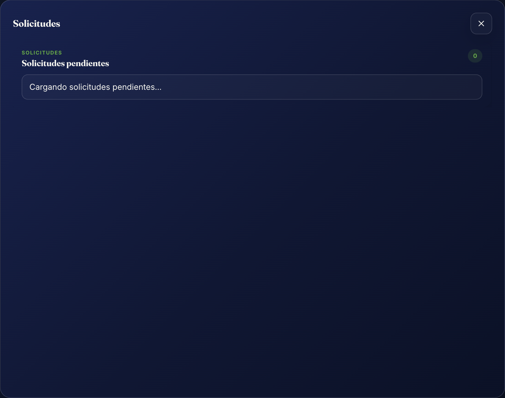
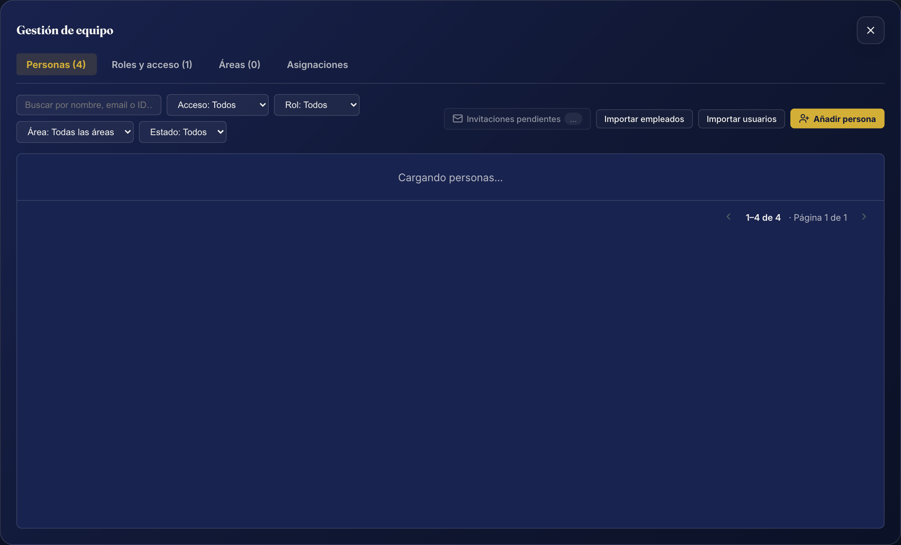
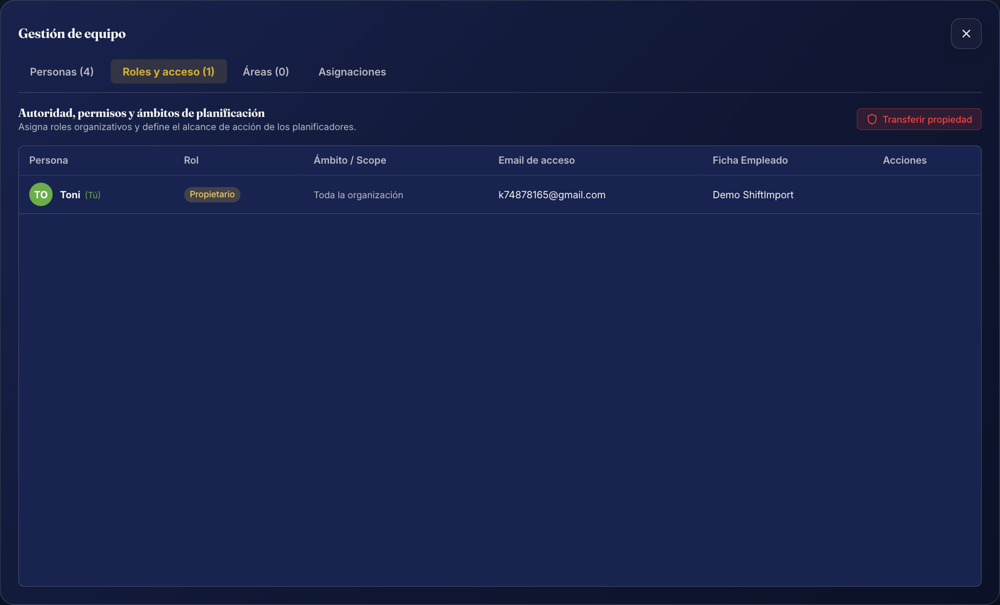
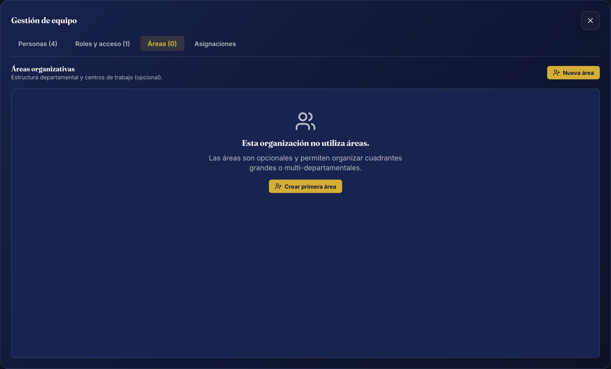
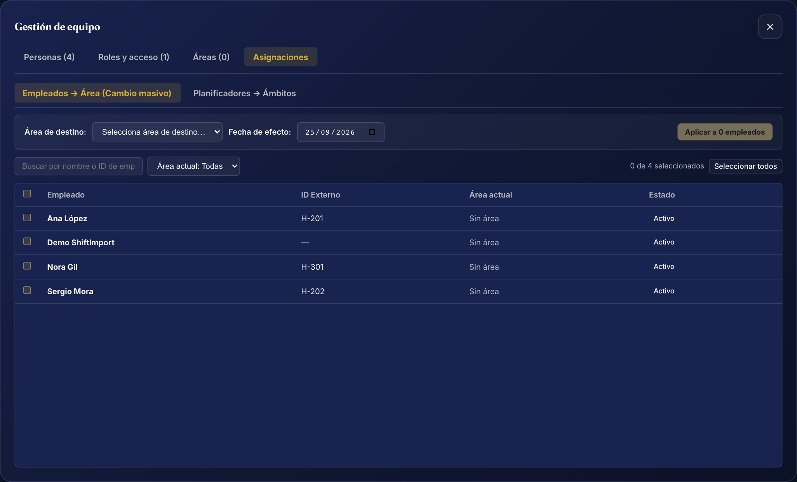

<div class="cover-page">

<div class="cover-logo"></div>

<div class="cover-brand">Anclora ShiftImport</div>

<div class="cover-title">Manual de Usuario</div>

<div class="cover-subtitle">Guía práctica para trabajadores por turnos,<br>planificadores y organizaciones</div>

<div class="cover-meta">
  <div class="cover-version">Versión 2.0</div>
  <div class="cover-date">9 septiembre 2026</div>
</div>

<div class="cover-disclaimer">Anclora ShiftImport convierte cuadrantes de turnos (PDF, imagen, CSV o Excel) en un calendario operativo editable y planificable. No sustituye el cuadrante oficial de tu empresa ni constituye un sistema de nóminas.</div>

</div>

<div class="page-break"></div>

## Índice

Una guía ordenada para recorrer ShiftImport desde la primera importación hasta la gestión completa de una organización con varios empleados.

| Nº | Sección | Página |
| --- | --- | ---: |
| 01 | [Qué es Anclora ShiftImport](#1-qué-es-anclora-shiftimport) | 3 |
| 02 | [Antes de empezar](#2-antes-de-empezar) | 5 |
| 03 | [Acceso y primeros pasos](#3-acceso-y-primeros-pasos) | 6 |
| 04 | [Organizaciones, personas, roles y ámbitos](#4-organizaciones-personas-roles-y-ámbitos) | 8 |
| 05 | [Tu calendario de turnos](#5-tu-calendario-de-turnos) | 11 |
| 06 | [Importar turnos — Safe Import paso a paso](#6-importar-turnos--safe-import-paso-a-paso) | 13 |
| 07 | [La frontera temporal: pasado histórico vs planificación futura](#7-la-frontera-temporal-pasado-histórico-vs-planificación-futura) | 16 |
| 08 | [Resolver un formato desconocido: el Asistente de formato](#8-resolver-un-formato-desconocido-el-asistente-de-formato) | 17 |
| 09 | [Formatos aprendidos](#9-formatos-aprendidos) | 18 |
| 10 | [Historial de importaciones](#10-historial-de-importaciones) | 20 |
| 11 | [Turnos manuales](#11-turnos-manuales) | 22 |
| 12 | [Planificación de turnos futuros: Planificador semanal](#12-planificación-de-turnos-futuros-planificador-semanal) | 23 |
| 13 | [Publicar la planificación](#13-publicar-la-planificación) | 25 |
| 14 | [Portal del empleado y autoservicio](#14-portal-del-empleado-y-autoservicio) | 26 |
| 15 | [Solicitudes de cambio y gestión de solicitudes](#15-solicitudes-de-cambio-y-gestión-de-solicitudes) | 27 |
| 16 | [Gestión de equipo: Personas, Roles y Áreas](#16-gestión-de-equipo-personas-roles-y-áreas) | 29 |
| 17 | [Aprovisionamiento masivo y credenciales temporales](#17-aprovisionamiento-masivo-y-credenciales-temporales) | 33 |
| 18 | [Tipos de turno personalizados](#18-tipos-de-turno-personalizados) | 35 |
| 19 | [Ajustes, tema e idioma](#19-ajustes-tema-e-idioma) | 37 |
| 20 | [Planes, privacidad y seguridad](#20-planes-privacidad-y-seguridad) | 39 |
| 21 | [Preguntas frecuentes](#21-preguntas-frecuentes) | 41 |
| 22 | [Glosario de términos](#22-glosario-de-términos) | 42 |
| 23 | [Aviso legal](#23-aviso-legal) | 43 |

<div class="page-break"></div>

## 1. Qué es Anclora ShiftImport


**Anclora ShiftImport** es una plataforma operativa diseñada para transformar los cuadrantes de turnos que entrega tu empresa —en formato PDF, imagen, CSV o Excel— en un **calendario digital estructurado, editable y colaborativo**, eliminando por completo la necesidad de transcribir horarios a mano.

A partir de un documento digital o fotografía de un tablón de anuncios, ShiftImport analiza la estructura visual y tabular, identifica a los trabajadores, clasifica los códigos de turno y presenta una vista previa de validación antes de confirmar cualquier dato. Una vez incorporados los turnos, la aplicación permite gestionar el calendario personal, planificar turnos futuros en equipo, solicitar cambios de jornada y coordinar departamentos enteros.

### Perfiles de uso y capacidades

| Perfil | Alcance y capacidades principales |
| --- | --- |
| **Invitado (sin cuenta)** | Importación local de cuadrantes y uso del calendario personal en el dispositivo actual. Persistencia exclusiva en el navegador. |
| **Empleado (con cuenta)** | Calendario sincronizado en la nube, autoservicio de importación propia, consulta de turnos publicados, solicitud de cambios de jornada y notas operativas. |
| **Planificador** | Todo lo anterior más acceso al Planificador semanal, construcción de borradores futuros, validación de descansos y publicación de turnos dentro de su ámbito autorizado. |
| **Administrador** | Todo lo anterior más gestión integral de equipo (personas, roles, accesos y áreas), importación de cuadrantes de equipo, auditoría de importaciones y gobierno de formatos aprendidos. |
| **Propietario** | Máxima autoridad de la organización. Todas las facultades del Administrador más la potestad exclusiva de transferir la propiedad de la organización. |

### Principios de diseño del producto

- **Aprende la estructura una sola vez.** Cuando se importa un formato de cuadrante inédito, un asistente interactivo solicita resolver ambigüedades clave (identificar tu fila o clasificar códigos de turno desconocidos). La organización memoriza dicha estructura y la reutiliza en futuras importaciones sin volver a preguntar.
- **Transparencia e integridad de datos.** ShiftImport jamás descarta datos ni inventa turnos en silencio. Si un código no es concluyente o una fila resulta ambigua, el sistema lo indica de forma explícita mediante diagnósticos estructurados.
- **La importación nunca escribe a ciegas.** Siempre interviene una vista previa editable (`Safe Import`). Puedes modificar fechas, horarios y tipos de turno, o descartar filas antes de la confirmación final.
- **Separación entre histórico y futuro.** Los turnos pasados se registran como histórico consolidado, mientras que los turnos futuros se canalizan hacia el planificador en estado de borrador para evitar publicaciones involuntarias.
- **Uso flexible sin fricción.** Es posible utilizar la aplicación como invitado desde el primer segundo; crear una cuenta añade sincronización remota y funciones de equipo sin alterar el flujo básico.

### Lo que no hace ShiftImport

- **No es un sistema de nóminas ni liquidación salarial:** no calcula complementos por nocturnidad, cotizaciones ni pagas extraordinarias.
- **No sustituye el cuadrante oficial de la empresa:** actúa como copia de trabajo operativa para facilitar la vida laboral del empleado y la coordinación del equipo.
- **Aislamiento absoluto:** la información de una organización jamás se comparte ni es accesible por usuarios de otra entidad.

---

## 2. Antes de empezar

### Formatos de documento admitidos

| Formato | Extensiones habituales | Características y recomendaciones |
| --- | --- | --- |
| **PDF** | `.pdf` | Cuadrantes vectoriales o escaneados, cuadrículas mensuales por trabajador o listados de turnos. |
| **Imagen** | `.png`, `.jpg`, `.jpeg`, `.webp` | Fotografías nítidas de cuadrantes en papel, capturas de pantalla o exportaciones gráficas. |
| **CSV** | `.csv` | Hojas de datos tabulares con columnas de empleado, fecha y horario. |
| **Excel** | `.xlsx` | Libros de cálculo con cuadrículas mensuales o listados por filas. Admite análisis de hojas múltiples. |
| **Intercambio** | `.json`, `.xml` | Archivos de datos estructurados admitidos en el importador de cuadrantes de equipo. |

Cualquier formato no reconocido (como documentos de texto `.docx` o archivos comprimidos `.zip`) se rechaza preventivamente al intentar seleccionarlo, explicando la causa.

### Requisitos previos para una importación óptima

1. **Documento legible:** asegurarse de que las fechas y los códigos de turno sean visibles sin recortes ni sombras pronunciadas en fotos.
2. **Identificador o nombre conocido:** tener presente cómo figura tu nombre o tu código de empleado en el encabezado o primera columna del cuadrante.
3. **Periodo de servicio:** confirmar el mes y año al que corresponden los turnos. El sistema los detecta automáticamente siempre que sea posible, pero siempre permite ajustarlos.

### Compatibilidad y entorno técnico

ShiftImport es una aplicación web moderna que no precisa instalación local. Se ejecuta en cualquier navegador contemporáneo (Google Chrome, Mozilla Firefox, Apple Safari, Microsoft Edge) tanto en ordenadores de sobremesa como en tabletas y teléfonos móviles. La zona horaria operacional de referencia para la consolidación de turnos es `Europe/Madrid`.

---

## 3. Acceso y primeros pasos

### 3.1 Modalidades de entrada


Al acceder a la aplicación existen tres alternativas:

1. **Continuar sin cuenta (Modo Invitado):** abre de inmediato un calendario mensual en tu navegador. No requiere correo, contraseña ni datos de contacto.
2. **Iniciar sesión:** introduce tus credenciales (correo electrónico y contraseña) para acceder a tu organización y sincronizar tus dispositivos.
3. **Crear cuenta:** registro rápido para habilitar persistencia remota, copias de seguridad automáticas y colaboración en equipo.

> Si inicias tu experiencia como invitado y decides registrarte posteriormente, ShiftImport detectará los turnos creados en tu navegador y te ofrecerá incorporarlos a tu cuenta de manera ordenada.

### 3.2 Creación de una organización inicial


Al registrar una cuenta nueva, el asistente de bienvenida solicita:

- **Nombre de la organización:** la denominación de tu empresa, centro de trabajo o departamento.
- **Tu nombre personal:** crea tu perfil vinculado como primer integrante de la entidad.

La persona que crea la organización recibe automáticamente el rol de **Propietario**, asumiendo la máxima responsabilidad administrativa sobre los datos y la configuración del equipo.

### 3.3 Trabajo con múltiples organizaciones

Si tu dirección de correo electrónico está invitada a varias empresas o centros, puedes alternar entre ellos en cualquier momento desde el selector de **Organización** ubicado en el panel lateral o en la barra superior. ShiftImport nunca mezcla datos entre distintas organizaciones ni realiza selecciones automáticas ambiguas.

---

## 4. Organizaciones, personas, roles y ámbitos

Para facilitar una gestión transparente y ordenada tanto en pequeños negocios como en empresas con cientos de trabajadores, ShiftImport adopta un modelo conceptual claro:

> **Concepto clave:**
> **Persona** = **Identidad** + **Acceso (Usuario)** + **Ficha operativa (Empleado)**

### 4.1 La distinción entre Usuario y Empleado

Un **Usuario** y un **Empleado** no son la misma entidad:

- **Usuario:** es una cuenta de acceso con credenciales (`correo`, `contraseña` y sesión activa). Permite autenticarse en la aplicación.
- **Empleado:** es una ficha operativa que figura en los cuadrantes de turnos (`nombre`, `código externo`, asignación a un área). Puede recibir turnos y figurar en la planificación.

Esta distinción permite tres situaciones naturales:

1. **Usuario sin Empleado:** por ejemplo, un asesor externo o gestor de recursos humanos que administra la plataforma pero no realiza turnos de guardia ni figura en el cuadrante.
2. **Empleado sin Usuario:** un trabajador que figura en los cuadrantes de la empresa pero no utiliza la aplicación móvil ni web. Sus turnos se importan y planifican con total normalidad.
3. **Usuario vinculado a Empleado:** un trabajador o responsable que accede a la aplicación con su cuenta para ver sus turnos propios o gestionar los de su equipo.

### 4.2 Matriz de Roles

La plataforma contempla cuatro roles con responsabilidades nítidas:

| Rol | Qué puede ver | Qué puede hacer | Qué no puede hacer |
| --- | --- | --- | --- |
| **Propietario** | Toda la organización, calendarios de todos los empleados, solicitudes, histórico y ajustes. | Todas las funciones de administración, planificación, importación masiva, y la potestad exclusiva de **Transferir la propiedad**. | No puede auto-aprobar sus propias solicitudes de cambio de turno si tiene ficha de empleado vinculada. |
| **Administrador** | Toda la organización, todos los calendarios, gestión de equipo y registros de auditoría. | Crear personas, gestionar accesos y roles, crear áreas, importar cuadrantes de equipo, planificar, publicar y eliminar importaciones erróneas. | No puede transferir la propiedad ni modificar el estatus del Propietario. Tampoco auto-aprueba solicitudes propias. |
| **Planificador** | El calendario y los turnos de su ámbito autorizado (toda la empresa, sus áreas o sus empleados asignados). | Crear y modificar borradores semanales en el Planificador, publicar turnos planificados y resolver solicitudes de cambio de su ámbito. | No puede alterar la configuración de usuarios, no puede crear áreas ni eliminar importaciones globales. No auto-aprueba solicitudes propias. |
| **Empleado** | Su propio calendario personal, sus turnos publicados y el estado de sus solicitudes. | Importar sus propios turnos históricos, registrar turnos manuales pasados y emitir solicitudes de cambio de jornada o notas. | No accede al menú de Gestión de Equipo, no puede planificar turnos futuros ajenos ni publicar horarios. |

### 4.3 Ámbitos de gestión del Planificador (Planner Scopes)

En organizaciones con múltiples turnos o delegaciones, un Planificador puede operar bajo tres modalidades de ámbito:

1. **Toda la organización:** planifica turnos de cualquier empleado de la empresa (idóneo para organizaciones sin departamentos formales).
2. **Áreas específicas:** acotado a una o varias áreas operativas (por ejemplo, «Recepción» y «Conserjería»). Solo puede ver y asignar turnos a trabajadores adscritos a esas áreas.
3. **Empleados específicos:** acotado a un grupo nominal de trabajadores concretos, con independencia del área en la que trabajen.

### 4.4 Navegación de la aplicación (Sidebar)

La barra lateral organiza las opciones de trabajo agrupadas según su naturaleza:

```
OPERACIÓN
- Calendario                 (Vista mensual de turnos operativos)
- Planificar                 (Borrador semanal; Propietario, Admin y Planificador)
- Importar turnos            (Safe Import: individual o de equipo)
- Añadir turno               (Alta manual de turnos pasados)
- Solicitudes                (Tus solicitudes para empleados / Solicitudes pendientes para gestores)

GESTIÓN                      (Solo Propietario, Administrador y Planificador autorizado)
- Equipo                     (Espacio unificado: Personas, Roles y acceso, Áreas, Asignaciones)
- Historial de importaciones (Registro de auditoría y revocación)
- Formatos aprendidos        (Biblioteca de formatos reconocidos)

CONFIGURACIÓN
- Ajustes                    (Perfil personal, Tipos de turno y opciones avanzadas)
```

La barra lateral puede contraerse mediante el botón inferior para maximizar la superficie útil del calendario en pantallas de escritorio.

---

## 5. Tu calendario de turnos


### 5.1 Cuadrícula mensual

El calendario presenta el mes completo estructurado de lunes a domingo. Cada día muestra:

- Los turnos programados con su **código identificativo** (por ejemplo, `M`, `T`, `N` o `08:00`), hora de inicio y hora de fin.
- Una **distinción cromática** según el tipo de turno (laborable, guardia, libre o vacaciones).
- La ubicación o departamento si figura en la planificación.

### 5.2 Barra de estadísticas operativas

En la franja superior del calendario se resumen las métricas clave del periodo:

- **Propios:** número de turnos y cómputo de horas del trabajador seleccionado.
- **Tot. M. (Total Mes):** suma de horas efectivas registradas durante el mes visible.
- **Tot. A. (Total Año):** acumulado anual de horas trabajadas para el seguimiento del cómputo laboral.

### 5.3 Modo Invitado


En ausencia de sesión iniciada, el calendario opera en modo local-first. Los datos se almacenan de forma segura en la memoria de tu navegador (`localStorage`). Puedes utilizarlo como tu agenda de turnos habitual; si limpias los datos del navegador sin haber creado una cuenta, la información local se restablecerá.

---

## 6. Importar turnos — Safe Import paso a paso

El protocolo **Safe Import** es el núcleo de ShiftImport. Garantiza que ningún dato entre en tu calendario sin haber sido inspeccionado y validado previamente.


### 6.1 Subida del archivo

1. Pulsa **Importar turnos** en el panel lateral.
2. Selecciona el **mes** y el **año** del calendario al que corresponde el documento.
3. Si perteneces a una organización con áreas, selecciona el **área de trabajo** si procede.
4. Arrastra tu documento (PDF, imagen, CSV o XLSX) o pulsa **Subir archivo** y presiona **Procesar archivo**.

> **Control de periodo:** si el mes seleccionado en la aplicación no coincide con las fechas detectadas en el documento, ShiftImport te alertará de la discrepancia y te permitirá decidir qué periodo prevalece. Nunca se importarán turnos en un mes diferente al acordado.

### 6.2 Detección de identidad

- **En cuenta con empleado vinculado:** la aplicación busca de forma automática tu nombre o identificador externo en el documento.
- **En cuadrantes multi-empleado:** si el sistema detecta varias personas y existe ambigüedad, te mostrará una lista para que pulses sobre tu fila.

### 6.3 Vista previa editable


Antes de persistir los datos, ShiftImport despliega una tabla con todos los turnos identificados:

- **Fecha:** día asignado al turno.
- **Tipo de turno:** clasificación (Regular, Libre, Vacaciones, etc.). Puedes cambiar el tipo con un clic.
- **Horario:** hora de inicio y fin, editables directamente en la celda.
- **Estado de validación:** indicador de calidad de la fila.
- **Acciones:** botón para eliminar filas individuales que no desees incorporar.

El botón principal de confirmación refleja en todo momento el balance de calidad (por ejemplo, `Confirmar Importación (28/31 listos)`).

### 6.4 Estados de importación

| Estado | Significado y actuación requerida |
| --- | --- |
| **Listo (Ready)** | Todas las filas disponen de fecha, horario y código clasificado. Se puede importar de inmediato. |
| **Parcial (Partial)** | Existen algunas filas con incidencias menores o códigos dudosos. Puedes confirmar los turnos válidos y descartar el resto. |
| **Necesita respuesta** | El asistente requiere clasificar un código nuevo o confirmar la fila antes de generar la vista previa. |
| **Bloqueado (Blocked)** | Se detectó una inconsistencia crítica (por ejemplo, cero turnos leídos o conflicto irresoluble). Requiere subsanación previa. |

### 6.5 Confirmación e Idempotencia

Al presionar **Confirmar Importación**, los turnos listos se consolidan en el calendario. Si importas el mismo documento dos veces, ShiftImport reconoce los turnos idénticos y no genera duplicados. Si detecta un conflicto en una fecha (un turno preexistente con horario diferente), te presenta las dos opciones: conservar el turno actual o reemplazarlo con el del archivo.

---

## 7. La frontera temporal: pasado histórico vs planificación futura

ShiftImport establece una distinción estricta y transparente en el tratamiento de las fechas según el momento en que ocurren (`Europe/Madrid`):

> **Regla de oro temporal:**
> - **Fecha < Hoy** ➔ **Histórico consolidado:** se registra directamente como turno cerrado en el calendario.
> - **Fecha ≥ Hoy** ➔ **Planificación operativa:** requiere validación previa y se canaliza hacia el Planificador semanal.

### 7.1 Consentimiento de importación futura (`FutureImportConsent`)

Cuando un archivo contiene turnos que abarcan tanto días pasados como días futuros, el sistema no toma decisiones unilaterales:

1. **Para Administradores y Planificadores:** la aplicación muestra un aviso explícito con dos opciones claras:
   - *Opción A:* Importar exclusivamente los turnos históricos pasados en el calendario.
   - *Opción B:* Importar el histórico y volcar automáticamente los turnos de hoy y futuros en el **Planificador semanal en modo borrador**, para que puedan ser revisados antes de publicarse.
2. **Para Empleados (autoservicio):** los turnos futuros se excluyen por seguridad para evitar que un trabajador sobrescriba la planificación oficial de la empresa. El empleado recibe un resumen claro informando de cuántos turnos pasados se han guardado y cuántas filas futuras han quedado fuera.

---

## 8. Resolver un formato desconocido: el Asistente de formato


Cuando subes un documento cuyo diseño visual o códigos no coinciden con ninguna plantilla conocida, entra en acción el **Asistente de formato**. En lugar de fallar con un error críptico, te formula un conjunto de preguntas breves e intuitivas:

1. **Identificación de fila:** *«¿Cuál de estas filas eres tú?»* (cuando hay varios nombres en el cuadrante).
2. **Clasificación de códigos cortos:** *«¿Qué turno representa "M"?»* — seleccionas si corresponde a turno de trabajo (definiendo horario habitual), guardia, descanso o vacaciones.
3. **Aclaración de leyendas:** *«¿Qué significa "RC"?»* — asocias abreviaturas internas a tipos de turno conocidos.
4. **Correspondencia de columnas:** confirmación de a qué día numérico del mes corresponde una columna de la tabla.

Al completar las preguntas y pulsar **Aplicar y continuar**, el sistema genera la vista previa y almacena internamente la lógica de lectura como un **Formato aprendido** para tu organización.

---

## 9. Formatos aprendidos


Un **Formato aprendido** es la memoria estructural que permite a ShiftImport recordar cómo interpretar un modelo de cuadrante específico. Cuando un integrante de la organización enseña un formato, todos sus compañeros se benefician de ese aprendizaje en sus importaciones posteriores.

### 9.1 Ciclo de vida del formato

Los formatos aprendidos se gestionan desde **Formatos aprendidos** en el panel lateral y atraviesan distintos estados de confianza:

```
[ Candidato ]  ──(Confirmación por Admin)──>  [ Validado ]  ──(Uso continuado)──>  [ Verificado ]
      │                                             │
      └──(Variación de plantilla detectada)─────────┴──>  [ Anterior ] / [ Desactivado ]
```

- **Candidato:** formato recién aprendido mediante el asistente. Es operativo de inmediato, pero está pendiente de validación formal por un administrador.
- **Validado:** un administrador ha certificado que la lectura de turnos y códigos es exacta.
- **Verificado:** formato consolidado con un historial amplio de importaciones libres de errores.
- **Anterior:** versión previa de una plantilla que ha sufrido cambios. Se conserva en archivo histórico por si se importan cuadrantes antiguos.
- **Desactivado:** formato retirado manualmente por el administrador para impedir su selección automática.

### 9.2 Qué información guarda un formato aprendido

Por razones estrictas de privacidad y seguridad:

- **Guarda:** relaciones de columnas con días del mes, equivalencias de códigos (`T` = 15:00 a 23:00) y criterios geométricos de detección de filas.
- **Nunca guarda:** nombres de trabajadores, identificadores personales, correos, fotografías ni el texto original del cuadrante.

---

## 10. Historial de importaciones



El **Historial de importaciones** registra la trazabilidad completa de cada archivo incorporado a la organización activa. Cualquier miembro con sesión puede consultarlo; las acciones de revocación están reservadas a los Administradores.

### 10.1 Información registrada por importación

- **Fecha y hora:** instante exacto en que se confirmó la operación y usuario que la llevó a cabo.
- **Tipo y Formato:** Individual o Equipo; archivo de origen (PDF, CSV o XLSX).
- **Alcance y Ámbito:** Global o Área asignada (con el nombre histórico fijado en ese momento).
- **Período:** mes y año del cuadrante (o rango de meses en cuadrantes plurimensuales).
- **Balance de turnos:** turnos detectados en el archivo, turnos nuevos creados y turnos existentes respetados.
- **Estado:** *Completada* o *Eliminada*.

### 10.2 Eliminar una importación concreta

Si se subió un archivo equivocado o desactualizado, un Administrador puede pulsar **Eliminar** en la fila correspondiente del historial:

- Se borran **únicamente los turnos generados por esa importación específica**.
- **Los turnos manuales se conservan intactos siempre**, aunque coincidan en la misma fecha y horario.
- Los turnos de otras importaciones no sufren ninguna alteración.
- La fila permanece en el historial señalizada como **Eliminada** para fines de auditoría.

### 10.3 Diferencia con «Restablecer la organización»

| Acción | Alcance | Efecto sobre turnos manuales | Cuándo utilizarla |
| --- | --- | --- | --- |
| **Eliminar una importación** | Una sola carga de archivo | Se respetan y conservan siempre | Para corregir un cuadrante subido por error |
| **Restablecer organización** | Toda la entidad | Se eliminan junto con todo lo demás | Para reiniciar la empresa desde cero |

---

## 11. Turnos manuales

### 11.1 Registro de turnos pasados

Para añadir un turno puntual no recogido en el cuadrante oficial:

1. Pulsa **Añadir turno** en la barra lateral o haz clic sobre un día vacío anterior a hoy en el calendario.
2. En la ventana **Programar Turno**, indica la fecha, hora de inicio, hora de fin y tipo de turno.
3. Confirma la operación para guardarlo en el calendario.

> **Regla de integridad:** la función *Añadir turno* está restringida exclusivamente a fechas pasadas (`date < today`). La asignación de turnos presentes y futuros se realiza a través del **Planificador**.

### 11.2 Modificar o suprimir turnos

Al pulsar sobre cualquier turno existente en el calendario se abre la ventana de edición (**Actualizar Turno**), permitiendo corregir el horario, cambiar la tipología o pulsar **Eliminar** para suprimirlo. Los turnos manuales e importados conviven con normalidad identificando internamente su procedencia.

---

## 12. Planificación de turnos futuros: Planificador semanal



El **Planificador semanal** (`Weekly Planner`) es el entorno donde los Propietarios, Administradores y Planificadores diseñan, ajustan y coordinan los cuadrantes de las semanas en curso y futuras antes de hacerlos visibles a los empleados.

### 12.1 Conceptos fundamentales de planificación

- **Cuadrante (Schedule):** contenedor de planificación para una semana concreta (de lunes a domingo o de domingo a sábado según preferencia).
- **Versión en Borrador (ScheduleVersion DRAFT):** espacio de trabajo editable. Solo puede existir un borrador activo por semana y área.
- **Asignación de turno (ShiftAssignment):** propuesta de turno asignada a un empleado para un día y horario determinados dentro del borrador.

### 12.2 Interfaz del Planificador

1. **Navegación semanal:** controles para desplazarse entre semanas futuras. El sistema advierte si se intenta retroceder a semanas completamente concluidas en el pasado.
2. **Selector de presentación:**
   - *Cuadrícula:* vista visual tipo matriz con empleados en filas y días de la semana en columnas.
   - *Tabla accesible:* formato lineal optimizado para lectura secuencial y lectores de pantalla.
3. **Filtro de empleados:** búsqueda y filtrado ágil para concentrarse en trabajadores o puestos concretos.
4. **Validaciones ergonómicas en tiempo real:** al crear o mover una asignación, ShiftImport verifica que no existan **solapamientos horarios** y alerta si no se respeta el **descanso mínimo legal de 11 horas** entre jornadas consecutivas.

---

## 13. Publicar la planificación

Mientras un cuadrante permanece en estado de borrador, sus turnos solo son visibles para los gestores en el Planificador; ningún empleado ve alterado su calendario personal.

### 13.1 El acto de publicación

Cuando la planificación semanal está lista:

1. Pulsa el botón **Publicar** en la cabecera del Planificador.
2. El sistema muestra un diálogo de confirmación indicando el número exacto de turnos que van a materializarse y verifica que los trabajadores asignados sigan activos.
3. Al pulsar **Confirmar publicación**, los turnos pasan de forma atómica al calendario operativo general con origen planificado (`origin = 'schedule'`).

### 13.2 Historial de versiones y modificaciones posteriores

Una vez publicada, la versión queda congelada como registro histórico inalterable. Si surgen cambios imprevistos:

- Se pulsa **Crear nueva versión**, lo que genera un nuevo borrador editable manteniendo las asignaciones previas como punto de partida.
- El panel **Historial de versiones** permite auditar cuándo se publicó cada versión y qué cambios se introdujeron respecto a la anterior.

---

## 14. Portal del empleado y autoservicio

El **Portal del empleado** ofrece a los trabajadores con rol `EMPLOYEE` una experiencia despejada, centrada exclusivamente en su jornada laboral y libre de complejidades administrativas.

### 14.1 Vistas especializadas del trabajador

- **Hoy:** tarjeta con el turno de la jornada actual, horario exacto, área asignada y botón para **Confirmar recepción** (reconocimiento formal de haber visto el turno).
- **Mi semana:** agenda semanal completa donde alternan turnos de trabajo y descansos programados.
- **Detalle de turno y notas:** espacio para consultar pormenores y añadir notas o comentarios de seguimiento personal sobre la guardia.

### 14.2 Acciones de autoservicio autorizadas

Desde el panel lateral, el empleado dispone de:

- **Importar mis turnos:** permite al trabajador subir su cuadrante personal; el sistema filtra automáticamente sus líneas y excluye turnos ajenos o futuros no autorizados.
- **Añadir turno pasado:** registro de turnos históricos no reflejados previamente.
- **Solicitudes:** acceso directo al buzón de solicitudes de cambio.

---

## 15. Solicitudes de cambio y gestión de solicitudes



ShiftImport unifica el ciclo de vida de las incidencias horarias bajo la denominación neutra de **Solicitudes**, evitando sesgos previos de aprobación obligatoria.

### 15.1 Emisión de una solicitud (Empleado)

Si un trabajador necesita permutar o modificar un turno ya publicado:

1. Accede al detalle del turno en su calendario o pulsa **Solicitudes → Nueva solicitud**.
2. Selecciona el tipo de petición (*Cambio de horario* u *Otro motivo*).
3. Indica el horario propuesto y redacta una breve exposición justificativa.
4. Pulsa **Enviar solicitud**. La petición queda registrada en estado *Pendiente*.

### 15.2 Resolución de solicitudes (Gestores)

Los Propietarios, Administradores y Planificadores asignados ven un contador en tiempo real en el menú lateral y en la barra superior (**Solicitudes pendientes**):

1. Al abrir la solicitud se examina el empleado solicitante, el turno afectado y la justificación aportada.
2. Opciones de resolución:
   - **Aprobar:** valida la petición e introduce el ajuste correspondiente.
   - **Rechazar:** exige obligatoriamente introducir un **motivo de rechazo** para que el trabajador conozca la razón organizativa de la negativa.

### 15.3 Principio de no auto-aprobación (Anti-Self-Approval)

Por estrictas razones de gobernanza y control interno:

> **Regla de oro:** si un Administrador o Planificador tiene a su vez una ficha de empleado vinculada y emite una solicitud sobre sus propios turnos, **no puede aprobarla ni rechazarla él mismo**. El sistema deshabilita las acciones de decisión para su usuario y exige que sea otro gestor de la organización quien resuelva la petición.

---

## 16. Gestión de equipo: Personas, Roles y Áreas

El espacio de trabajo **Equipo** (accesible desde el menú de Gestión) unifica en un solo entorno de alta densidad las antiguas pantallas fragmentadas de miembros y departamentos. Dispone de cuatro pestañas operativas:



### 16.1 Pestaña 1: Personas

Reúne a todos los integrantes de la entidad con herramientas de búsqueda y filtros combinados por nivel de acceso, rol, área asignada y estado (activo/inactivo).

- **Añadir persona:** abre un asistente estructurado en cinco pasos:
  1. *Identidad:* nombre y apellidos.
  2. *Acceso:* decidir si dispondrá de credenciales de inicio de sesión o si será únicamente ficha operativa.
  3. *Empleo:* creación de ficha de empleado, asignación de código externo y área inicial.
  4. *Rol y Ámbito:* asignación de rol (Empleado, Planificador o Administrador) y ámbito operativo.
  5. *Confirmación:* resumen final y generación de contraseña inicial si procede.



### 16.2 Pestaña 2: Roles y acceso

Espacio dedicado al control de autoridad y seguridad:

- **Modificación de roles:** asignación dinámica entre Empleado, Planificador y Administrador.
- **Concesión y revocación de acceso:** habilita o inhabilita el inicio de sesión a un empleado sin borrar su histórico de turnos.
- **Gestión de ámbito del Planificador:** configuración del alcance (Organización, Áreas o Empleados).
- **Transferir propiedad:** flujo reservado exclusivamente al **Propietario activo** para ceder la titularidad de la organización a otro usuario de forma segura y atómica.



### 16.3 Pestaña 3: Áreas

Las **Áreas** son divisiones organizativas opcionales (por ejemplo, «Planta 1», «Mantenimiento» o «Urgencias»).

- Si tu empresa no requiere departamentos, la pestaña muestra un estado informativo y todo funciona sin áreas de manera transparente.
- Si se crean áreas, permiten acotar la importación de cuadrantes, filtrar el calendario y limitar el campo de actuación de los planificadores.
- Las áreas no se eliminan físicamente para preservar el histórico de cuadrantes pasados; en su lugar se **desactivan**, impidiendo nuevas altas.



### 16.4 Pestaña 4: Asignaciones

Permite coordinar movimientos operativos masivos con fecha de entrada en vigor:

- **Asignar empleados a un área:** selección múltiple de trabajadores para trasladarlos a un departamento con fecha de efectividad temporal (`valid_from`), garantizando que los turnos pasados conserven su adscripción original.
- **Asignar áreas o empleados a planificadores:** configuración visual de los grupos tutelados por cada planificador.

---

## 17. Aprovisionamiento masivo y credenciales temporales


Para poner en marcha organizaciones medianas o grandes sin cargar datos uno a uno, ShiftImport admite la ingesta de archivos tabulares masivos.

### 17.1 Alta masiva de trabajadores

Desde el espacio de gestión se puede suministrar un archivo CSV con las columnas correspondientes (nombre, identificador externo y área opcional). El sistema realiza una validación previa señalando filas válidas, posibles coincidencias con empleados existentes y registros duplicados antes de confirmar el alta en bloque.

### 17.2 Generación y entrega de credenciales temporales

Cuando se crea acceso para usuarios nuevos que aún no disponen de contraseña:

1. El sistema genera de forma automática una **contraseña temporal segura de un solo uso**.
2. Al finalizar el proceso masivo, se ofrece la descarga de un archivo seguro que asocia cada correo con su contraseña provisional.
3. **Advertencia de seguridad:** esta clave provisional solo se exhibe en el momento de su creación y no vuelve a almacenarse en texto claro. El administrador debe distribuirla por un canal seguro al trabajador, quien deberá actualizarla en su primer inicio de sesión.

---

## 18. Tipos de turno personalizados


ShiftImport incorpora un registro de tipos de turno neutro que se adapta a los convenios laborales de cualquier sector.

### 18.1 Tipos predeterminados y personalizados

El sistema incluye de fábrica cuatro clasificaciones esenciales:

- **Regular:** jornada laboral estándar (computa en estadísticas).
- **Libre:** día de descanso semanal.
- **Vacaciones:** periodo vacacional retribuido.
- **Extras:** turnos extraordinarios o refuerzos.

Desde **Ajustes → Tipos de turno**, un gestor puede añadir nuevos tipos (por ejemplo, «Guardia 24h», «Turno Noche» o «Formación»), configurando su nombre, código abreviado, color distintivo y si computa como tiempo de trabajo efectivo.

### 18.2 Archivado y resolución de alias

- **Archivar un tipo:** los turnos del pasado mantienen su color y leyenda, pero el tipo deja de aparecer en los selectores para nuevas asignaciones.
- **Resolución de alias:** cuando el asistente de importación aprende que la letra `M` corresponde al tipo *Mañana*, el catálogo de alias relaciona automáticamente ambas referencias en importaciones sucesivas.

---

## 19. Ajustes, tema e idioma


### 19.1 Perfil y preferencias

Desde el menú **Ajustes** puedes consultar y afinar:

- **Nombre para mostrar:** nombre visible en el calendario y la cabecera.
- **Identificadores de empleado:** códigos personales que utiliza tu empresa para identificarte en los cuadrantes impresos.
- **Zona horaria:** huso horario para el cálculo de jornadas (`Europe/Madrid`).

### 19.2 Tema visual e idioma

En la barra superior de la aplicación dispones de controles rápidos:

- **Tema visual:** alternancia entre **Modo Oscuro** (interfaz relajada y de alto contraste, recomendada) y **Modo Claro**.
- **Idioma:** selector entre Español (`ES`) e Inglés británico (`EN`). En ambos idiomas la semana se inicia normativamente en lunes.

### 19.3 Zona de peligro: Restablecer la organización

En el pie de los ajustes de organización, un Administrador o Propietario dispone de la opción de **Restablecer la situación inicial**:

- Suprime todos los turnos, asignaciones, empleados y vinculaciones de la entidad.
- **Conserva** la organización, la cuenta de administrador, las áreas y los formatos aprendidos.
- Requiere escribir la palabra exacta **RESTABLECER** en el cuadro de diálogo para evitar ejecuciones accidentales.

---

## 20. Planes, privacidad y seguridad


### 20.1 Modalidades de suscripción

ShiftImport ofrece tres niveles de servicio orientados a diferentes necesidades operativas:

| Característica | Plan Free | Plan Personal | Plan Team |
| --- | :---: | :---: | :---: |
| **Límite de empleados** | 1 | 1 | Ilimitados |
| **Importaciones mensuales** | 5 | Ilimitadas | Ilimitadas |
| **Historial y auditoría** | Básico | Completo | Completo |
| **Planificador semanal** | No | No | Sí |
| **Gestión de equipo y áreas** | No | No | Sí |
| **Importación de cuadrante de equipo** | No | No | Sí |

### 20.2 Gestión de cookies y privacidad


Al ingresar en la web, el banner de consentimiento permite aceptar o personalizar las cookies según su finalidad:

- **Necesarias:** indispensables para mantener tu sesión activa y tus preferencias de tema e idioma.
- **Analíticas:** métricas funcionales internas anónimas para evaluar el rendimiento de la aplicación.
- **Marketing:** desactivadas por defecto; orientadas a avisos de producto relevantes.

### 20.3 Seguridad y tratamiento de documentos

- **Sin almacenamiento de originales:** los archivos PDF o imágenes que subes se procesan en memoria en el momento de la ingesta y se descartan de inmediato. ShiftImport jamás almacena copias de tus documentos de cuadrante.
- **Aislamiento multi-inquilino:** cada petición se valida rigurosamente en el servidor en función de tu organización y rol activo. Es técnicamente imposible acceder a los turnos o formatos de otra empresa.

---

## 21. Preguntas frecuentes

**¿Es obligatorio registrar una cuenta para usar ShiftImport?**
No. Puedes utilizar la aplicación completa en modo invitado. Tus turnos y preferencias se conservarán en el navegador de tu dispositivo. Crear una cuenta es necesario únicamente para sincronizar varios terminales o trabajar en equipo.

**He importado mi cuadrante pero no veo reflejados mis turnos futuros. ¿Qué ha ocurrido?**
Si eres empleado, los turnos futuros se excluyen de la importación directa para respetar la planificación de la empresa. Si eres administrador o planificador, comprueba si en el diálogo de consentimiento elegiste incorporar los turnos futuros al Planificador en modo borrador.

**¿Por qué el sistema no me permite aprobar mi propia solicitud de cambio?**
ShiftImport aplica el principio de no auto-aprobación (*Anti-Self-Approval*). Si tienes rol de gestor pero la solicitud afecta a tu propia ficha de empleado, la resolución debe realizarla otro administrador o planificador de la entidad.

**¿Qué ocurre si vuelvo a importar el mismo archivo de turnos?**
El proceso es estrictamente idempotente. ShiftImport reconocerá los turnos idénticos ya existentes y no creará duplicados. Si algún turno discrepa en horario, te permitirá decidir si deseas mantener el previo o sustituirlo.

**¿Se borran mis turnos manuales si elimino una importación del historial?**
No. Eliminar una importación solo suprime los turnos generados por ese archivo específico. Los turnos introducidos manualmente se conservan siempre.

**¿Qué diferencia existe entre un Usuario y un Empleado?**
Un Usuario es una cuenta con correo y contraseña para entrar a la plataforma. Un Empleado es el registro de la persona que trabaja y figura en el cuadrante. Un trabajador puede existir como empleado sin necesidad de tener acceso informático creado.

**¿Cómo recupero una contraseña temporal generada durante un alta masiva?**
Las contraseñas temporales se muestran una única vez y se descargan en el archivo de credenciales del momento. Si se extravía, el administrador puede revocar y conceder acceso nuevamente a la persona para generar una clave nueva.

---

## 22. Glosario de términos

| Término | Definición operativa |
| --- | --- |
| **Cuadrante** | Documento oficial expedido por la empresa con la distribución de turnos de trabajo y descansos del equipo. |
| **Safe Import** | Protocolo de ingesta protegida que antepone el análisis y la vista previa editable antes de escribir cualquier dato. |
| **Formato aprendido** | Perfil estructural que memoriza la equivalencia de columnas y códigos de turno de una plantilla de cuadrante concreta. |
| **Borrador (Draft)** | Estado editable de una semana de planificación en el Planificador; invisible para los empleados hasta su publicación. |
| **Publicar** | Acción mediante la cual una planificación semanal en borrador se consolida como turnos oficiales en el calendario de los trabajadores. |
| **Persona** | Entidad integral que engloba la identidad humana, su usuario de acceso y su ficha operativa de empleado. |
| **Ámbito (Scope)** | Límite organizativo (toda la empresa, áreas concretas o empleados específicos) dentro del cual puede actuar un Planificador. |
| **Área** | Departamento, delegación o sección operativa opcional dentro de una organización. |

---

## 23. Aviso legal

Anclora ShiftImport es una herramienta de asistencia tecnológica diseñada para facilitar la consulta personal y la coordinación operativa de calendarios de trabajo.

### Límites de responsabilidad

1. **Naturaleza del servicio:** los turnos calculados y visualizados constituyen una copia de trabajo auxiliar. En caso de contradicción con las comunicaciones formales de tu empresa, prevalecerá en todo momento el cuadrante oficial expedido por el empleador.
2. **Revisión del usuario:** la existencia de la vista previa editable responde al deber del usuario de verificar la fidelidad de los turnos detectados antes de prestar su conformidad.
3. **Ámbito normativo:** ShiftImport no realiza cómputos salariales vinculantes, liquidaciones de cotización a la Seguridad Social ni certificaciones legales de jornada a efectos de inspección laboral.

<div class="footer-brand">
© 2026 Anclora Group — Anclora ShiftImport es un producto del ecosistema Anclora Group. Todos los derechos reservados.
</div>
