

Anclora ShiftImport

Manual de Usuario

Guía práctica para trabajadores por turnos, administradores de equipo y organizaciones

  
Versión 1.0

  
27 agosto 2026

Anclora ShiftImport convierte cuadrantes de turnos (PDF, imagen, CSV o Excel) en un calendario editable. No sustituye el cuadrante oficial de tu empresa ni ningún sistema de nóminas.

## Índice

Una guía ordenada para recorrer ShiftImport desde la primera importación hasta la gestión completa de una organización con varios empleados.

| Nº | Sección | Página |
| --- | --- | ---: |
| 01 | [Qué es Anclora ShiftImport](#1-qué-es-anclora-shiftimport) | 3 |
| 02 | [Antes de empezar](#2-antes-de-empezar) | 5 |
| 03 | [Acceso, cuenta y organización](#3-acceso-cuenta-y-organización) | 6 |
| 04 | [Modo invitado: primeros pasos sin cuenta](#4-modo-invitado-primeros-pasos-sin-cuenta) | 9 |
| 05 | [Importar un cuadrante paso a paso](#5-importar-un-cuadrante-paso-a-paso) | 11 |
| 06 | [Formatos aprendidos](#6-formatos-aprendidos) | 16 |
| 07 | [Tu calendario de turnos](#7-tu-calendario-de-turnos) | 19 |
| 08 | [Ajustes de tu cuenta](#8-ajustes-de-tu-cuenta) | 22 |
| 09 | [Gestión de la organización (solo administradores)](#9-gestión-de-la-organización-solo-administradores) | 25 |
| 10 | [Importación de equipo (solo administradores)](#10-importación-de-equipo-solo-administradores) | 29 |
| 11 | [Migrar tus datos locales a una organización](#11-migrar-tus-datos-locales-a-una-organización) | 32 |
| 12 | [Planes de Anclora ShiftImport](#12-planes-de-anclora-shiftimport) | 34 |
| 13 | [Privacidad, cookies y tus datos](#13-privacidad-cookies-y-tus-datos) | 36 |
| 14 | [Preguntas frecuentes](#14-preguntas-frecuentes) | 38 |
| 15 | [Glosario rápido](#15-glosario-rápido) | 40 |
| 16 | [Aviso legal](#16-aviso-legal) | 41 |

## 1. Qué es Anclora ShiftImport

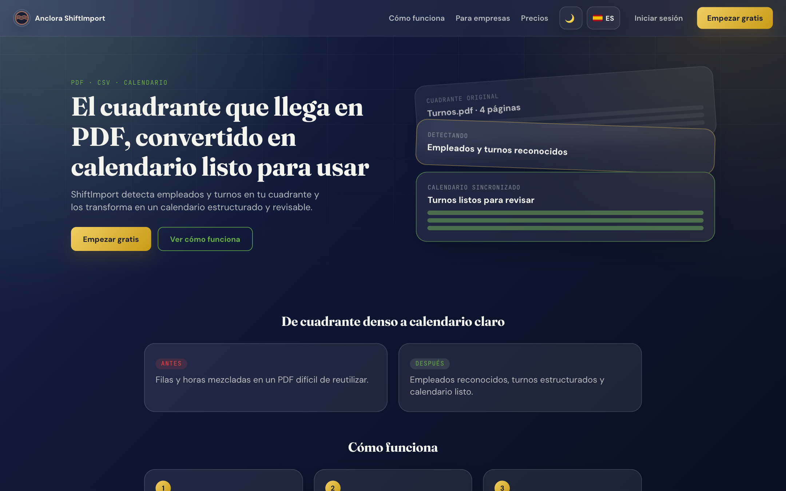

**Anclora ShiftImport** es una aplicación que convierte el cuadrante de turnos que te entrega tu empresa —en PDF, imagen, CSV o Excel— en un **calendario digital editable**, sin que tengas que copiar los horarios a mano.

Subes el documento, la aplicación detecta tus turnos automáticamente y te muestra una vista previa que puedes corregir antes de confirmar. Una vez importado, tu calendario queda disponible para consultarlo, añadir turnos manuales o volver a importar el mes siguiente.

### Qué puedes hacer

| Perfil | Qué permite hacer |
| --- | --- |
| Invitado (sin cuenta) | Importar cuadrantes y llevar tu calendario en este dispositivo, con todos los datos guardados solo en tu navegador |
| Empleado (con cuenta) | Todo lo anterior más persistencia en la nube, acceso desde cualquier dispositivo y formatos de cuadrante aprendidos compartidos con tu organización |
| Administrador | Todo lo anterior más gestión de usuarios, empleados, áreas, importación masiva de cuadrantes de equipo y control del ciclo de vida de los formatos aprendidos |

### Lo que hace especial a ShiftImport

- **Aprende tu formato una sola vez.** Cuando importas un cuadrante con un diseño que la aplicación no reconoce, un asistente te hace un puñado de preguntas sencillas (qué fila eres tú, qué significa cada código de turno). A partir de ahí, tu organización reconoce ese mismo formato automáticamente en cada importación futura, sin volver a preguntar.
- **Nunca inventa turnos.** Si un código de turno es desconocido, si faltan horas o si no encuentra tu fila en el documento, ShiftImport te lo dice explícitamente en lugar de adivinar o descartar datos en silencio.
- **La importación nunca escribe directamente en tu calendario.** Siempre hay una vista previa editable: puedes corregir, eliminar filas o cambiar el tipo de turno antes de confirmar.
- **Funciona sin cuenta.** Puedes usar la aplicación completa como invitado; crear una cuenta solo añade sincronización en la nube y funciones de equipo.

### Qué no hace ShiftImport

- No es un sistema de nóminas ni de fichaje: no calcula pagas, cotizaciones ni horas extra a efectos legales.
- No sustituye el cuadrante oficial de tu empresa: es una copia de trabajo para consultarlo cómodamente.
- No comparte datos entre organizaciones distintas: lo que aprende o guarda una organización nunca es visible para otra.

---

## 2. Antes de empezar

### Formatos de documento admitidos

| Formato | Extensión | Notas |
| --- | --- | --- |
| PDF | `.pdf` | El más habitual: cuadrantes en cuadrícula mensual o con leyenda de códigos |
| Imagen | `.png`, `.jpg`, `.jpeg`, `.webp` | Fotos o capturas de un cuadrante impreso o en pantalla |
| CSV | `.csv` | Listas de turnos por fila (fecha, empleado, hora) o cuadrículas exportadas |
| Excel | `.xlsx` | Cuadrantes en hoja de cálculo |

Cualquier otro formato (por ejemplo `.docx` o `.txt`) se rechaza explícitamente con un mensaje de error — nunca se procesa a ciegas.

### Qué tener a mano antes de importar

- El documento del cuadrante, en uno de los formatos anteriores.
- Tu nombre tal como aparece en el documento, o tu identificador de empleado (si lo usa tu empresa). Lo necesitarás la primera vez para que la aplicación localice tu fila.
- El mes y el año que corresponden al documento — la aplicación los detecta cuando puede, pero siempre puedes indicarlos tú.

### Requisitos técnicos

ShiftImport es una aplicación web: no requiere instalación. Funciona en cualquier navegador moderno (Chrome, Firefox, Edge, Safari), tanto en ordenador como en móvil. Como invitado, tus datos se guardan en el navegador que estés usando; con una cuenta, se guardan en el servidor y están disponibles desde cualquier dispositivo en el que inicies sesión.

---

## 3. Acceso, cuenta y organización

### 3.1 Tres formas de empezar

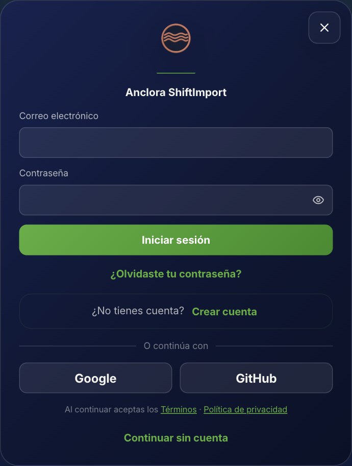

Al abrir ShiftImport puedes elegir entre tres caminos:

1. **Continuar sin cuenta** — accedes directamente a tu calendario local. No hace falta ningún dato personal.
2. **Iniciar sesión** — si ya tienes una cuenta, entras con tu correo y contraseña.
3. **Crear cuenta** — te registras con nombre, correo y contraseña para empezar a usar la aplicación con persistencia en la nube.

> Puedes empezar como invitado y crear una cuenta más adelante sin perder tu trabajo: la aplicación te ofrecerá migrar tus turnos locales a la nueva cuenta (ver [sección 11](#11-migrar-tus-datos-locales-a-una-organización)).

### 3.2 Primer acceso: crear tu organización

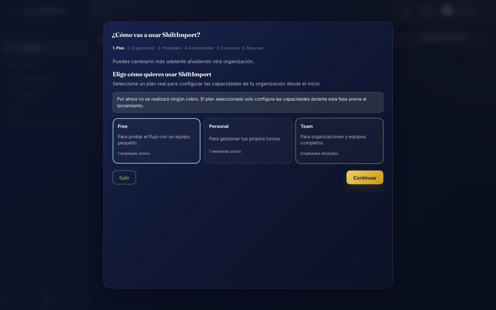

Nada más crear una cuenta, ShiftImport te pide un único dato obligatorio — el **nombre de tu organización** — y uno opcional, **tu nombre**. Con eso crea tu primera organización y te asigna como **administrador**.

- Si rellenas también tu nombre, ShiftImport crea además tu propio registro de empleado dentro de esa organización, para que puedas llevar tu calendario desde el primer momento.
- Si dejas tu nombre en blanco, la organización queda lista para que añadas empleados más adelante desde la gestión de usuarios (ver [sección 9](#9-gestión-de-la-organización-solo-administradores)) — útil cuando quien se registra es quien va a administrar el equipo, no quien va a fichar turnos.

Tanto el nombre de la organización como tu propio nombre se pueden cambiar después desde **Ajustes**.

### 3.3 Varias organizaciones con la misma cuenta

Si tu correo pertenece a más de una organización (por ejemplo, trabajas en dos empresas distintas que usan ShiftImport), la aplicación te pedirá elegir explícitamente con cuál quieres trabajar cada vez que haya ambigüedad — nunca selecciona una por ti en silencio. Puedes cambiar de organización en cualquier momento desde el selector de la cabecera.

### 3.4 Roles dentro de una organización

| Rol | Puede hacer |
| --- | --- |
| **Empleado** | Ver y editar su propio calendario, importar sus cuadrantes, enseñar nuevos formatos a la organización, usar formatos ya aprendidos |
| **Administrador** | Todo lo anterior, más gestionar usuarios y empleados, crear áreas, importar cuadrantes de todo el equipo, confirmar o retirar formatos aprendidos, y restaurar la organización a su estado inicial |

No existen más roles que estos dos. Un administrador puede degradar o promocionar a otros usuarios de la organización desde la gestión de usuarios (ver [sección 9](#9-gestión-de-la-organización-solo-administradores)).

---

## 4. Modo invitado: primeros pasos sin cuenta

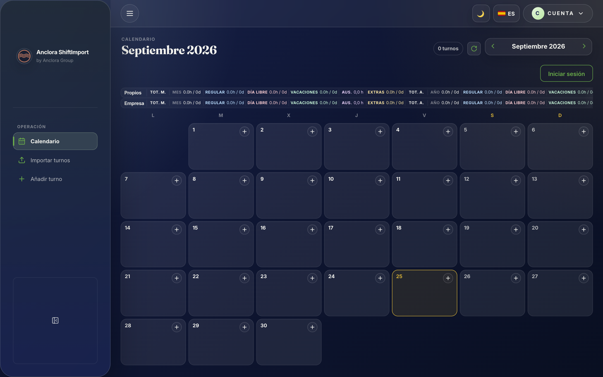

Elegir **Continuar sin cuenta** te lleva directamente a un calendario vacío del mes actual, listo para importar tu primer cuadrante.

### Qué guarda el modo invitado

Todo lo que hagas como invitado —turnos, tipos de turno personalizados, formatos de cuadrante aprendidos y tus preferencias— se guarda **únicamente en el navegador que estés usando**, mediante `localStorage`. Esto significa:

- Los datos sobreviven a cerrar y volver a abrir el navegador.
- Los datos **no** se sincronizan entre dispositivos ni navegadores distintos.
- Si borras los datos de navegación de tu navegador, los turnos guardados se pierden.
- Nadie más puede ver tus datos: no hay ningún servidor implicado en el modo invitado.

### Cuándo conviene crear una cuenta

El modo invitado es perfectamente funcional para un uso puntual o personal en un solo dispositivo. Conviene crear una cuenta cuando quieras:

- Acceder a tu calendario desde el móvil y el ordenador con los mismos datos.
- Que tu organización comparta los formatos de cuadrante ya aprendidos entre varios compañeros.
- Formar parte de un equipo gestionado por un administrador.

---

## 5. Importar un cuadrante paso a paso

Este es el flujo central de ShiftImport. Funciona igual para invitados y para usuarios con cuenta; la única diferencia es dónde se guarda el resultado.

### 5.1 Abrir el importador

Pulsa el botón **Importar** en la cabecera de la aplicación. Se abre una ventana con:

- Un selector de **mes** y **año** del calendario (rellenado por defecto con el mes en curso).
- Una zona para **subir el archivo** del cuadrante.
- Si tu organización tiene varias áreas activas, un selector de **área** (ver [sección 9.3](#93-áreas-de-la-organización)).

> **Importante:** si el mes/año que seleccionas no coincide con el que detecta el documento, ShiftImport te avisa y te deja elegir explícitamente cuál usar — nunca importa turnos en un mes distinto al que has confirmado.

### 5.2 Subir el documento

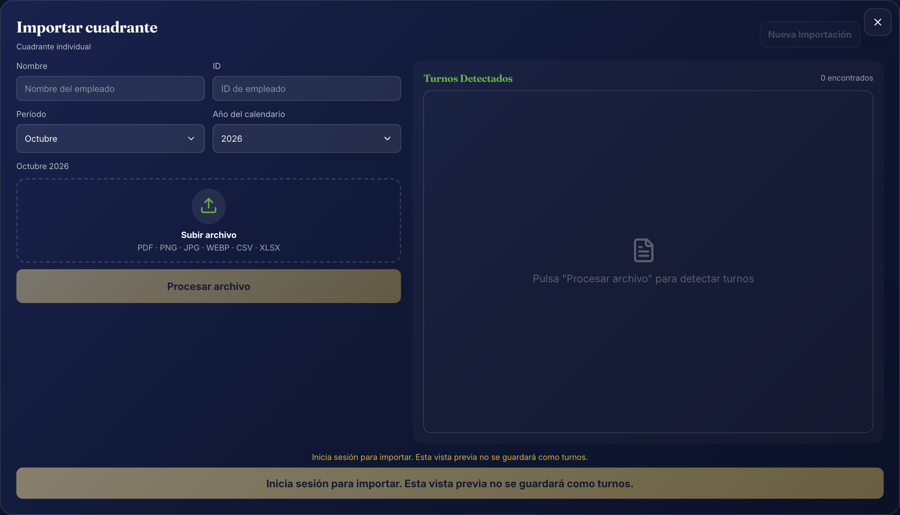

Pulsa **Subir archivo**, elige tu documento (PDF, imagen, CSV o Excel) y después **Procesar archivo**. La aplicación analiza el documento y localiza tu fila:

- Si tienes una cuenta vinculada a un empleado, ShiftImport ya conoce tu nombre y tu identificador y busca tu fila automáticamente.
- Si es un documento con varias personas y no puede identificarte con certeza, te pregunta cuál de las filas detectadas eres tú.

### 5.3 El asistente de formato (solo si hace falta)

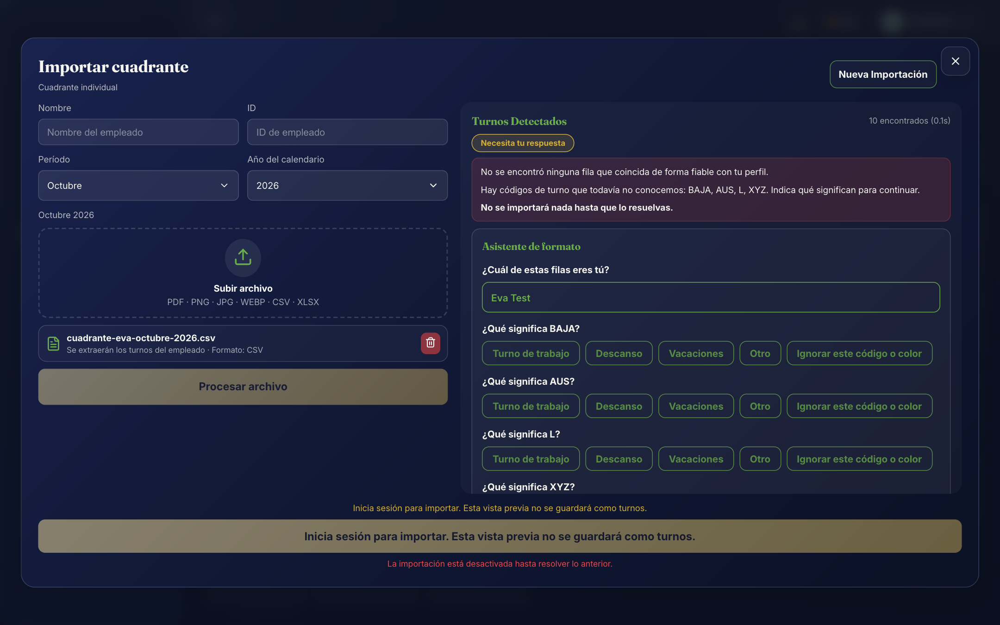

Si el documento tiene un formato que la organización todavía no conoce, aparece el **asistente de formato** dentro de la misma ventana. Te pregunta, con opciones a un clic:

| Pregunta | Cuándo aparece |
| --- | --- |
| ¿Cuál de estas filas eres tú? | El documento tiene varias personas y no se pudo identificar tu fila automáticamente |
| ¿Qué turno representa «X»? | Hay un código corto (por ejemplo `M`, `T`, `L`) que la organización todavía no ha clasificado |
| ¿Qué significa «X»? | Hay un texto más largo sin clasificar (por ejemplo, una anotación de la leyenda) |
| ¿Esta columna corresponde al día X? | La aplicación necesita confirmar a qué día del mes corresponde una columna del cuadrante |

Para cada código desconocido eliges si es **turno de trabajo** (indicando hora de inicio y fin), **descanso**, **vacaciones** u **otro**. Cuando terminas y pulsas **Aplicar y continuar**, ShiftImport guarda automáticamente lo que acabas de enseñarle como un **formato aprendido** de tu organización (ver [sección 6](#6-formatos-aprendidos)) — así nadie tendrá que volver a responder estas preguntas para el mismo formato.

> El asistente nunca guarda nombres, identificadores ni el contenido de las celdas del documento: solo la estructura (qué columna es cada día, qué significa cada código). Ver [sección 13.3](#133-qué-guarda-shiftimport-de-tus-documentos).

### 5.4 Vista previa editable

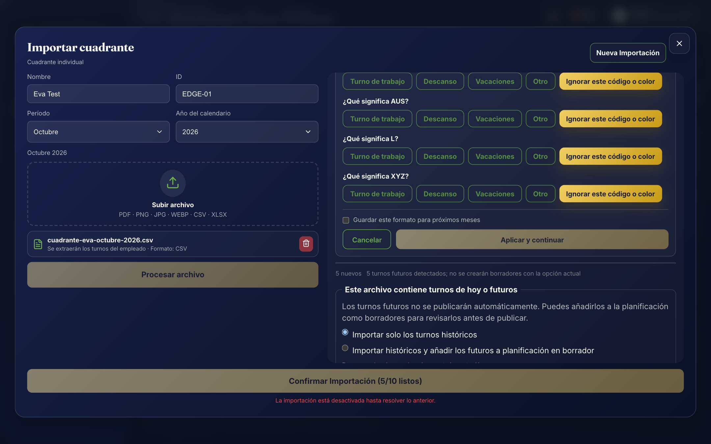

Antes de guardar nada, ves una tabla con todos los turnos detectados: fecha, tipo, hora de inicio y fin. Cada fila indica si está **lista** para importar o si necesita tu atención. Puedes:

- Editar el tipo de turno, la hora de inicio o la hora de fin de cualquier fila.
- Eliminar filas que no quieras importar.
- Ver cuántos turnos están listos frente al total detectado, en el propio botón de confirmación (por ejemplo, «Confirmar Importación (28/31 listos)»).

Un indicador de estado resume la calidad de la importación: **Listo** (todo correcto), **Parcial** (algunas filas necesitan revisión pero puedes importar el resto), **Necesita tu respuesta** (falta resolver alguna pregunta del asistente) o **Bloqueado** (no se puede importar hasta corregir algo, por ejemplo cero turnos detectados).

### 5.5 Confirmar

Al pulsar **Confirmar Importación**, ShiftImport guarda los turnos listos en tu calendario. Si ya existían turnos en las mismas fechas de una importación anterior, se te muestra un resumen de cuántos son nuevos, cuántos han cambiado y cuántos se mantienen igual, y —si hay un conflicto real en una fecha concreta— se te pregunta si quieres mantener el turno existente o sustituirlo por el nuevo. La importación nunca sobrescribe datos en silencio.

### 5.6 Reimportar el mismo formato más adelante

La siguiente vez que tú, o cualquier compañero de tu organización con cuenta, importéis un documento con el mismo diseño, ShiftImport lo reconoce automáticamente: no vuelve a aparecer el asistente, y la vista previa se genera directamente. La validación y la vista previa editable siguen ejecutándose siempre — reconocer el formato acelera el proceso, pero nunca se salta la revisión.

---

## 6. Formatos aprendidos

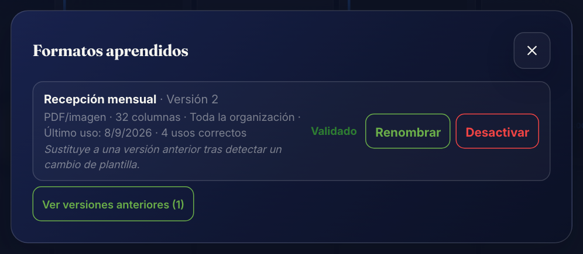

Cada vez que enseñas a ShiftImport cómo leer un cuadrante nuevo, esa configuración queda guardada como un **formato aprendido**. Si tienes una cuenta, el formato se guarda en tu organización y lo puede reutilizar cualquier compañero — no hace falta que cada persona enseñe el mismo cuadrante por separado.

### 6.1 Abrir «Formatos aprendidos»

Pulsa el botón **Formatos aprendidos** en la cabecera. Verás la lista de formatos de tu organización, cada uno con:

- Un **nombre** descriptivo (por ejemplo, «Cuadrante mensual recepción»).
- El **tipo de origen**: PDF/imagen o CSV/tabla.
- Su **estado** (ver siguiente apartado).
- La **versión**, el **último uso** y el número de **usos correctos**.

Cualquier persona de la organización puede consultar esta lista; solo un **administrador** puede confirmar, renombrar, reactivar o desactivar un formato.

### 6.2 Ciclo de vida de un formato

| Estado | Qué significa |
| --- | --- |
| **Candidato** | Recién enseñado. Ya se puede reutilizar automáticamente, pero todavía no ha sido revisado por un administrador |
| **Validado** | Un administrador lo ha confirmado como fiable para la organización |
| **Verificado** | Validado y con un historial amplio de usos correctos |
| **Anterior** | Ha sido sustituido por una versión más reciente del mismo formato (ver más abajo), pero se conserva por si hace falta volver a él |
| **Desactivado** | Retirado manualmente por un administrador; nunca se vuelve a seleccionar en automático |

Un administrador confirma un formato candidato pulsando **Confirmar** en su fila. Para retirarlo, pulsa **Desactivar**; para recuperar un formato anterior o desactivado, pulsa **Reactivar**.

### 6.3 Qué pasa si la plantilla de tu empresa cambia

Si tu empresa cambia ligeramente el diseño de su cuadrante (por ejemplo, añade una columna), ShiftImport lo detecta como una variación del formato ya conocido. En lugar de sobrescribir el formato existente —arriesgando romper el reconocimiento de las versiones antiguas del documento—, crea una **nueva versión candidata** enlazada a la anterior. El formato original se conserva intacto hasta que un administrador confirme la nueva versión; en ese momento, la anterior pasa a estado **Anterior** (nunca se borra, y se puede reactivar en cualquier momento).

### 6.4 Qué nunca guarda un formato aprendido

Un formato aprendido describe **la estructura** del documento, nunca su contenido:

- Nunca contiene nombres de personas, identificadores de empleado, correos ni ningún dato personal.
- Nunca contiene el texto o las imágenes del documento original.
- Solo guarda: qué columna corresponde a qué día, qué significa cada código de turno corto (por ejemplo, que `M` es un turno de mañana con esas horas), y la estrategia usada para encontrar la fila del empleado (nunca el contenido de esa fila).

---

## 7. Tu calendario de turnos

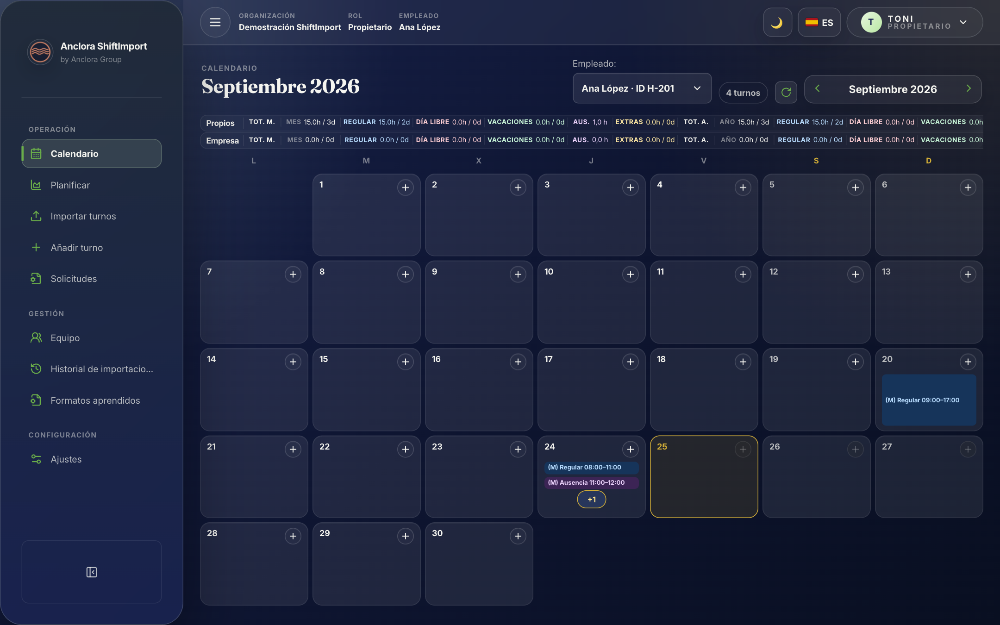

### 7.1 Navegación

La cabecera del calendario muestra el mes y el año actuales, con flechas para moverte al mes anterior o siguiente. Cada día del mes aparece como una celda con los turnos programados ese día.

### 7.2 Estadísticas del mes

Justo encima del calendario, una barra de estadísticas resume, para el mes visible:

- **Propios** — tus turnos (si eres administrador viendo el calendario de un empleado, también puede mostrar los de la **Empresa**).
- **Tot. M.** — total de horas o turnos del mes.
- **Tot. A.** — total acumulado del año.

### 7.3 Añadir un turno manualmente

Pulsa sobre un día vacío del calendario (o el botón **Añadir**) para abrir la ventana **Programar Turno**: eliges fecha, hora de inicio, hora de fin y tipo de turno, y confirmas. Los turnos añadidos a mano conviven sin problema con los importados — cada uno conserva su origen (manual o importado) internamente.

### 7.4 Editar o eliminar un turno

Pulsa sobre un turno ya existente para abrir la misma ventana en modo edición (**Actualizar Turno**), con opción de eliminarlo.

### 7.5 Vista en móvil

El calendario se adapta a pantallas pequeñas: en móvil, la cuadrícula mensual se reorganiza para que cada día siga siendo legible y los turnos táctiles fáciles de abrir.

---

## 8. Ajustes de tu cuenta

Abre **Ajustes** desde el icono de engranaje de la cabecera. Encontrarás distintas pestañas según tu situación (invitado, empleado o administrador).

### 8.1 Perfil

- **Nombre** — el que se muestra en la cabecera y en el calendario. Si tienes una cuenta vinculada a un empleado, cambiarlo aquí actualiza tu nombre de empleado en la organización.
- **Identificadores de empleado** — los códigos con los que apareces en tus cuadrantes (por ejemplo, `EMP-101`). Se usan para que ShiftImport te reconozca automáticamente al importar un documento con varias personas.
- **Zona horaria** — usada para interpretar correctamente las horas de tus turnos.
- **Empresa (opcional)** — un campo libre informativo.

### 8.2 Tipos de turno

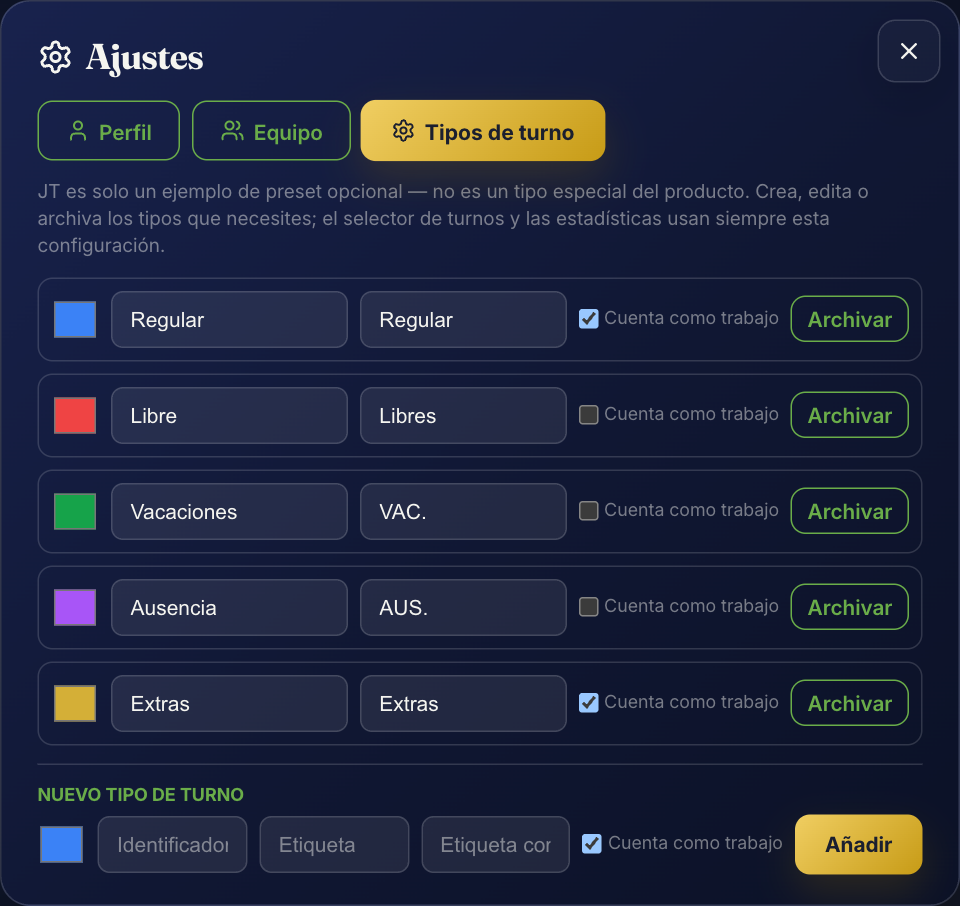

ShiftImport viene con cuatro tipos de turno neutros: **Regular**, **Libre**, **Vacaciones** y **Extras**. Desde esta pestaña puedes:

- Crear un tipo de turno nuevo, con su propio identificador, etiqueta, etiqueta corta y color.
- Marcar si un tipo **cuenta como trabajo** a efectos de estadísticas.
- **Archivar** un tipo que ya no uses (los turnos ya guardados con ese tipo conservan su etiqueta y color) o **restaurarlo** más adelante.

Estos tipos son los que usa el selector de turnos, las estadísticas y el asistente de formato al preguntarte qué significa un código nuevo.

### 8.3 Equipo (solo si tienes una organización de empresa)

Un resumen con el nombre de tu organización, tu rol y accesos rápidos a la gestión de usuarios (ver [sección 9](#9-gestión-de-la-organización-solo-administradores)) y, si eres administrador con varios empleados, un selector para elegir qué calendario de empleado ver.

### 8.4 Borrar tus datos locales

Si usas ShiftImport como invitado, Ajustes incluye la opción **Borrar todos mis datos locales**, que elimina de este dispositivo tus turnos, tipos de turno personalizados, perfil y preferencias. Es irreversible y se pide confirmación explícita antes de ejecutarla.

---

## 9. Gestión de la organización (solo administradores)

### 9.1 Usuarios

Desde el botón **Usuarios de la organización**, un administrador puede:

- **Añadir un usuario** indicando su correo, un nombre opcional y su rol (Empleado o Administrador). Si el correo no tiene cuenta todavía y dejas la contraseña en blanco, ShiftImport genera una contraseña temporal que se muestra **una sola vez** para que se la entregues de forma segura — todavía no existe invitación automática por correo.
- **Vincular** el usuario a un empleado ya existente, para que sus importaciones se guarden bajo esa persona.
- **Quitar** un usuario de la organización.
- **Importar varios usuarios a la vez** mediante un archivo CSV.

### 9.2 Empleados

En la pestaña **Empleados** de la misma ventana, un administrador puede añadir empleados uno a uno (nombre, identificador externo opcional y área) o importar una lista completa mediante CSV, con una vista previa antes de confirmar que indica cuántas filas son nuevas, cuántas ya existen y cuántas tienen errores.

### 9.3 Áreas de la organización

Las **áreas** son opcionales y sirven para segmentar empleados, importaciones y turnos dentro de una misma organización (por ejemplo, «Recepción» y «Cocina» en un hotel). Desde el botón **Áreas**, un administrador puede:

- Crear un área con nombre y, opcionalmente, un código corto.
- Renombrar un área o cambiar su código.
- **Desactivar** un área — no se elimina nunca: los empleados, turnos e importaciones que ya la usaban conservan la referencia, y simplemente deja de estar disponible para altas nuevas.

Si una organización no tiene ninguna área activa, todo funciona igual pero sin ese nivel de segmentación — las áreas nunca son obligatorias.

### 9.4 Restaurar la organización a su estado inicial

Dentro de Ajustes, en la sección **Zona de peligro**, un administrador puede **restaurar el estado inicial** de la organización. Esta acción:

- Elimina permanentemente los empleados, los turnos, las importaciones y los vínculos usuario↔empleado.
- **Conserva** la organización, tu cuenta de administrador, las áreas creadas y los formatos de cuadrante aprendidos — se consideran configuración de la organización, no datos operativos de un mes concreto.
- Exige escribir la palabra **RESTABLECER** para confirmar, precisamente porque no se puede deshacer.

---

## 10. Importación de equipo (solo administradores)

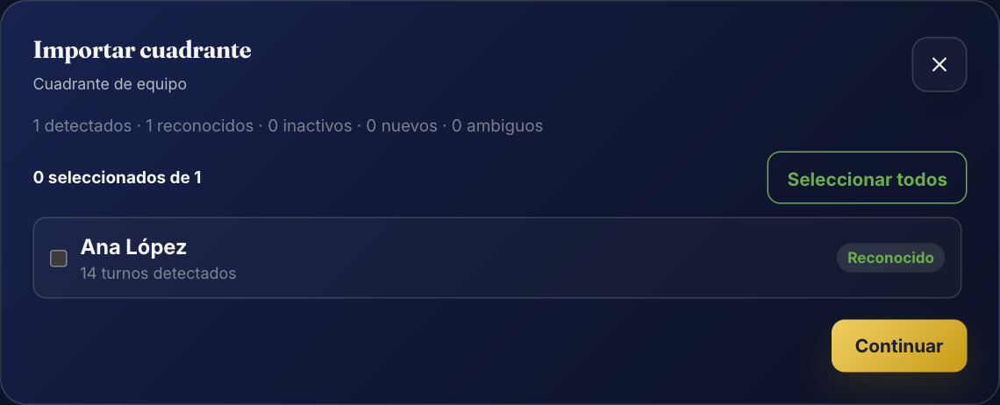

Cuando un administrador pulsa **Importar**, en lugar del importador individual se abre el importador de equipo, pensado para cuadrantes con varias personas a la vez.

### 10.1 Subir el cuadrante del equipo

Admite un CSV con columnas de empleado y fecha, o un PDF de cuadrante con varios empleados. ShiftImport compara cada nombre o identificador detectado con los empleados ya existentes en la organización y los clasifica:

| Estado | Significado |
| --- | --- |
| Reconocido | Coincide con un empleado activo existente |
| Existente — Inactivo | Coincide con un empleado desactivado; se puede reactivar desde aquí |
| Nuevo | No hay ningún empleado coincidente; se puede crear |
| Ambiguo | Hay más de una coincidencia posible; hay que elegir manualmente |

### 10.2 Seleccionar y crear empleados

El administrador marca qué personas del cuadrante quiere importar. Para las filas «Nuevo» puede crear el empleado sobre la marcha, o crear varios empleados nuevos de una sola vez con un resumen de creados, ya existentes y errores.

### 10.3 Resumen antes de importar

Antes de confirmar, se muestra un resumen con los empleados seleccionados, cuántos turnos nuevos se van a crear y cuántos conflictos hay con turnos ya existentes (que nunca se sobrescriben sin confirmación). Al confirmar, ShiftImport importa los turnos de todos los empleados seleccionados y verifica que se hayan guardado correctamente antes de mostrar la confirmación final.

---

## 11. Migrar tus datos locales a una organización

Si empezaste como invitado y después creas una cuenta o te añaden a una organización, ShiftImport detecta que tienes datos guardados en este dispositivo y te ofrece migrarlos.

### 11.1 Migrar tus turnos

La aplicación te muestra cuántos turnos locales ha encontrado y a qué organización/empleado se importarían. Puedes:

- **Importar a mi cuenta** — sube esos turnos a tu cuenta.
- **Mantener solo en este dispositivo** — no migra nada; no se te volverá a preguntar en esta sesión.
- **Cancelar** — se te preguntará de nuevo la próxima vez.

La operación es **idempotente**: repetirla no crea turnos duplicados, y tu copia local nunca se borra automáticamente, ni al migrar ni al declinar.

### 11.2 Migrar tus formatos aprendidos

Del mismo modo, si tienes formatos de cuadrante aprendidos como invitado, ShiftImport te ofrece migrarlos a tu organización por separado. Se explica claramente qué se sube (la configuración estructural del formato) y qué no (ningún documento original ni dato personal), y tampoco se elimina la copia local al migrar.

---

## 12. Planes de Anclora ShiftImport

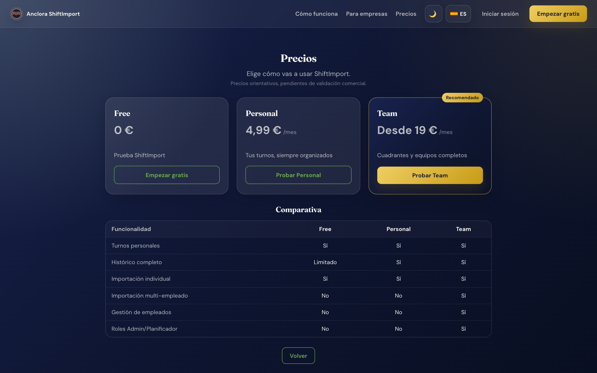

ShiftImport ofrece tres planes con distintos límites y funciones de equipo. Los precios son orientativos y están pendientes de validación comercial, tal como indica la propia página de precios; los límites y funciones sí son los que aplica la aplicación hoy.

| Plan | Empleados | Importaciones al mes | Historial completo | Gestión de equipo | Importación de varios empleados |
| --- | --- | --- | --- | --- | --- |
| **Free** | 1 | 5 | No | No | No |
| **Personal** | 1 | Sin límite | Sí | No | No |
| **Team** | Sin límite | Sin límite | Sí | Sí | Sí |

- Los planes **Free** y **Personal** están pensados para un único empleado (tu propio calendario).
- El plan **Team** añade gestión de usuarios, áreas e importación de cuadrantes de equipo — es el plan necesario para las funciones descritas en las [secciones 9](#9-gestión-de-la-organización-solo-administradores) y [10](#10-importación-de-equipo-solo-administradores).
- Un intento de superar un límite de tu plan (por ejemplo, añadir un segundo empleado en el plan Free) se rechaza explícitamente, indicando qué límite lo impide.

---

## 13. Privacidad, cookies y tus datos

### 13.1 Cookies

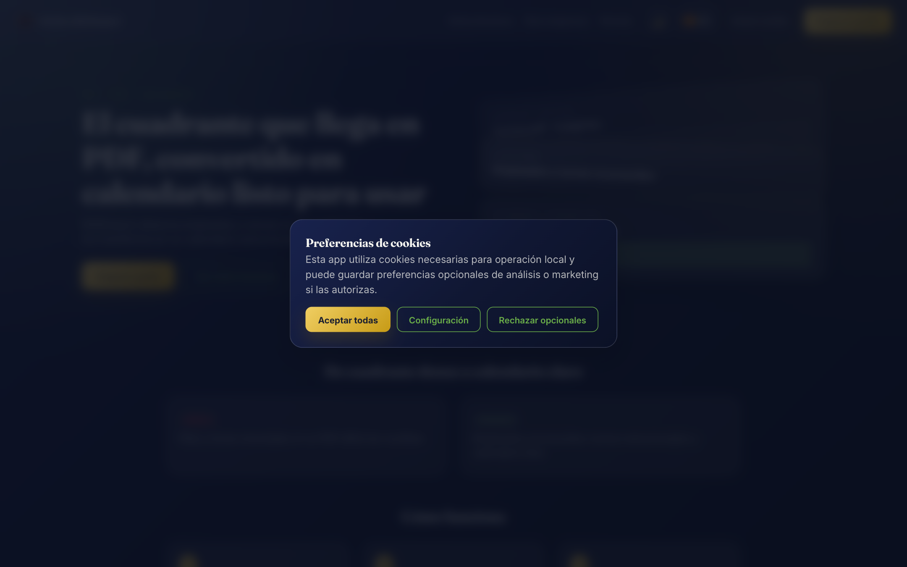

Al usar ShiftImport por primera vez, un aviso te permite **Aceptar todas** las cookies, **Rechazar opcionales** o entrar en **Configuración** para decidir categoría por categoría:

| Categoría | Se puede desactivar | Para qué se usa |
| --- | --- | --- |
| Necesarias | No | Funcionamiento básico y tus preferencias (tema, idioma) |
| Análisis | Sí | Medición funcional interna de uso |
| Marketing | Sí | Reservadas para comunicaciones relevantes |

Puedes volver a abrir esta configuración en cualquier momento desde el enlace **Cookies** del pie de página.

### 13.2 Aislamiento entre organizaciones

Todo lo que guardas en una organización —empleados, turnos, importaciones, formatos aprendidos— es visible únicamente para los miembros de esa organización. Ninguna otra organización, aunque use ShiftImport, puede consultar ni reutilizar tus datos. Esta separación se aplica siempre en el servidor, nunca depende de la aplicación que se ejecuta en tu navegador.

### 13.3 Qué guarda ShiftImport de tus documentos

ShiftImport nunca almacena el documento original que subes (el PDF, la imagen o el CSV) — se procesa en el momento de la importación y no se conserva. De ese documento, solo se guardan permanentemente:

- Los **turnos** que confirmas en la vista previa (fecha, hora de inicio, hora de fin y tipo).
- Si enseñas un formato nuevo, la **estructura** del documento (qué columna es cada día, qué significan los códigos de turno cortos) — nunca nombres, identificadores ni el texto original. Ver [sección 6.4](#64-qué-nunca-guarda-un-formato-aprendido).

### 13.4 Borrar tus datos

- Como invitado, puedes borrar todos tus datos locales desde **Ajustes** (ver [sección 8.4](#84-borrar-tus-datos-locales)).
- Como administrador, puedes restaurar tu organización a su estado inicial, eliminando empleados, turnos e importaciones (ver [sección 9.4](#94-restaurar-la-organización-a-su-estado-inicial)).

---

## 14. Preguntas frecuentes

**¿Necesito crear una cuenta para usar ShiftImport?**
No. Puedes usar la aplicación completa como invitado; tus datos se guardan en tu navegador. Crear una cuenta añade sincronización en la nube y funciones de equipo.

**Importé un cuadrante y algunos turnos no aparecen. ¿Por qué?**
ShiftImport nunca descarta turnos en silencio. Si faltan filas, revisa el indicador de estado de la importación (Parcial, Necesita tu respuesta o Bloqueado): siempre indica el motivo exacto, como un código de turno todavía sin clasificar o una fila que no se pudo identificar como tuya.

**¿Por qué me sigue preguntando el asistente de formato si ya enseñé este cuadrante?**
Comprueba que el mes/año seleccionado coincide con el documento y que estás en la misma organización con la que enseñaste el formato la primera vez. Si la plantilla de tu empresa ha cambiado ligeramente (por ejemplo, una columna nueva), ShiftImport lo trata como una variación del formato y te pedirá confirmarla una vez (ver [sección 6.3](#63-qué-pasa-si-la-plantilla-de-tu-empresa-cambia)).

**¿Puedo importar el mismo cuadrante dos veces sin duplicar turnos?**
Sí. Si vuelves a importar un documento que ya habías importado, ShiftImport detecta los turnos que coinciden y te avisa de los que difieren, dejándote elegir si mantener o sustituir cada uno — nunca duplica en silencio.

**¿Qué pasa con mis formatos aprendidos si mi empresa restaura la organización?**
Se conservan. Restaurar la organización elimina datos operativos (empleados, turnos, importaciones) pero mantiene la configuración, incluidos los formatos de cuadrante aprendidos y las áreas.

**¿Puedo usar ShiftImport en el móvil?**
Sí, tanto el calendario como el importador se adaptan a pantallas pequeñas. Puedes fotografiar tu cuadrante directamente con el móvil y subir la imagen.

**¿Se comparten mis formatos aprendidos con otras empresas?**
No. Cada organización tiene sus propios formatos aprendidos, completamente aislados del resto.

---

## 15. Glosario rápido

| Término | Significado |
| --- | --- |
| Cuadrante | El documento (PDF, imagen, CSV o Excel) que reparte tu empresa con los turnos del mes |
| Turno | Un bloque de trabajo o descanso con fecha, hora de inicio, hora de fin y tipo |
| Formato aprendido | La configuración que ShiftImport guarda tras enseñarle a leer un diseño de cuadrante concreto |
| Candidato / Validado / Verificado | Estados de confianza de un formato aprendido, de menor a mayor revisión |
| Área | Segmento opcional dentro de una organización (por ejemplo, un departamento) |
| Organización | El espacio de trabajo compartido: personal (un empleado) o de empresa (varios empleados y administradores) |
| Invitado | Sesión sin cuenta, con los datos guardados solo en el navegador |
| Empleado | Persona real cuyo calendario se gestiona en ShiftImport, con o sin cuenta de usuario vinculada |

---

## 16. Aviso legal

Anclora ShiftImport es una herramienta de apoyo para consultar y organizar tus turnos a partir de los cuadrantes que te entrega tu empresa. No sustituye el documento oficial de tu empresa, ni ningún sistema de fichaje, nómina o control horario con validez legal.

### Limitaciones importantes

- Los turnos mostrados en ShiftImport son una copia de trabajo derivada del documento que importaste; en caso de discrepancia, prevalece siempre el cuadrante oficial de tu empresa.
- ShiftImport no garantiza la exactitud de la detección automática de turnos: la vista previa editable existe precisamente para que revises y corrijas cualquier dato antes de confirmarlo.
- El uso de la aplicación está sujeto a los Términos de uso y la Política de privacidad, accesibles desde el pie de página de la aplicación.

© 2026 Anclora Group — Anclora ShiftImport es un producto del ecosistema Anclora Group.

