

Anclora ShiftImport

Manual de usuario

Aprende paso a paso. Consulta, importa y organiza tus turnos.

  
Versión 3.0

  
9 septiembre 2026

Anclora ShiftImport convierte cuadrantes de turnos (PDF, imagen, CSV o Excel) en un calendario operativo editable y planificable. No sustituye el cuadrante oficial de tu empresa ni constituye un sistema de nóminas.

## Índice

Empieza por los capítulos 1 a 4. Después sigue la ruta de tu perfil.

- **[Empezar](#1-empieza-aquí)**: capítulos 1 a 4.
- **[Tu calendario](#5-consultar-el-calendario-los-meses-y-los-colores)**: capítulos 5 y 6.
- **[Importar con revisión](#7-safe-import-cómo-importar-con-control)**: capítulos 7 a 13.
- **[Formatos e historial](#14-enseñar-y-administrar-formatos-aprendidos)**: capítulos 14 a 16.
- **[Planificar y publicar](#17-preparar-una-semana-en-el-planificador)**: capítulos 17 a 19.
- **[Trabajar como empleado](#20-guía-rápida-para-el-empleado-tu-calendario-y-tus-turnos)**: capítulos 20 y 21.
- **[Gestionar personas y accesos](#22-entender-personas-empleados-y-cuentas)**: capítulos 22 a 25.
- **[Preferencias y ayuda](#26-perfil-tipos-de-turno-idioma-y-tema)**: capítulos 26 a 30.

## 1. Empieza aquí

ShiftImport te ayuda a convertir un cuadrante que ya tienes en turnos que puedes revisar y consultar. Si gestionas una organización, también puedes preparar semanas de trabajo, publicarlas y atender solicitudes. No necesitas conocer hojas de cálculo avanzadas ni términos informáticos.

### Qué vas a conseguir

**Si trabajas por turnos**, aprenderás a consultar tu jornada, pedir un cambio y consultar su resolución. **Si organizas un equipo**, aprenderás a dar de alta personas, importar cuadrantes y publicar una semana revisada.

La aplicación no sustituye las comunicaciones de tu empresa ni calcula tu nómina. Antes de actuar sobre un horario, comprueba que coincide con el cuadrante que debes seguir. La lectura de un archivo puede necesitar correcciones, especialmente si es una fotografía.

### Elige tu recorrido

| Tu situación | Lee primero | Primera tarea |
| --- | --- | --- |
| Nunca has utilizado la aplicación | 1–4 | Entrar y reconocer tu espacio |
| Eres empleado | 20–21; después 7–13 si vas a importar | Consultar el calendario personal |
| Eres planificador | 2, 4 y 17–19 | Preparar un borrador y publicarlo |
| Administras una empresa pequeña | 3, 22–25 y 7–13 | Crear el equipo e importar un cuadrante |
| Gestionas muchas personas | 22–25 y 17–19 | Organizar áreas, accesos y ámbitos |
| Solo quieres probar | 3, 5–7 | Entrar sin cuenta y explorar |

**Sobre los ejemplos:** las personas, correos, archivos y turnos de las capturas son de demostración. El manual usa el tema oscuro y el idioma español. El número de turnos y las opciones disponibles pueden variar según tu cuenta, tu rol y el archivo.

## 2. Qué puedes hacer según tu perfil

**Empleado:** consulta sus turnos y comunica lo que necesita cambiar. **Planificador:** organiza los turnos futuros de las personas que tiene asignadas. **Administrador:** gestiona el equipo y la operación. **Propietario:** tiene las funciones de administración y puede transferir la titularidad de la organización.

El rol indica qué tareas puedes realizar. El **ámbito de trabajo** indica sobre qué personas puedes realizarlas. Tener un rol de gestión y trabajar también por turnos es compatible.

| Tarea | Empleado | Planificador | Administrador | Propietario |
| --- | --- | --- | --- | --- |
| Consultar sus turnos | Sí | Si tiene ficha propia | Si tiene ficha propia | Si tiene ficha propia |
| Enviar una solicitud desde el autoservicio | Sí | No disponible en esta navegación | No disponible en esta navegación | No disponible en esta navegación |
| Importar turnos propios pasados | Sí | No disponible en esta navegación | Con ficha propia | Con ficha propia |
| Importar cuadrantes de equipo desde el recorrido actual | No | No disponible en esta navegación | Sí | Sí |
| Crear borradores y publicar | No | Dentro de su ámbito | Sí | Sí |
| Resolver solicitudes ajenas | No | Según ámbito y política | Sí | Sí |
| Crear personas, áreas y accesos | No | No | Sí | Sí |
| Eliminar una importación | No | No | Sí | Sí |
| Transferir propiedad | No | No | No | Sí |

Las funciones de equipo dependen también del plan. La tabla describe permisos; no significa que todos los perfiles vean los mismos menús. Si una acción no aparece, comprueba el rol y la organización activos antes de repetirla.

### Qué significa el ámbito de un planificador

- **Toda la organización:** gestiona el conjunto de empleados autorizado en esa organización.
- **Áreas seleccionadas:** trabaja, por ejemplo, con Recepción y Mantenimiento.
- **Empleados seleccionados:** trabaja con una lista concreta de personas, aunque pertenezcan a distintas áreas.

> **IMPORTANTE:** nadie puede aprobar ni rechazar su propia solicitud. También se aplica a propietarios, administradores y planificadores que trabajan por turnos.

## 3. Entrar, crear una cuenta y preparar tu organización

### Entrar con una cuenta existente

**Para qué sirve:** recuperar tu espacio y los datos de tu organización. Necesitas el correo y la contraseña de tu cuenta; si tu empresa ya te ha dado acceso, utiliza esos datos.

1. Abre ShiftImport y pulsa **Iniciar sesión**.
2. Escribe **Correo electrónico** y **Contraseña**.
3. Pulsa **Iniciar sesión** y espera a que termine.
4. Si aparece **Selecciona organización**, elige aquella con la que vas a trabajar.

**Resultado:** verás el calendario correspondiente a tu perfil. Si el acceso falla, comprueba espacios al copiar la contraseña y que estás usando el correo correcto. No crees otra organización para intentar acceder a la de tu empresa.

### Probar sin cuenta

Pulsa **Continuar sin cuenta** en la pantalla de acceso. Puedes explorar el calendario y las funciones locales. Los datos locales pertenecen a ese navegador: cerrar una pestaña normalmente no los borra, pero limpiar sus datos o utilizar navegación privada puede hacer que se pierdan. No se sincronizan por sí solos entre dispositivos.

**Límite importante de la edición actual:** puedes abrir el importador y revisar una vista previa, pero su confirmación requiere sesión. Si ves **Inicia sesión para importar. Esta vista previa no se guardará como turnos.**, no se ha guardado la importación. Conserva el archivo para retomarla después de entrar.

### Crear tu propia cuenta

1. Pulsa **Crear cuenta**.
2. Indica tu nombre visible, correo y una contraseña de al menos ocho caracteres.
3. Repite la contraseña y revisa los enlaces a términos y privacidad.
4. Pulsa **Crear cuenta**.
5. Completa el recorrido de bienvenida y revisa el resumen antes de confirmar.

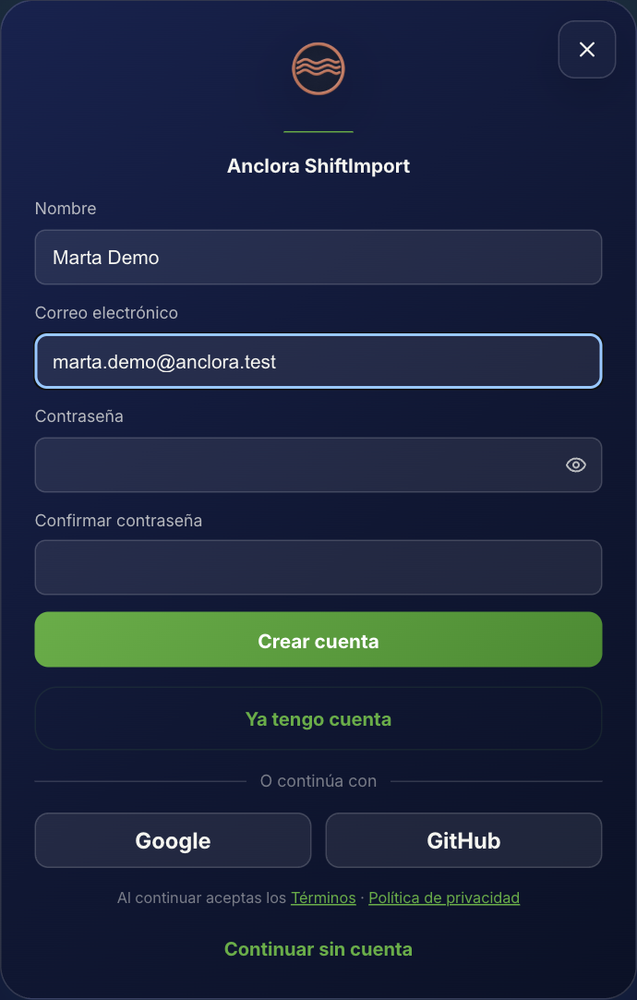

### Preparar una organización sin complicarla

El recorrido permite elegir el plan, nombrar la organización y decidir si tú también trabajas como empleado. Las áreas, otros administradores y los planificadores son opcionales. Los pasos de equipo dependen del plan elegido.

**Ejemplo:** Marta crea «Centro Demo». Gestiona la empresa, pero no trabaja por turnos: no necesita una ficha de empleada propia. Puede empezar sin áreas y añadirlas después. No es obligatorio crear un segundo administrador.

**Antes de confirmar**, revisa nombres, correos y vínculos. Si se muestran credenciales iniciales, guárdalas y entrégalas de forma individual siguiendo el capítulo 25. Cuando se ofrezca trasladar datos locales a la cuenta, revisa el destino y el resultado; no des por hecho que abrir sesión ha movido todo.

## 4. Reconocer la navegación y elegir la tarea correcta

La barra lateral reúne las tareas. **Calendario** sirve para consultar; **Importar turnos** abre un archivo; **Planificar** prepara semanas futuras. **Equipo**, **Historial de importaciones** y **Formatos aprendidos** aparecen cuando el contexto permite utilizarlos. **Ajustes** reúne preferencias y configuración.

### Importar, añadir o planificar

| Lo que necesitas | Opción | Qué ocurre |
| --- | --- | --- |
| Registrar un turno que ya ocurrió | **Añadir turno** | Introduces una fecha anterior a hoy y su horario |
| Incorporar un cuadrante existente | **Importar turnos** | Analizas, revisas y confirmas un archivo |
| Crear o reorganizar turnos de hoy o posteriores | **Planificar** | Trabajas en un borrador y luego publicas |
| Pedir que cambie tu turno publicado | **Solicitar cambio** | Envías una solicitud para revisión |

**Hoy cuenta como planificación futura**, no como pasado. La aplicación utiliza su fecha operativa para establecer esta separación. Si una fecha no se admite en Añadir turno, no la cambies por otra falsa para poder guardarla.

### Moverte sin perder el contexto

1. Comprueba la **Organización** activa. Si perteneces a varias, utiliza su selector para cambiar.
2. Revisa **Área** y **Empleado** cuando aparezcan. Seleccionar un filtro no amplía tus permisos.
3. Abre la tarea que necesitas.
4. Cierra el diálogo o vuelve al calendario para comprobar el resultado.

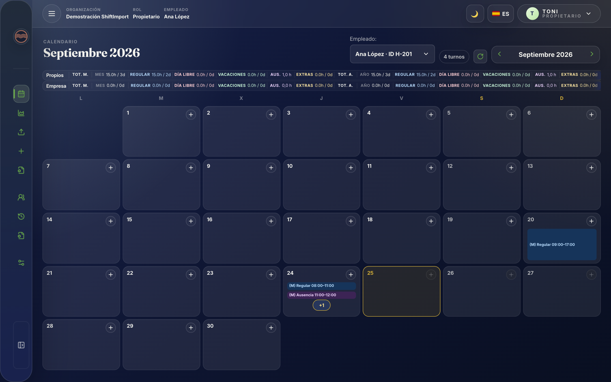

En móvil, abre la navegación desde su botón. Dentro de ventanas con listas largas, desplázate por la lista para llegar a las filas inferiores. No confundas una fila fuera de la vista con una fila eliminada.

## 5. Consultar el calendario, los meses y los colores

**Para qué sirve:** localizar días de trabajo y descanso y revisar horas. Un empleado consulta su espacio personal; un gestor puede consultar empleados dentro de su alcance.

1. Abre **Calendario**.
2. Comprueba el mes y el año en la cabecera.
3. Utiliza **Mes anterior** o **Mes siguiente** para cambiar de mes.
4. Si hay selectores de área y empleado, elige la persona que quieres consultar.
5. Lee el tipo de turno y las horas de cada día; abre el turno si necesitas detalle.

El calendario mensual empieza en lunes. Las letras y los colores identifican tipos de turno. El color por sí solo no te dice si se cuentan horas: consulta también el nombre y el horario. **Regular**, **Libre**, **Vacaciones** y **Extras** son tipos iniciales; puedes encontrar otros configurados.

### Entender los resúmenes

**Tot. M.** resume el mes y **Tot. A.** el año. Los grupos **Propios** y **Empresa**, cuando aparecen, distinguen los datos según su clasificación en la aplicación. No sumes las cifras como si fueran categorías salariales: no calculan nóminas, complementos ni certifican la jornada legal.

**Si no ves un turno**, comprueba mes, empleado y área. Si procede de una planificación, confirma que esté publicada. Si procede de una importación, revisa su resultado y su historial.

> **CONSEJO:** compara al menos el primer día, el último y un turno nocturno con el archivo original. Un horario de 22:00 a 06:00 termina al día siguiente; no lo corrijas a 06:00–22:00.

## 6. Añadir, corregir o eliminar un turno pasado

### Añadir un turno que falta

**Cuándo usarlo:** para un turno puntual anterior a hoy. Necesitas conocer la fecha, las horas y el tipo. En una organización, trabaja únicamente sobre el empleado autorizado.

1. Pulsa **Añadir turno**, o **Añadir turno pasado** en el autoservicio del empleado.
2. En **Programar Turno**, indica **Fecha de Servicio**.
3. Completa **Hora Inicio**, **Hora Fin** y **Tipo**.
4. Pulsa **Confirmar**.
5. Vuelve al mes correspondiente y comprueba que aparece.

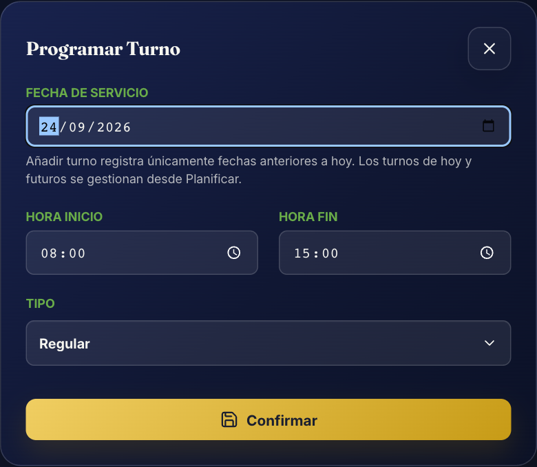

**Si no se guarda**, revisa la fecha y el aviso. No uses esta acción para planificar hoy o mañana. Tampoco añadas manualmente un turno que ya existe sin comprobarlo.

### Corregir o eliminar

Si tu perfil permite editar ese turno, al abrirlo verás **Actualizar Turno**. Corrige los campos y confirma, o utiliza **Eliminar** para suprimirlo. Comprueba después el calendario. Un empleado no debe intentar modificar directamente un turno oficial: utiliza **Solicitar cambio**.

Para cambiar una semana publicada, sigue el recorrido de nueva versión del capítulo 19. Para corregir datos que aún no has importado, utiliza la vista previa del capítulo 10: todavía no necesitas borrar nada del calendario.

## 7. Safe Import: cómo importar con control

**Safe Import** significa que primero ves lo que se ha interpretado y después decides qué guardar. Seleccionar o procesar un archivo no equivale a importar sus turnos.

El recorrido es: **elegir archivo → analizar → identificar persona → resolver dudas → revisar → corregir → decidir qué hacer con el futuro → confirmar → comprobar el resultado**. Algunos pasos se resuelven automáticamente si no hay dudas.

### Antes de empezar

Necesitas un archivo legible, conocer el periodo y saber a qué persona o equipo corresponde. Para confirmar necesitas una sesión activa. Para importar un equipo necesitas permisos y un plan que lo permita. Comprueba la organización y el área de destino.

| Archivo | Uso actual y precaución |
| --- | --- |
| PDF | Cuadrantes con texto o documentos que puedan leerse; la estructura influye en el resultado |
| PNG, JPG, JPEG, WEBP | Lectura de imágenes en el importador individual; una foto borrosa puede fallar |
| CSV | Listados de turnos o cuadrículas reconocibles; las columnas deben representar datos coherentes |
| Excel | Utiliza preferentemente XLSX; en lectura individual se utiliza la primera hoja, y el recorrido de equipo puede analizar varias |
| JSON y XML | Disponibles en el importador de equipo para estructuras reconocibles; no son opciones universales del individual |

Que una extensión se pueda seleccionar no garantiza que su contenido se pueda interpretar. Si un libro antiguo XLS falla, expórtalo a XLSX o CSV. No basta con cambiar el nombre de la extensión.

### Ejemplo completo

Ana recibe un cuadrante de septiembre. Abre Importar turnos, selecciona septiembre y el archivo, comprueba su identidad y revisa las filas. Corrige una hora de fin y elimina una fila que no corresponde. Como empleada, revisa qué fechas futuras quedan excluidas. Confirma los turnos pasados válidos y comprueba el resumen. Para consultar los futuros de la empresa, utiliza los turnos publicados en su portal.

## 8. Elegir el archivo y analizarlo

**Quién puede hacerlo:** quien tenga acceso al importador; guardar requiere sesión y permisos sobre el destino. **Qué vas a hacer:** obtener una vista previa, todavía sin escribir turnos.

1. Pulsa **Importar turnos**.
2. En **Importar cuadrante**, comprueba nombre o identificador, cuando se muestren.
3. Elige el **Período** y el **Año del calendario** que corresponden al documento.
4. Revisa **Área de la importación** si está disponible.
5. Pulsa **Subir archivo** y selecciona el documento.
6. Comprueba el nombre del archivo y pulsa **Procesar archivo**.

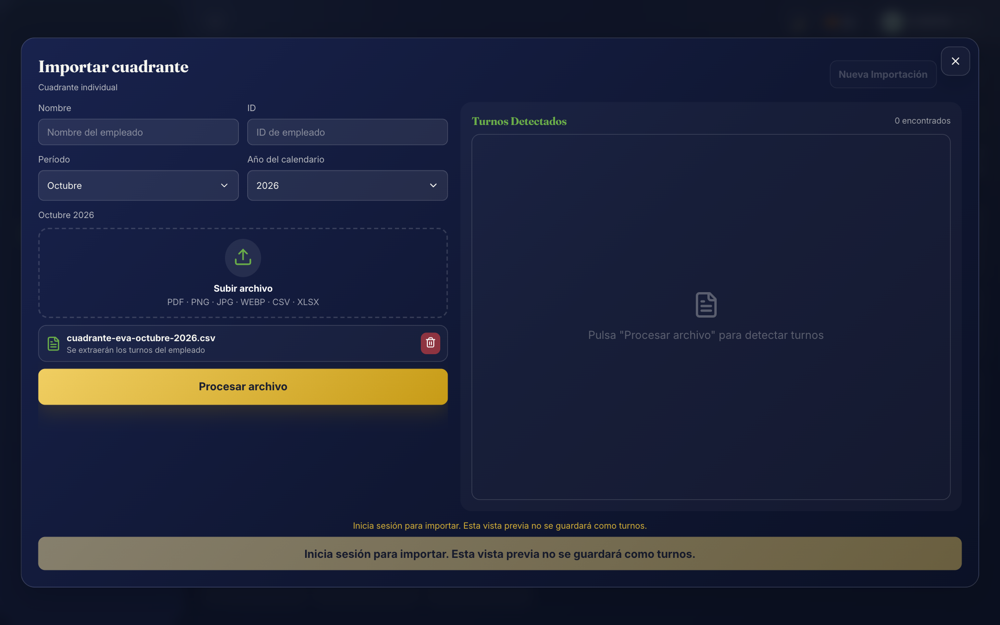

### Mientras se analiza

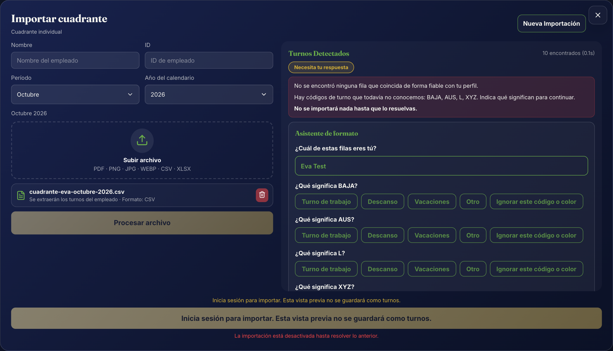

Durante **Procesando archivo…**, espera a que termine. Una imagen o un PDF complejo puede tardar más que un CSV. Si aparece **Análisis visual**, se está intentando una lectura adicional; revisa especialmente el resultado. Esta ayuda depende de la sesión y de la disponibilidad del servicio.

Si necesitas cancelar, cierra el recorrido cuando la interfaz lo permita y vuelve a abrirlo. No pulses confirmar repetidamente mientras se está guardando.

### Si el periodo no coincide

Un aviso de mes distinto requiere una decisión explícita. Lee el periodo detectado y compáralo con el documento. Corrige la selección o utiliza la recuperación propuesta, según corresponda. No aceptes un cambio de mes solo para desbloquear el botón: podrías situar turnos en días equivocados.

## 9. Identificar a la persona y resolver dudas

### Elegir la fila correcta

**Cuándo ocurre:** cuando hay varios nombres o la aplicación no puede determinar tu fila con suficiente claridad. Compara el nombre completo y el identificador con el cuadrante. Si hay dos coincidencias posibles, resuelve la identidad antes de continuar; no selecciones a otra persona para avanzar.

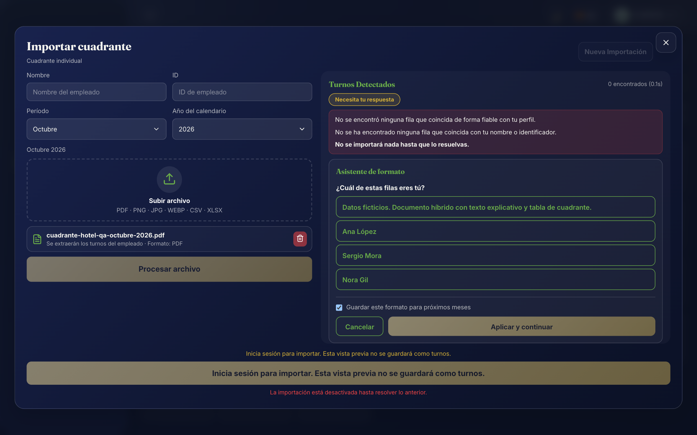

En autoservicio se buscan tus propios turnos. Las filas de compañeros se excluyen. Si no aparece tu identidad, revisa que el archivo sea el correcto y que tu ficha tenga el identificador utilizado por la empresa. Un gestor puede completar la ficha o el acceso desde las opciones de equipo.

### Enseñar un código desconocido

El **Asistente de formato** puede preguntar por códigos, columnas o días. Consulta la leyenda del cuadrante antes de responder.

1. Lee el código que aparece en la pregunta.
2. Decide si representa trabajo, descanso u otro tipo disponible.
3. Si es trabajo, escribe el horario que corresponde a ese código.
4. Repite con las dudas pendientes.
5. Pulsa **Aplicar y continuar** cuando todas las respuestas sean correctas.

**Ejemplo:** la leyenda dice «M = 08:00–16:00». Asocia M a un turno de trabajo y esas horas. Si N significa 22:00–06:00, conserva el cruce de medianoche. No inventes horas para conseguir una importación completa. Si la pregunta contiene un encabezado como «Recepción» que no representa un turno, utiliza **Ignorar este código o color** cuando esa sea la interpretación correcta.

**Resultado esperado:** aparece una vista previa revisable. Si aún hay dudas, el asistente puede hacer otra pregunta. Si no puedes responder con seguridad, cancela y consigue una copia con leyenda o un CSV más claro.

## 10. Revisar, editar y quitar filas antes de guardar

**Qué vas a hacer:** comparar lo detectado con el cuadrante. Esta es la comprobación más importante, incluso cuando el estado parece correcto.

1. Lee el total de **Turnos Detectados**.
2. Revisa **Fecha**, **Tipo**, **Inicio** y **Fin**.
3. Comprueba días libres, vacaciones, noches y cambios de mes.
4. Corrige en la fila los campos editables que no coincidan.
5. Utiliza el botón de eliminar de la fila para quitar lo que no deba importarse.
6. Revisa de nuevo el contador de filas listas y los avisos.

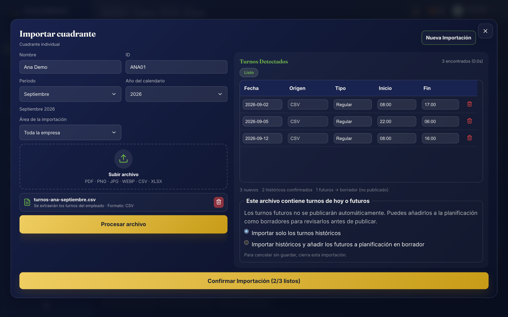

Quitar una fila de esta vista previa no elimina un turno que ya estuviera guardado. Si necesitas recuperar la fila retirada y no hay una acción para deshacer, vuelve a procesar el archivo y repite las correcciones necesarias.

**No debes hacer:** confirmar un resultado solo porque tenga muchas filas. Veintiocho turnos correctos no convierten tres dudosos en correctos. Revisa qué se excluirá antes de aceptar un resultado parcial.

## 11. Entender los estados y decidir sobre turnos futuros

### Leer el aviso antes de actuar

La interfaz distingue el resultado del análisis y el resultado de guardar. «Listo» describe lo que puedes revisar y confirmar; no significa «guardado».

| Situación | Qué significa | Qué debes hacer |
| --- | --- | --- |
| Listo / Correcto | Hay turnos utilizables sin incidencias bloqueantes | Revisar y confirmar si todo coincide |
| Necesita respuesta | Falta identificar una fila o explicar un código | Contestar al asistente |
| Parcial / Revisar | Parte del contenido necesita atención o queda fuera | Corregir y comprobar los recuentos |
| Bloqueado | Hay una incidencia que impide continuar | Resolver el aviso antes de confirmar |
| No compatible / No reconocido | No se ha podido interpretar ese archivo | Usar otro formato o la ayuda disponible |
| Fallo de procesamiento | No terminó el análisis o el guardado | Leer el resultado y reintentar cuando proceda |

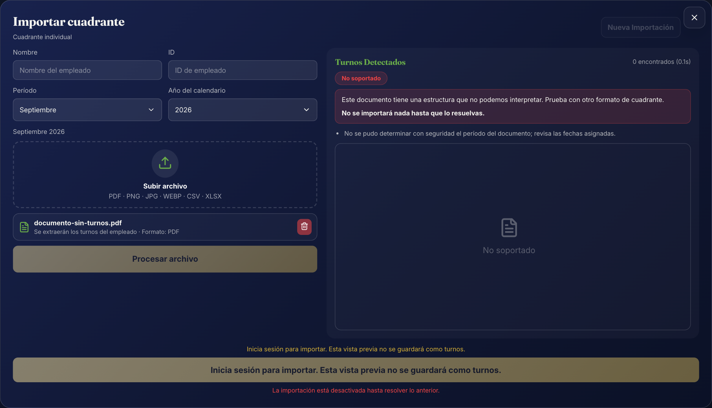

**Cero turnos no es una importación correcta.** Un botón desactivado puede indicar que no quedan filas nuevas, que solo hay fechas futuras excluidas, que falta iniciar sesión o que existe un bloqueo.

### Decidir qué hacer con hoy y el futuro

Si tienes permiso para planificar, un archivo con fechas de hoy o posteriores ofrece dos opciones:

- **Importar solo los turnos históricos:** guarda los anteriores a hoy; los demás quedan fuera.
- **Importar históricos y añadir los futuros a planificación en borrador:** separa las fechas; los futuros quedan pendientes de publicación.

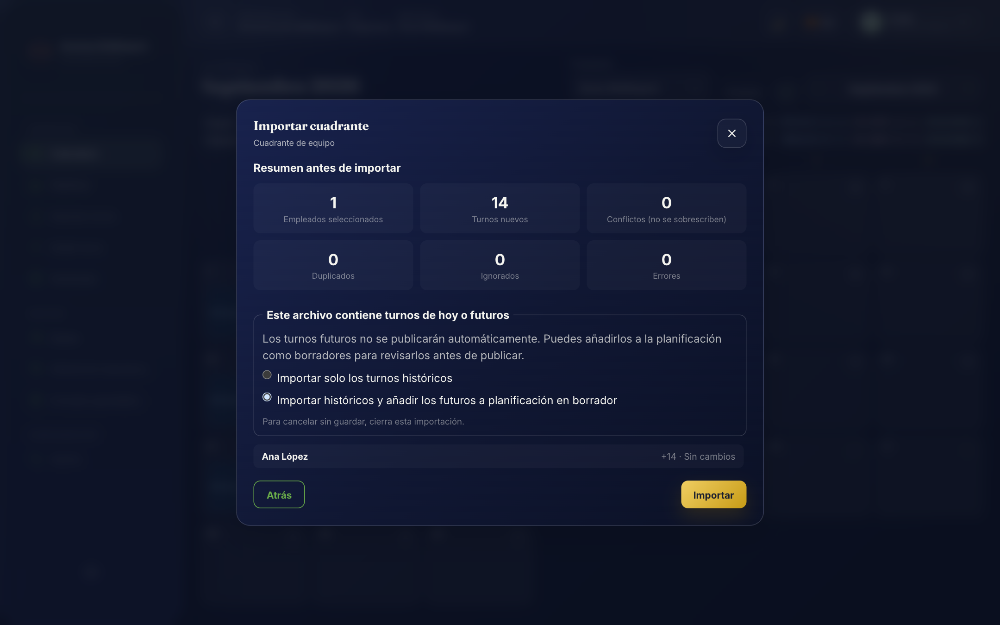

**Si eres empleado**, el autoservicio excluye hoy y el futuro y muestra su recuento. Si el documento solo contiene fechas excluidas, no habrá turnos históricos que guardar. No intentes cambiar sus fechas para incorporarlos.

**Resultado esperado para un gestor:** podrás consultar los pasados en calendario y abrir **Ver planificación** para revisar los borradores. Si el archivo cubre varias semanas, comprueba cada una. Un fallo de permisos sobre el futuro puede bloquear la operación: sigue el resultado concreto y no supongas que se guardó una parte.

## 12. Confirmar y comprobar duplicados o conflictos

### Confirmar una importación individual

**Antes de empezar:** todas las dudas bloqueantes deben estar resueltas y las filas listas deben coincidir con el documento.

1. Revisa el contador del botón **Confirmar Importación**.
2. Comprueba qué se guardará y qué quedará fuera, incluidas las fechas futuras.
3. Pulsa el botón una vez y espera.
4. Lee el resultado completo: turnos creados, ya existentes, excluidos o con error.
5. Comprueba el calendario del mes y empleado correctos; revisa también los borradores si los has creado.

El resultado puede ser completado, parcial, bloqueado o fallido. Lee los recuentos incluso si el título general dice que el proceso terminó. Guarda el contexto del problema —archivo, periodo y aviso— si necesitas ayuda. No compartas el cuadrante completo si basta con describir el error.

### Si vuelves a importar un archivo

ShiftImport reconoce turnos idénticos y evita crear copias. Un aviso como **No hay turnos nuevos para importar** puede indicar que el archivo ya está incorporado. Comprueba el calendario o el historial; no cambies artificialmente las horas para forzar una carga.

### Si hay un horario diferente

En el recorrido individual puede aparecer **Conflicto de importación**, que compara el turno existente y el del archivo. **Omitir turno** conserva el existente; **Actualizar con el archivo importado** utiliza el nuevo; **Abortar proceso** detiene el recorrido. Lee el resultado final, sobre todo si ya se han tratado otras filas.

En el recorrido de equipo, el resumen identifica **Conflictos (no se sobrescriben)**. No presupongas que se aplicará la misma ventana de reemplazo individual. Resuelve los turnos pendientes con el gestor y el recorrido de edición o planificación correspondiente.

Eliminar una fila del nuevo archivo no borra automáticamente un turno de una importación anterior. Compara siempre el resultado, no solo el nombre del archivo.

## 13. Importar un cuadrante de equipo

**Quién puede hacerlo:** propietario o administrador con la función disponible en su plan. **Necesitas:** identificar a los empleados, el periodo y el área de destino.

1. Abre **Importar turnos**, revisa el área y pulsa **Elegir archivo** para seleccionar el archivo de equipo.
2. Cuando se detecten varias personas, revisa el recorrido **Cuadrante de equipo**. Si se detecta una sola, la aplicación puede pasar al recorrido individual con su identidad propuesta.
3. Comprueba las coincidencias de cada empleado y resuelve las ambiguas.
4. Selecciona las personas cuyos turnos vas a incorporar.
5. Pulsa **Continuar**.
6. Lee **Resumen antes de importar**, incluyendo nuevos, conflictos, sin cambios, duplicados, ignorados y errores.
7. Decide qué hacer con las fechas futuras si corresponde.
8. Pulsa **Importar** y revisa el resultado por empleado.

| Identificación | Qué debes comprobar |
| --- | --- |
| Reconocido | Que el nombre y el identificador corresponden a la persona correcta |
| Nuevo | Que no existe ya con otro nombre o código; crear la ficha no concede acceso |
| Ambiguo | Elegir una coincidencia inequívoca antes de seleccionar |
| Existente — Inactivo | Resolver la situación con un administrador; no crear un duplicado |
| Pendiente de activación | Completar el alta o vínculo indicado antes de importar sus turnos |

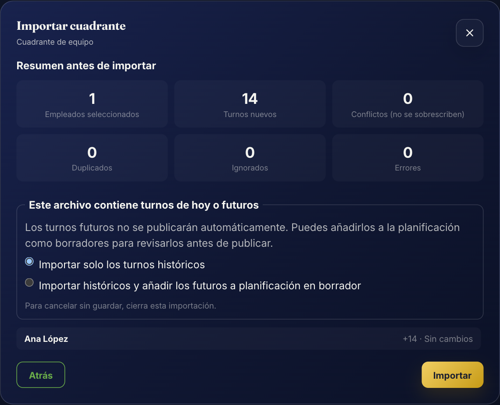

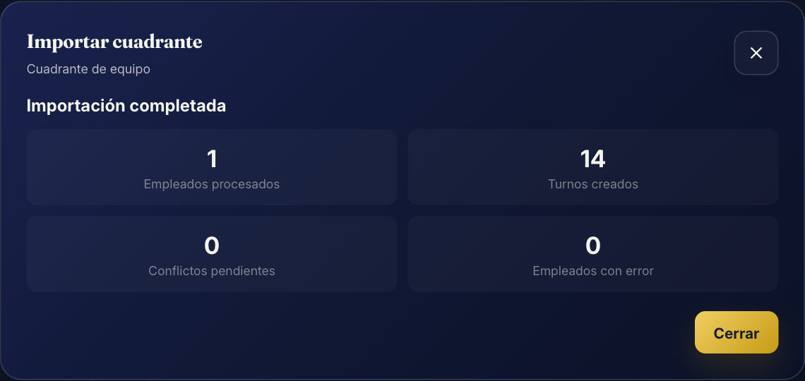

**Excel con varias hojas:** revisa cuántas se procesaron y cuántas se ignoraron. Una hoja de notas puede ignorarse; una hoja de turnos que falta exige atención. **JSON/XML:** utiliza archivos con una estructura de empleados, fechas y horarios reconocible; no cualquier exportación será compatible.

En la navegación verificada, un planificador no dispone de este recorrido de importación de equipo; para incorporar el archivo, debe intervenir un propietario o administrador. Puede seguir utilizando la planificación dentro de su ámbito.

**No confundas tres operaciones:** importar un cuadrante crea turnos; importar empleados crea fichas; importar usuarios concede accesos. Las dos últimas se explican en el capítulo 24.

## 14. Enseñar y administrar formatos aprendidos

Un **formato aprendido** recuerda cómo leer una estructura de cuadrante y qué significan sus códigos. No es una copia de todos tus turnos. En una organización puede reutilizarse por otros miembros de esa misma organización.

### Enseñar y reutilizar

1. Importa el documento y responde al asistente del capítulo 9.
2. Comprueba la vista previa antes de continuar.
3. En el siguiente archivo de la misma estructura, verifica si la lectura se resuelve con menos preguntas.
4. Revisa igualmente fechas y horarios: una plantilla puede cambiar de mes a mes.

Si no se pudo guardar el aprendizaje, la aplicación puede avisarte aunque el análisis o la importación hayan terminado. No repitas una importación ya guardada solo para aprender el formato.

### Administrar la biblioteca

Abre **Formatos aprendidos**. Cuando tus permisos lo permitan, **Renombrar** ayuda a distinguir plantillas; **Confirmar** valida un candidato que ya has revisado; **Desactivar** lo retira de la selección habitual; **Reactivar** lo vuelve a habilitar.

| Estado | Lectura sencilla |
| --- | --- |
| Candidato | Aprendizaje reciente que conviene comprobar |
| Validado | Formato confirmado |
| Verificado | Acumula usos correctos según los controles de la aplicación |
| Anterior | Versión previa conservada tras un cambio de estructura |
| Desactivado | Retirado de uso por una acción de gestión |

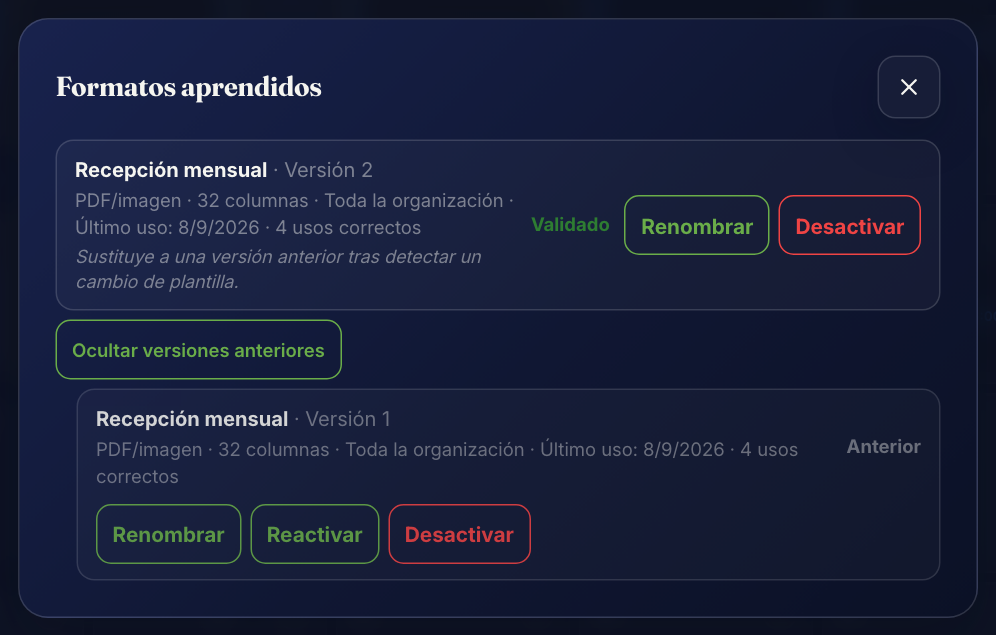

Utiliza **Ver versiones anteriores** cuando aparezca. Dos entradas parecidas pueden ser versiones distintas, no duplicados que debas borrar. Comprueba tipo, columnas y versión antes de desactivar. No hay que volver a enseñar un formato solo porque cambie el nombre de un empleado.

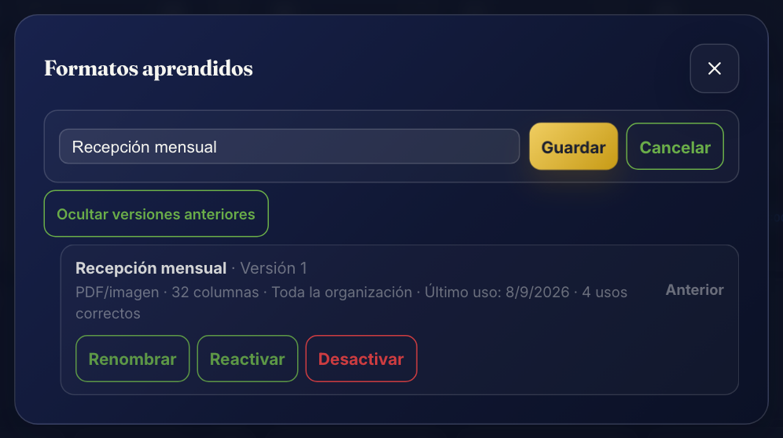

**Privacidad práctica:** pon nombres como «Recepción mensual» y evita nombres de personas o datos sensibles en la etiqueta. El aprendizaje describe reglas de lectura; los datos de las personas y sus turnos se gestionan por separado.

## 15. Consultar el historial de importaciones

El historial te permite ver qué archivo se importó, cuándo, quién lo hizo y cuántos turnos se crearon. También te ayuda a distinguir una carga nueva de un intento que quedó bloqueado, parcial o fallido. Su alcance depende de tu sesión y permisos.

1. Abre **Historial de importaciones**.
2. Busca el archivo y el periodo que necesitas.
3. Lee modo, área o alcance, persona que importó y balance de turnos.
4. Consulta el estado y el motivo disponible si no terminó correctamente.
5. Usa los filtros y la paginación para localizar otras cargas.

### Filtrar sin perder resultados

Puedes acotar por ámbito, tipo, formato o estado. Si no aparece una carga, vuelve a todos los valores y revisa la página y la organización. Los filtros de formato no necesariamente ofrecen todas las extensiones que puede leer el importador: usa el conjunto sin filtrar si no ves la opción que buscas.

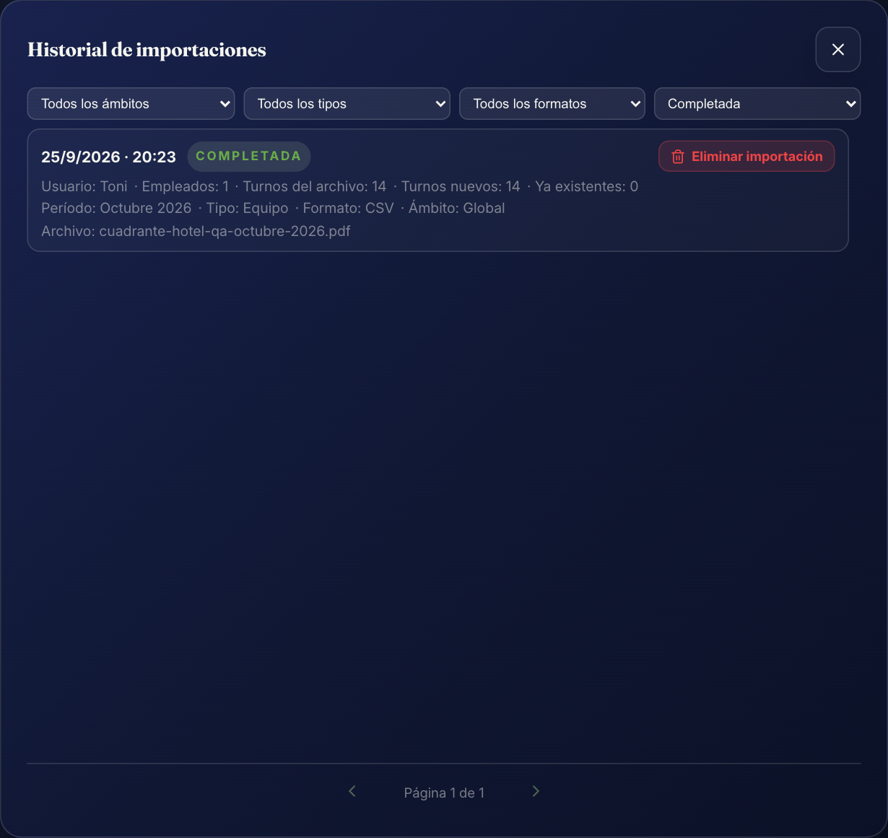

**Ejemplo:** Carlos importó un CSV y no encuentra todos los turnos. Localiza la carga y compara detectados, creados y existentes. «Ya existentes» no significa «perdidos». «Parcial» requiere leer qué quedó fuera.

## 16. Eliminar una importación sin restablecer la organización

**Quién puede hacerlo:** propietario o administrador. **Cuándo usarlo:** cuando un archivo equivocado ha creado turnos que deben retirarse. Comprueba primero el nombre, el periodo y el empleado o equipo afectado.

1. Abre **Historial de importaciones**.
2. Localiza la importación exacta.
3. Pulsa su acción **Eliminar importación**.
4. Lee el diálogo y confirma solo si es la carga correcta.
5. Comprueba el estado **Eliminada** y el calendario.

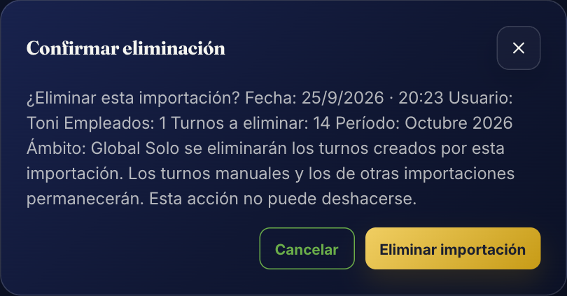

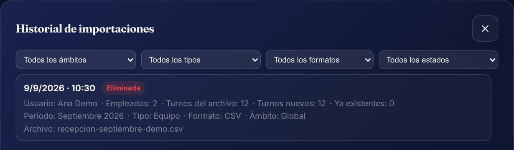

Se eliminan los turnos guardados vinculados a esa importación. Los turnos manuales independientes y los de otras importaciones no se borran por esa acción. La fila del historial permanece marcada como eliminada. No hay un botón general de deshacer: conserva el archivo si después necesitas volver a importarlo.

**Si creó planificación futura**, revisa también las semanas afectadas: no utilices este borrado como sustituto de revisar o modificar borradores y versiones publicadas. El historial de importación y la planificación son recorridos distintos.

| Acción | Qué abarca | Uso adecuado |
| --- | --- | --- |
| Eliminar una importación | Los turnos asociados a una carga concreta | Corregir un archivo equivocado |
| Eliminar un turno | El turno que estás revisando | Corrección puntual autorizada |
| Restablecer la organización | Turnos, importaciones y empleados de toda la organización | Reinicio operativo deliberado |

No restablezcas toda la organización para corregir una sola carga.

## 17. Preparar una semana en el Planificador

**Quién puede hacerlo:** propietario, administrador y planificador dentro de su ámbito. **Necesitas:** empleados activos, fechas de hoy o posteriores y el contexto correcto.

1. Pulsa **Planificar**.
2. Comprueba la semana y el contexto.
3. Si aparece **Crear borrador semanal**, púlsalo.
4. Selecciona **Todos los empleados** o busca una persona.
5. Usa **Cuadrícula** o **Tabla accesible**, según te resulte más cómodo.

### Leer la cuadrícula

La intersección de un empleado y un día muestra sus turnos. El control para añadir en esa celda abre el editor con esa persona y fecha. Las flechas cambian de semana; el planificador no permite navegar a una semana completamente pasada. Puedes elegir el inicio de semana disponible en esta vista.

Un **borrador** es una propuesta editable. Guardar un turno en él todavía no cambia lo que ve el empleado como planificación publicada. Si otra persona trabaja sobre la misma semana, comprueba el estado actual antes de editar.

### Si no hay empleados o no hay ámbito

No crees personas de relleno para abrir la cuadrícula. Comprueba el filtro y si existen empleados activos en el contexto. Si aparece un aviso de ámbito, un administrador debe revisar la asignación del planificador. No todos los responsables necesitan un área: el ámbito también puede ser toda la organización o empleados concretos.

## 18. Añadir, editar y comprobar turnos del borrador

**Qué vas a hacer:** asignar horarios futuros sin publicarlos aún.

1. En la fila de la persona y el día correcto, pulsa la acción de añadir.
2. Comprueba **Empleado** y **Fecha** en **Añadir turno**.
3. Introduce **Inicio**, **Fin** y, si procede, **Ubicación**.
4. Guarda y comprueba la celda.
5. Para corregir, abre **Editar turno**, cambia los campos y guarda.
6. Para retirar una propuesta, usa **Eliminar turno** y lee la confirmación.

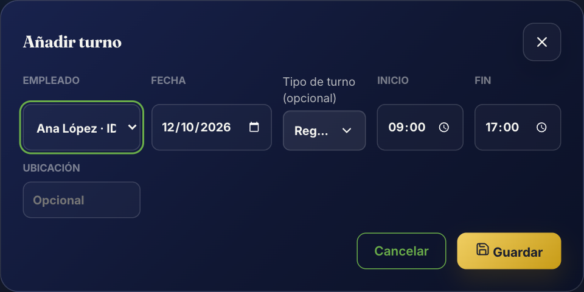

### Resolver conflictos

| Aviso | Qué comprobar |
| --- | --- |
| El horario se solapa con otro turno | Revisa los dos intervalos del mismo empleado y corrige uno |
| Menos de 11 horas de descanso | Ajusta el final de una jornada o el inicio de la siguiente |
| La versión ya no es editable | Recarga; otra persona puede haber publicado |
| El turno queda fuera del ámbito | Vuelve al empleado o área que puedes gestionar |

El umbral de once horas es una comprobación de la aplicación. No constituye una evaluación completa del convenio o de todas las reglas laborales aplicables.

**Ejemplo:** si Carlos acaba a las 23:00, empezar a las 08:00 del día siguiente deja nueve horas. Revisa el aviso y acuerda un horario correcto antes de guardar. No cambies de empleado para evitarlo.

## 19. Publicar, crear otra versión y consultar el historial

### Publicar la semana

**Antes de empezar:** revisa empleados, días, horas, ubicaciones, descansos y exclusiones. Publicar hace visibles los turnos en el calendario operativo.

1. Abre el borrador que has comprobado.
2. Pulsa **Publicar**.
3. Lee **Publicar planificación** y el número de turnos.
4. Pulsa **Confirmar publicación**.
5. Lee el resultado y comprueba el calendario o portal correspondiente.

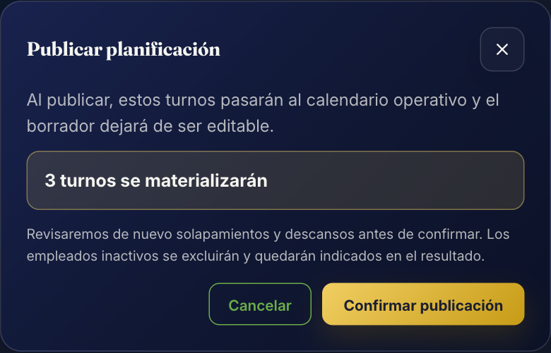

La publicación vuelve a comprobar conflictos y descansos. Los empleados inactivos pueden quedar excluidos y deben figurar en el resultado. No comuniques que toda la semana está publicada hasta revisar esos recuentos.

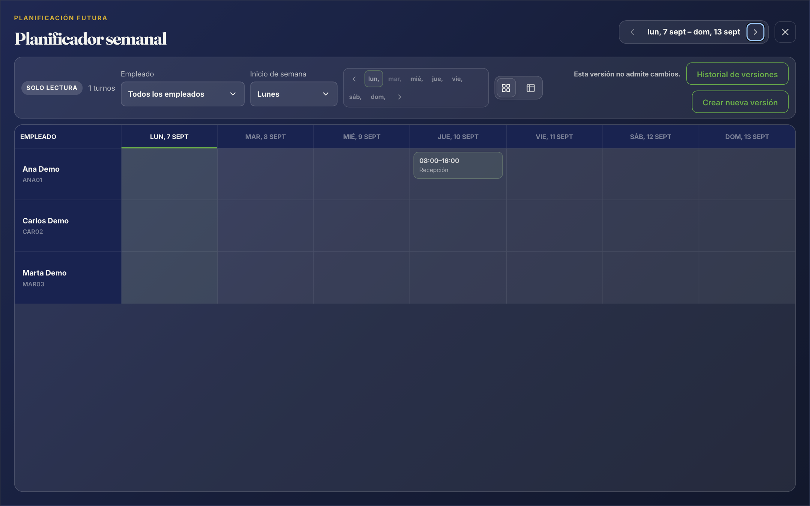

### Cambiar una semana publicada

Pulsa **Crear nueva versión** para obtener un borrador de trabajo a partir de la planificación existente. Revisa y ajusta sus turnos; después vuelve a publicar. Crear la versión no comunica por sí solo el cambio como horario publicado.

### Consultar versiones

Abre **Historial de versiones**. Compara número, estado, fecha de creación y fecha de publicación. **Ver versión** abre una versión concreta; **Volver a la versión actual** recupera el contexto vigente. El historial muestra versiones, no una comparación exhaustiva de cada campo modificado.

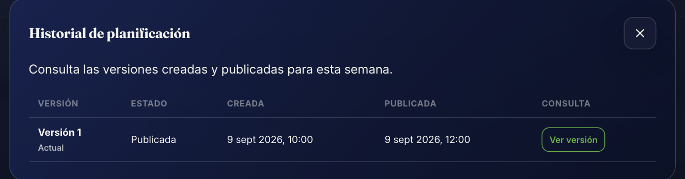

## 20. Guía rápida para el empleado: tu calendario y tus turnos

Puedes utilizar este capítulo sin aprender a administrar una empresa. Necesitas entrar con la cuenta vinculada a tu ficha de empleado y elegir la organización correcta, si tienes varias.

### Tu primer acceso

1. Abre **Iniciar sesión** y utiliza el correo y la contraseña que corresponden a tu acceso.
2. Comprueba tu nombre y la organización.
3. En **Calendario**, revisa el mes visible y tu nombre de empleado.
4. Localiza el día que necesitas consultar.

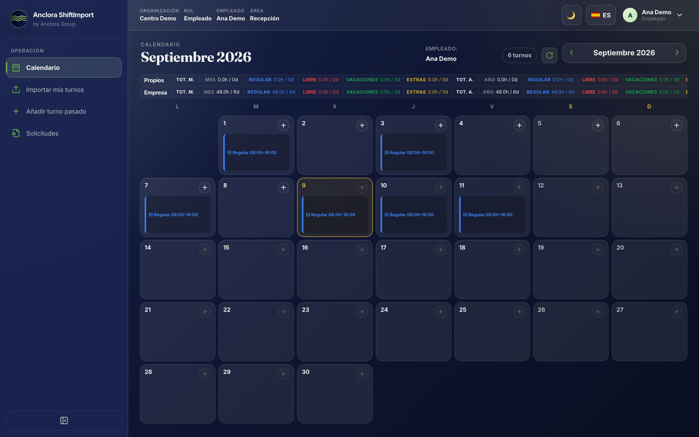

La navegación actual utiliza un calendario mensual compartido con el resto de perfiles, adaptado a tus permisos. No necesitas buscar pestañas independientes llamadas Hoy o Semana: consulta el día o la semana dentro del mes.

### Consultar hoy o una semana concreta

Busca el día de hoy en la cuadrícula. Para otra semana, cambia de mes con **Mes anterior** o **Mes siguiente** cuando sea necesario y recorre sus días de izquierda a derecha. Si una semana cruza de mes, comprueba ambos meses. Lee el nombre del tipo y el horario, no solo el color.

Si no aparece un turno que esperabas, verifica la cuenta, el mes y la comunicación de tu empresa. Puede que la planificación aún esté en borrador. Una casilla vacía no equivale por sí sola a un día libre confirmado ni a vacaciones aprobadas.

### Ver el turno asociado a una solicitud

Desde **Solicitudes**, pulsa **Ver turno asociado**. Se abre el turno y el calendario se sitúa en su mes. Comprueba fecha y horas y cierra la ventana para volver a consultar. El título de esta ventana puede ser **Actualizar Turno**; para pedir cambios sobre un turno oficial utiliza el recorrido de solicitud, sin intentar saltarte los permisos.

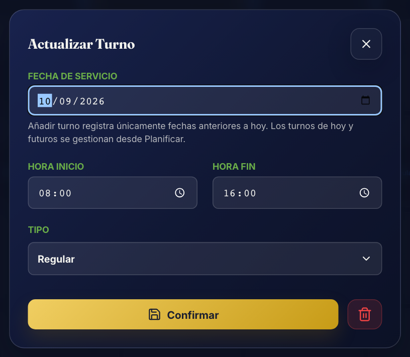

En esta navegación no se ofrece un control de **Confirmar recepción**. No confundas **Confirmar**, en un formulario de alta o edición, con dejar constancia de haber visto un turno. Tampoco hay un fichaje de entrada o salida en este recorrido.

### Importar tus turnos o registrar uno pasado

**Importar mis turnos** abre el recorrido de los capítulos 7–12: revisa tu identidad y los recuentos. Los turnos ajenos y las fechas de hoy o posteriores quedan fuera del autoservicio. **Añadir turno pasado** sirve para registrar una fecha anterior a hoy que falta, siguiendo el capítulo 6.

**Si necesitas cambiar un horario publicado**, abre **Solicitudes → Nueva solicitud**. Explica qué cambio necesitas y consulta después su estado. El capítulo siguiente te acompaña en ese proceso.

## 21. Solicitar un cambio y consultar su resolución

### Enviar tu solicitud

**Quién puede hacerlo en este recorrido:** empleado con su cuenta vinculada.

**Cuándo usarlo:** cuando necesitas cambiar un turno y quieres que quede una petición visible. La solicitud no modifica por sí sola el horario publicado.

1. Entra en **Solicitudes → Nueva solicitud**.
2. Comprueba **Turno afectado**.
3. Elige **Cambio de horario** u **Otro motivo**.
4. Para un horario distinto, completa las nuevas horas.
5. Escribe el **Motivo** y pulsa **Enviar solicitud**.
6. Comprueba el mensaje de envío y el estado **Pendiente**.

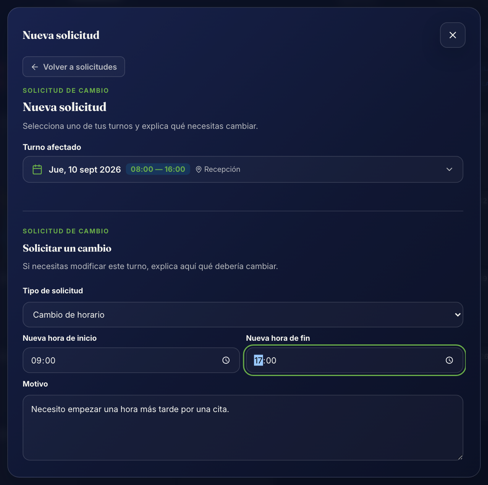

**Ejemplo:** Ana solicita empezar a las 09:00 y acabar a las 17:00 por una cita. Hasta que se resuelva, no debe dar ese horario por confirmado. No envíes varias solicitudes idénticas si una sigue pendiente.

### Consultar o cancelar

En **Solicitudes**, filtra por estado y abre la petición. Revisa **Pendiente**, **Aprobada**, **Rechazada** o **Cancelada**, y el motivo de resolución disponible. **Ver turno asociado** permite comprobar el turno correspondiente. Si una petición pendiente ya no hace falta, usa **Cancelar solicitud** cuando esté disponible.

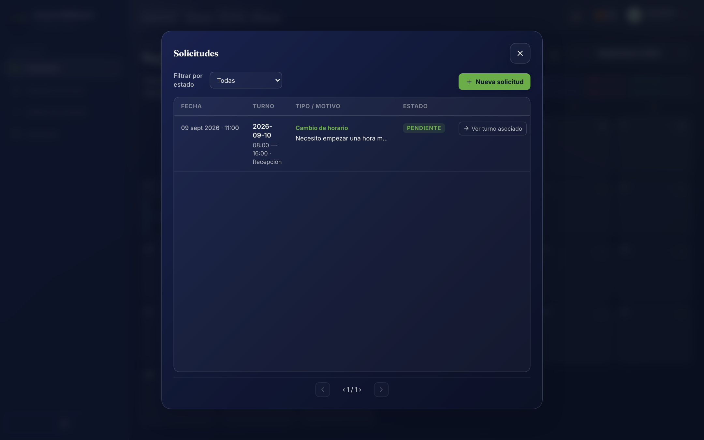

### Resolver una solicitud como gestor

1. Abre **Solicitudes** o **Solicitudes pendientes**.
2. Lee persona, turno, horario propuesto y motivo.
3. Comprueba tu ámbito y la política de solicitudes de la organización.
4. Pulsa **Aprobar** si procede, o **Rechazar** e indica el motivo requerido.
5. Comprueba que la petición queda resuelta y revisa el turno afectado.

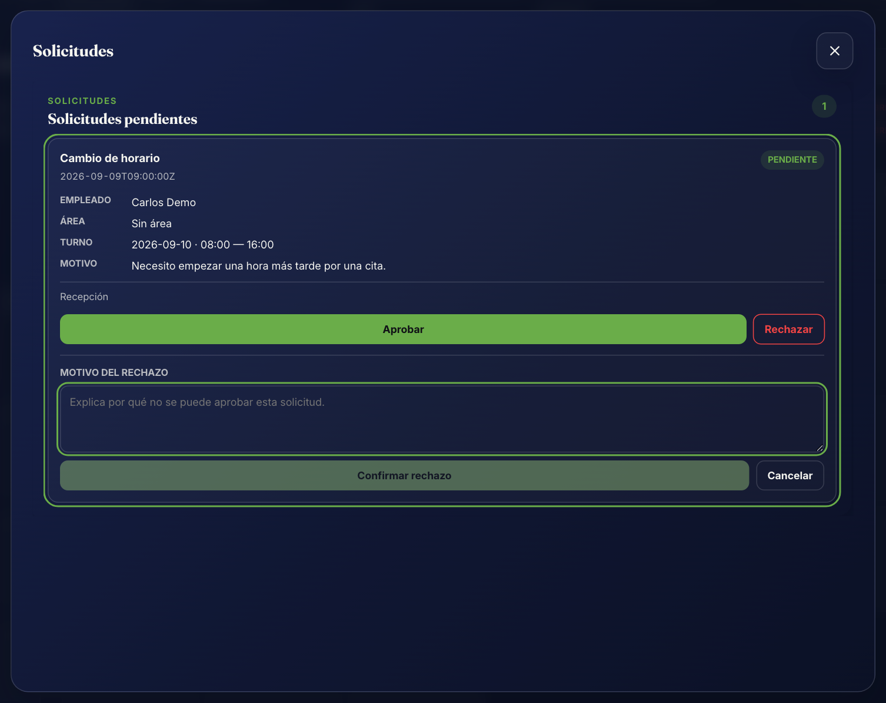

En un cambio de horario aprobado, comprueba las horas resultantes. «Otro motivo» no aporta por sí mismo un horario nuevo. Si eres la persona solicitante, otro gestor debe resolver la petición. Las solicitudes que puedas atender dependen también de la política configurada en Ajustes.

## 22. Entender personas, empleados y cuentas

**Empleado** es la persona que aparece en el cuadrante. **Usuario** es la cuenta con la que entra en ShiftImport. Una misma persona puede tener ambas cosas, solo ficha de empleado o solo acceso para gestionar.

| Ejemplo | Qué necesita |
| --- | --- |
| María trabaja por turnos pero aún no entra en la aplicación | Ficha de empleada |
| Se concede acceso a María | Ficha María + usuario maria@example.test vinculados |
| Luis administra, pero no trabaja por turnos | Cuenta con rol de gestión; ficha de empleado opcional |

No crees otra ficha de María solo porque ahora necesita una contraseña. Vincula su acceso con la ficha existente para que consulte los turnos que le corresponden.

### Añadir una persona

**Quién puede hacerlo:** propietario o administrador. **Antes de empezar:** comprueba si la persona ya aparece en la búsqueda y ten su nombre, correo si va a tener acceso e identificador si lo usa el cuadrante.

1. Abre **Equipo → Personas** y pulsa **Añadir persona**.
2. En **Identidad**, indica el nombre.
3. En **Acceso**, decide si necesita una cuenta.
4. En **Empleo**, decide si necesita ficha de empleado y completa sus datos.
5. Revisa el rol y su ámbito; el paso puede mostrarse como **Scope**.
6. Revisa **Confirmación** y confirma el alta.
7. Si aparecen credenciales, guárdalas antes de cerrar.

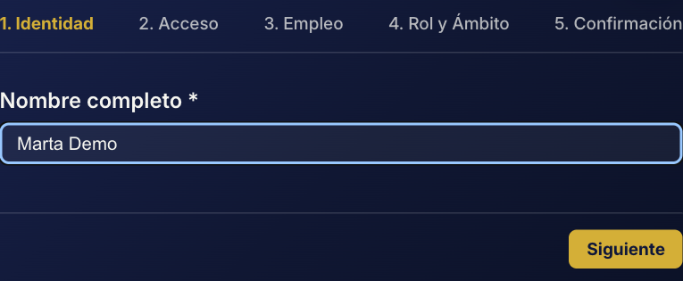

Crear una ficha y conceder acceso son decisiones separadas. Revisa el estado final: una persona **pendiente de activación** puede necesitar completar su alta antes de recibir turnos por importación. Sigue **Completar alta** cuando el resultado lo indique.

## 23. Roles, áreas, asignaciones y propiedad

### Cambiar un rol o el alcance de un planificador

**Quién puede hacerlo:** propietario o administrador, con la protección especial del propietario.

1. Abre **Equipo → Roles y acceso**.
2. Localiza a la persona por nombre y correo.
3. Pulsa **Cambiar rol** o **Gestionar ámbito**, según la tarea.
4. Elige el rol y, para planificación, toda la organización, áreas o empleados.
5. Guarda y comprueba el resumen de la persona.

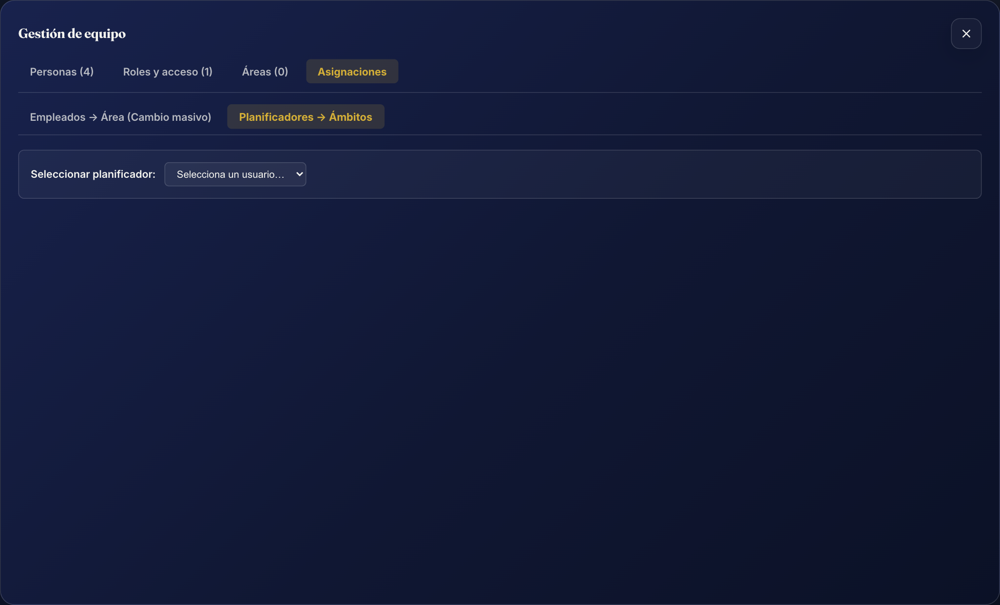

**Revocar acceso** impide utilizar ese acceso a la organización; no lo utilices para borrar el historial de un empleado ni para recuperar una contraseña. El administrador no puede modificar la condición del propietario.

### Crear o modificar un área

Las áreas son opcionales. Sirven para agrupar, por ejemplo, Recepción y Mantenimiento. En **Equipo → Áreas**, utiliza **Nueva área**, completa el nombre y el código opcional, y guarda. **Editar** permite revisar los datos y si el área está activa. Comprueba las personas asociadas antes de desactivarla.

### Mover varias personas a un área

1. Abre **Equipo → Asignaciones**.
2. Busca y selecciona a los empleados afectados.
3. Elige el área de destino o la opción sin área, si procede.
4. Indica la fecha a partir de la cual entra en vigor el cambio.
5. Revisa el número seleccionado, aplica el cambio y comprueba el mensaje.

Esta fecha permite distinguir el cambio nuevo de asignaciones anteriores. No la confundas con la fecha de un turno. Para delegar planificación, utiliza el apartado de ámbitos de planificadores; mover empleados y conceder permisos son tareas diferentes.

### Transferir la propiedad

Solo el propietario activo puede hacerlo. En **Roles y acceso**, pulsa **Transferir propiedad**, selecciona el nuevo titular y el rol que conservará el anterior, lee la advertencia y completa la confirmación. Comprueba la nueva titularidad al terminar. No se realiza escogiendo Propietario en un cambio de rol ordinario.

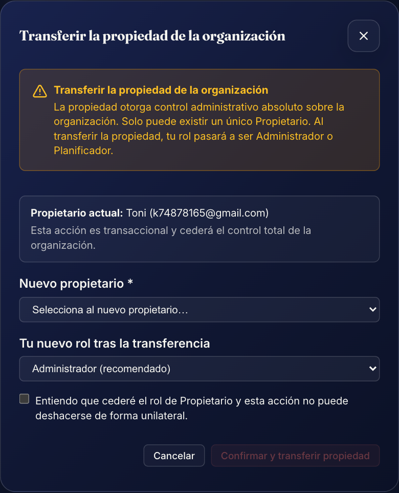

No transfieras la titularidad para dar permisos temporales. Para eso, utiliza los roles y ámbitos adecuados.

## 24. Dar de alta muchos empleados o usuarios mediante CSV

**Quién puede hacerlo:** propietario o administrador con la gestión de equipo habilitada. **Ruta:** **Ajustes → Equipo → Abrir Usuarios** abre **Usuarios de la organización**, con pestañas **Usuarios** y **Empleados**.

### Primero: importar fichas de empleados

Prepara un CSV con las cabeceras **external_employee_id** y **name**. La columna **area** es opcional. Los nombres de cabecera se escriben así para que la aplicación los reconozca; son las únicas palabras técnicas que necesitas conservar en el archivo.

| external_employee_id | name | area |
| --- | --- | --- |
| ANA01 | Ana Demo | Recepción |
| CAR02 | Carlos Demo | Recepción |

1. Abre la pestaña **Empleados**.
2. Pulsa **Importar empleados CSV** y selecciona el archivo.
3. Revisa filas nuevas, existentes y con error.
4. Corrige en el archivo las filas erróneas y vuelve a cargarlo si es necesario.
5. Pulsa **Confirmar importación** cuando el resumen sea correcto.
6. Lee creados, actualizados y filas con error.

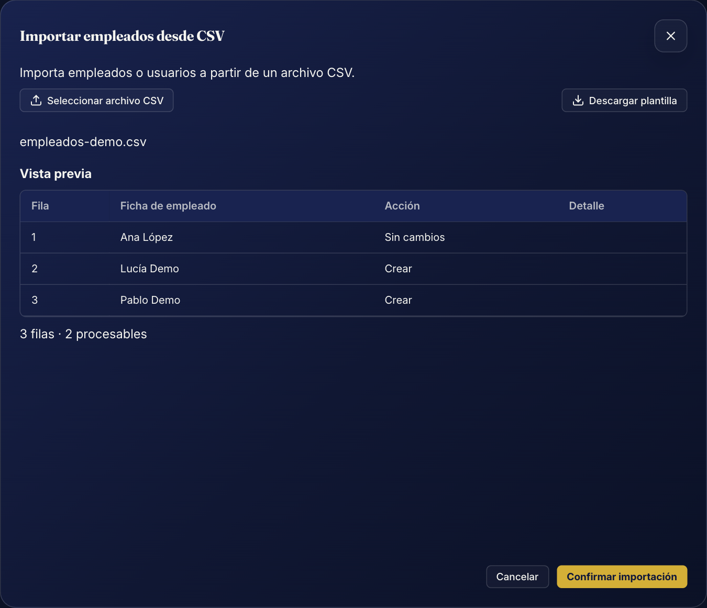

El alta de empleados **no crea cuentas**, aunque el archivo incluya un correo. Un identificador existente puede corresponder a una ficha que se actualiza; no cambies el código para eludir una coincidencia. Un área desconocida produce una incidencia: créala o corrige su nombre antes de reintentar.

### Después: importar accesos de usuarios

Prepara un CSV con **email** y **role**. Puedes añadir **name** y **external_employee_id** para vincular cada cuenta a un empleado que ya existe. Para roles habituales utiliza **ADMIN**, **PLANNER** o **EMPLOYEE**. La propiedad se gestiona mediante el recorrido específico del capítulo 23.

| email | name | role | external_employee_id |
| --- | --- | --- | --- |
| ana@example.test | Ana Demo | EMPLOYEE | ANA01 |
| carlos@example.test | Carlos Demo | PLANNER | CAR02 |

1. En **Usuarios**, pulsa **Importar CSV**.
2. Comprueba correo, rol y empleado vinculado en la vista previa.
3. Corrige correos incompletos, roles no válidos o vínculos que no correspondan.
4. Pulsa **Confirmar importación**.
5. Lee usuarios creados, existentes, vinculados y errores.
6. Descarga las credenciales generadas antes de cerrar.

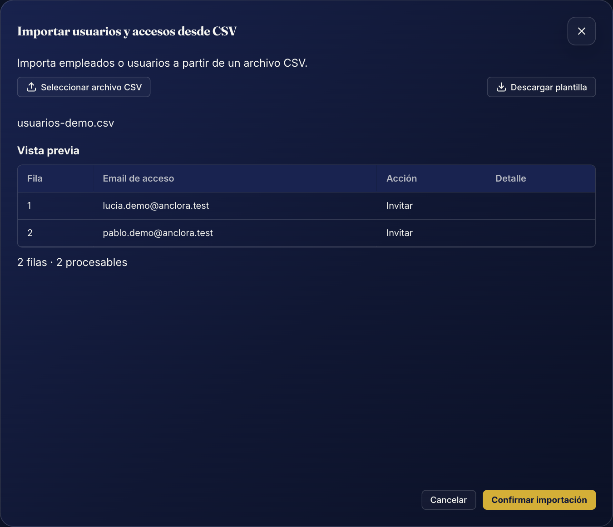

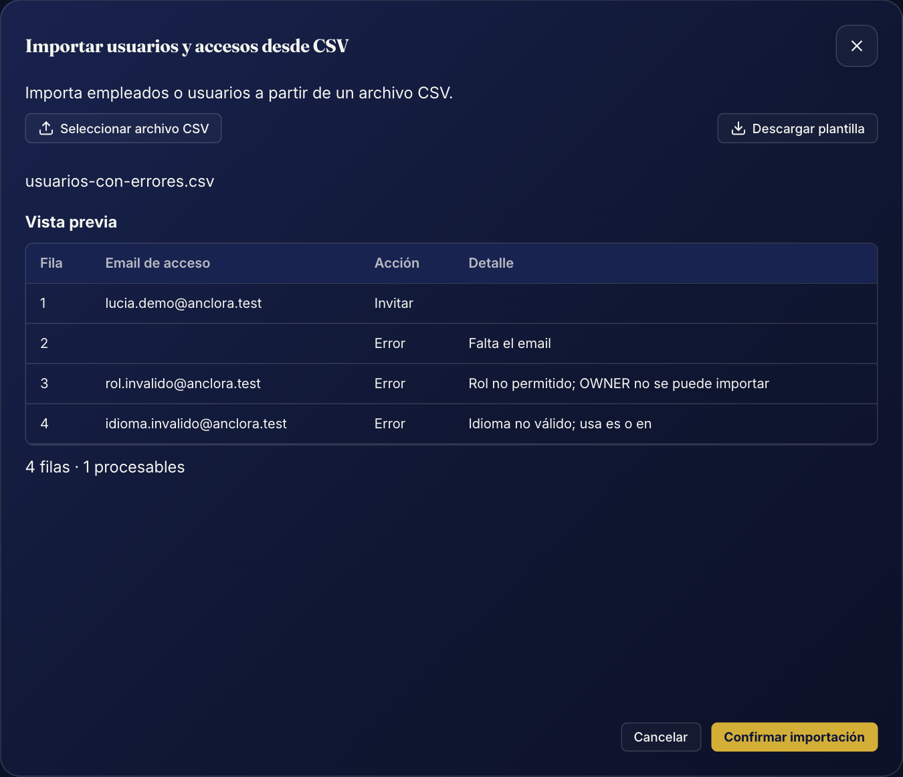

La importación de usuarios **no crea empleados nuevos**. Si necesitas ambos, crea las fichas primero. Un usuario ya existente no recibe necesariamente una contraseña nueva. Revisa el resultado fila a fila y no entregues credenciales atribuidas a otra persona.

## 25. Guardar y entregar las credenciales iniciales

Las credenciales aparecen cuando se crea una cuenta nueva con contraseña generada. Se muestran en ese momento para que puedas entregarlas. No son una lista que puedas recuperar después desde el historial.

1. Al terminar el alta, revisa para qué usuarios se generaron credenciales.
2. Pulsa **Descargar credenciales (.txt)** si aparece en el resultado masivo.
3. Comprueba que el navegador descargó el archivo.
4. Entrega a cada persona únicamente su correo y su contraseña.
5. Guarda o elimina la copia de forma acorde con las normas de tu organización.

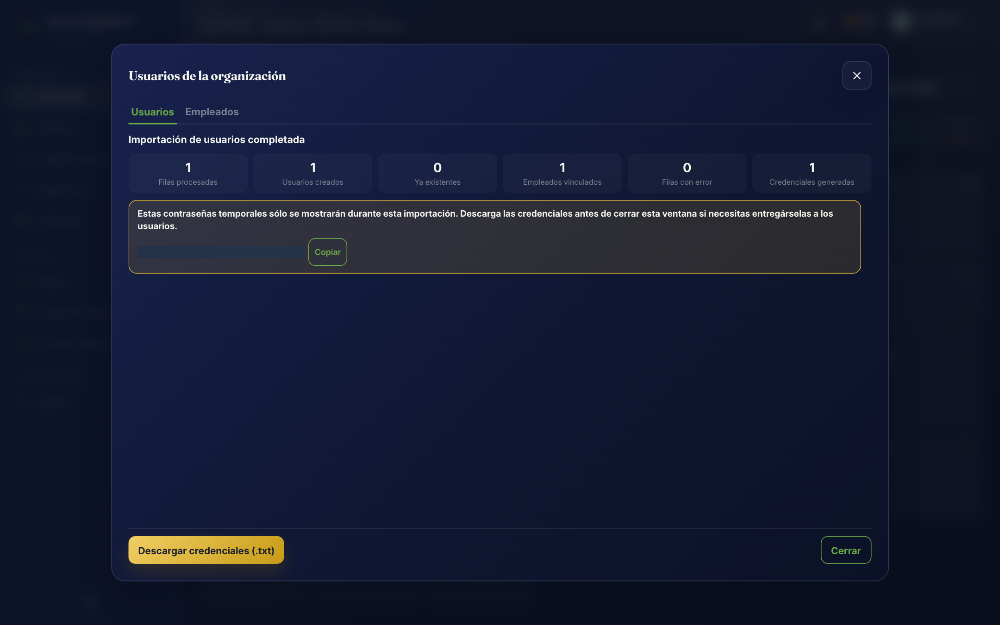

> **SEGURIDAD:** el TXT contiene contraseñas legibles; no es un archivo cifrado. No lo envíes a todo el equipo ni lo adjuntes a un cuadrante compartido. Utiliza un canal privado y comprueba el destinatario.

**«Se muestra una vez» no significa «solo permite un inicio de sesión».** Tampoco debes suponer que se exige automáticamente cambiarla en el primer acceso.

### Si pierdes una contraseña

Primero comprueba si la descargaste durante el alta. No puedes recuperar el valor anterior volviendo a abrir la ventana. No revoques y concedas acceso esperando que cambie la contraseña de una cuenta ya existente.

En el acceso, **¿Olvidaste tu contraseña?** abre el formulario de recuperación. Introduce tu correo y sigue el aviso. El mensaje de solicitud no confirma por sí mismo que se haya entregado un correo. Si no recibes el enlace, utiliza el contacto de soporte mostrado en la aplicación; la entrega automática no está verificada en esta edición. Si recibes un enlace válido, úsalo para establecer una contraseña nueva y vuelve a iniciar sesión.

## 26. Perfil, tipos de turno, idioma y tema

### Ajustar tu perfil

Si tu navegación ofrece **Ajustes**, abre **Ajustes → Perfil**. Revisa el nombre y los identificadores que se muestran para tu uso. Los controles disponibles dependen de si estás como invitado, empleado o gestor. Guarda los cambios con la acción disponible y comprueba el resultado. Cambiar tu nombre de perfil no concede permisos ni sustituye un vínculo de empleado incorrecto.

### Crear y mantener tipos de turno

1. Con un perfil de propietario o administrador, abre **Ajustes → Tipos de turno**.
2. Crea un tipo o edita uno existente.
3. Comprueba nombre, código, color y si **cuenta como trabajo**.
4. Guarda y comprueba cómo se presenta en los selectores.
5. Archiva un tipo que ya no quieras utilizar para nuevas selecciones.

**Ejemplo:** «Formación» puede tener su propio color y contar como trabajo. «Libre» no debe sumar ocho horas por tener un color similar. Las preferencias de tipos se conservan en el navegador del usuario; no supongas que editar un color lo cambia para toda la organización o en todos tus dispositivos.

### Cambiar idioma y apariencia

Utiliza el control **ES / EN** para alternar español e inglés. El botón de tema permite cambiar la apariencia entre las opciones disponibles. El calendario mensual utiliza lunes como primer día en ambos idiomas. Cambiar el idioma o el tema no cambia los turnos.

Si buscas un botón descrito en español y ves la interfaz en inglés, vuelve temporalmente a ES para seguir los pasos. El modo oscuro es la referencia visual de este manual.

## 27. Planes, privacidad y restablecimiento

### Qué cambia según el plan

| Plan | Empleados | Importaciones mensuales | Funciones destacadas |
| --- | --- | --- | --- |
| Free | 1 | 5 | Prueba del uso individual e historial básico |
| Personal | 1 | Sin límite configurado | Uso individual e historial completo |
| Team | Sin límite configurado | Sin límite configurado | Importación multiempleado y gestión de equipo |

Consulta **Precios** antes de elegir. La selección de plan en el recorrido actual no equivale por sí misma a realizar un pago. Los precios mostrados pueden ser orientativos y cambiar; este manual no fija condiciones comerciales. El rol determina la autoridad y el plan determina las funciones disponibles.

### Cookies y documentos

En el aviso de cookies puedes **Aceptar todas**, abrir **Configuración** o **Rechazar opcionales**. Puedes volver a **Cookies** desde el pie de la página. Las necesarias mantienen las funciones esenciales; las opcionales se eligen según tus preferencias.

El archivo original no se conserva como un documento descargable del historial. Los turnos extraídos y los datos necesarios de la importación sí pueden persistirse. La lectura ordinaria utiliza el navegador; un análisis visual adicional autenticado puede enviar imágenes al servicio de análisis. No presupongas que todos los recorridos son exclusivamente locales.

ShiftImport aplica controles de acceso y separación por organización. Esto no justifica promesas de riesgo cero. Utiliza solo documentos que estés autorizado a tratar y consulta **Privacidad**, **Términos** y **Aviso legal** en la aplicación para la información publicada del servicio.

### Restablecer la organización

**Solo propietarios y administradores.** Esta acción es para un reinicio operativo deliberado, no para resolver un error puntual.

1. Abre **Ajustes → Equipo** y localiza **Restablecer la situación inicial**.
2. Lee la explicación y comprueba la organización activa.
3. Escribe **RESTABLECER** cuando se solicite.
4. Confirma únicamente si quieres eliminar los datos operativos indicados.
5. Revisa el resultado antes de volver a crear empleados o importar.

Se eliminan turnos, importaciones y fichas de empleados, incluidas las vinculadas a gestores. Se conservan la organización, las cuentas y sus accesos, el plan, las áreas y los formatos aprendidos. No es una eliminación de cuenta. Si solo necesitas retirar un archivo, utiliza el capítulo 16.

## 28. Si algo no funciona

Empieza por comprobar **sesión, organización, empleado, área y periodo**. Lee el mensaje exacto antes de reintentar. Si el problema es de permisos, cambiar el archivo no lo resolverá.

| Problema | Posible causa | Qué hacer |
| --- | --- | --- |
| El archivo no se procesa | Formato no compatible, archivo dañado o imagen poco legible | Prueba una exportación CSV/XLSX o una copia PDF más clara |
| No aparece mi nombre | Archivo distinto o identificador que no coincide | Comprueba tu fila y ficha; no elijas a otra persona |
| Hay dos coincidencias | Nombres o códigos ambiguos | Resuelve la identidad antes de confirmar |
| Me pregunta por un código | Falta su significado u horario | Consulta la leyenda y responde al asistente |
| El mes no coincide | Selección distinta del documento | Revisa el aviso y decide el periodo correcto |
| No puedo confirmar | Falta sesión, hay bloqueos o no hay filas nuevas | Lee el pie del importador y el contador |
| Solo hay turnos futuros | No hay histórico o se excluye el futuro | Un gestor debe usar borradores; el empleado consulta lo publicado |
| La carga es parcial | Algunas filas o empleados quedaron fuera | Revisa el resultado y corrige lo pendiente |
| Empleado pendiente o inactivo | Alta incompleta o estado no operativo | Utiliza Completar alta o la gestión de equipo autorizada |
| No encuentro una importación | Filtro, página, organización o alcance | Quita filtros y revisa contexto e historial |
| No puedo eliminar la carga | Falta rol o ya está eliminada | Comprueba su estado; solo un gestor autorizado puede borrarla |
| No puedo publicar | Conflicto, descanso, ámbito o versión no editable | Corrige el aviso y recarga el estado actual |
| El empleado no ve la semana | Se guardó un borrador | Revisa y publica; crear una versión no basta |
| No veo Equipo | Rol, plan o navegación distinta | Comprueba tu perfil; no todos los usuarios gestionan personas |
| No puedo resolver una solicitud | Es propia, queda fuera del ámbito o la política no lo permite | Debe resolverla otro gestor habilitado |
| El portal no carga | Conexión o sesión | Usa Reintentar y vuelve a entrar si es necesario |
| No tengo la contraseña temporal | Se cerró la ventana sin guardar | Busca la descarga; si no existe, consulta soporte |

Si necesitas soporte, indica la tarea, la fecha aproximada, el mensaje literal y si estabas en modo invitado o con cuenta. Nunca adjuntes contraseñas. Evita incluir datos personales de compañeros en una captura de ayuda.

## 29. Preguntas frecuentes

### ¿Necesito una cuenta?

Puedes explorar sin cuenta y utilizar funciones locales. El importador actual exige sesión para confirmar los turnos; la planificación y el equipo necesitan una cuenta autorizada.

### ¿Qué pasa si cierro el navegador como invitado?

Los datos locales normalmente permanecen en ese navegador. Pueden perderse si borras sus datos o utilizas una sesión privada. Una vista previa sin confirmar no es una importación guardada.

### ¿Qué archivo es mejor subir?

Usa una exportación legible. CSV y XLSX evitan muchos problemas de fotografías; un PDF con texto claro también puede funcionar. Revisa siempre el resultado.

### ¿Por qué mi archivo no se reconoce?

La extensión puede ser compatible y la estructura no. Prueba otra exportación, consulta la leyenda o responde al asistente si está disponible.

### ¿Por qué me pregunta cuál es mi fila?

Porque necesita distinguirte de otras personas del cuadrante. Comprueba nombre e identificador y no elijas una coincidencia dudosa.

### ¿Qué es un formato aprendido?

Una forma de recordar cómo interpretar la estructura y los códigos de una plantilla. No sustituye la revisión de nuevos archivos.

### ¿Qué pasa si importo el mismo archivo dos veces?

Los turnos idénticos se reconocen como existentes. Revisa el resumen y los conflictos; no deberían convertirse en nuevas copias por repetir la carga.

### ¿Por qué no aparecen los turnos futuros?

Pueden haberse excluido del autoservicio o estar en borrador. Revisa el resultado y, si gestionas la planificación, comprueba las semanas pendientes de publicar.

### ¿Importar y Planificar hacen lo mismo?

Importar parte de un archivo existente. Planificar permite preparar turnos de hoy o posteriores en un borrador y publicarlos.

### ¿Puedo añadir manualmente el turno de hoy?

Añadir turno se reserva para fechas anteriores a hoy. Para hoy utiliza Planificar, si tienes permisos, o solicita un cambio sobre tu turno publicado.

### ¿Cómo corrijo una hora antes de importar?

Modifica Inicio o Fin en la fila de la vista previa y vuelve a compararla con el documento antes de confirmar.

### ¿Cómo quito una fila de la vista previa?

Pulsa la acción de eliminar de esa fila y comprueba que el total cambia. Esto no borra por sí solo un turno ya guardado.

### ¿Puedo deshacer una importación?

Un propietario o administrador puede eliminar la carga desde el historial. Revisa el alcance del capítulo 16; no es un deshacer universal de planificación ni de otras operaciones.

### ¿Se borran los turnos manuales al eliminar una importación?

Los turnos manuales independientes no se eliminan con esa carga. Se retiran los turnos asociados a la importación elegida.

### ¿Qué diferencia hay entre usuario y empleado?

El empleado figura en los turnos. El usuario entra con correo y contraseña. Se vinculan cuando esa persona necesita consultar sus turnos con su cuenta.

### ¿Por qué no veo Equipo?

Porque la navegación depende del rol y el contexto. Un empleado utiliza su portal; no necesita gestión de personas para consultar y solicitar cambios.

### ¿Qué puede hacer un planificador?

Preparar y publicar turnos y atender solicitudes autorizadas dentro de su ámbito. No concede accesos ni cambia la titularidad de la organización.

### ¿Necesito crear áreas?

No. Puedes empezar con toda la organización y añadir áreas después si ayudan a organizar personas o responsabilidades.

### ¿Por qué no puedo aprobar mi propia solicitud?

Debe revisarla otro gestor autorizado, aunque seas propietario, administrador o planificador.

### ¿Qué ve el empleado antes de publicar?

La planificación ya publicada, si existe. Los nuevos cambios que solo están en borrador aún no constituyen su nueva semana publicada.

### ¿Dónde confirmo que he visto mi turno?

La navegación actual del empleado no muestra Confirmar recepción. El botón Confirmar de un formulario tiene otra finalidad. Para pedir una modificación, abre Solicitudes.

### ¿Cómo añado muchas personas?

Utiliza el CSV de empleados para las fichas y el CSV de usuarios para los accesos. Sigue el orden y las cabeceras del capítulo 24.

### ¿Se envían automáticamente las contraseñas iniciales?

No debes darlo por hecho: la interfaz de alta indica que debes guardarlas o compartirlas y que no se han enviado por correo.

### ¿Cómo cambio idioma o tema?

Utiliza los controles ES/EN y de tema. La elección cambia la presentación, no los turnos.

### ¿Qué ocurre al restablecer la organización?

Se eliminan turnos, importaciones y empleados de toda la organización. Se conservan cuentas, accesos y configuración indicada en el capítulo 27. No lo uses para corregir una sola carga.

## 30. Glosario y límites de esta guía

| Palabra | Qué significa al utilizar ShiftImport |
| --- | --- |
| Cuadrante | Documento que distribuye turnos y descansos |
| Turno | Un día y horario de trabajo o una clasificación como libre o vacaciones |
| Organización | El espacio de una empresa o de uso personal |
| Área | Una agrupación opcional, como un departamento o centro |
| Empleado | Persona que recibe turnos |
| Usuario | Cuenta con la que una persona entra en la aplicación |
| Rol | Funciones que puede realizar esa cuenta |
| Ámbito | Personas o áreas sobre las que puede actuar un gestor |
| Planificador | Persona autorizada para preparar planificación |
| Borrador | Semana editable que todavía no se ha publicado |
| Publicar | Hacer que los turnos revisados pasen al calendario operativo |
| Versión | Una edición de la planificación de una semana |
| Safe Import | Analizar y revisar un archivo antes de confirmar qué se guarda |
| Vista previa | Turnos detectados que aún debes revisar y confirmar |
| Formato aprendido | Reglas recordadas para leer una plantilla de cuadrante |
| Importación | Operación de incorporar turnos desde un archivo |
| Conflicto | Diferencia o incompatibilidad que necesita una decisión |
| Solicitud | Petición de cambio que puede estar pendiente o resuelta |
| Credenciales | Correo y contraseña para acceder |

### Aviso de uso

Esta guía explica las funciones verificadas de la edición de producto revisada el 9 de septiembre de 2026. Las opciones pueden variar según permisos, plan y disponibilidad del servicio. Las pantallas son ejemplos con datos sintéticos, no instrucciones laborales de una empresa concreta.

Revisa los turnos y contrástalos con las comunicaciones de tu empresa. ShiftImport es una herramienta de apoyo: sus métricas y avisos no sustituyen asesoramiento laboral, cálculos de nómina ni una certificación de jornada. Consulta los textos vigentes desde **Términos**, **Privacidad** y **Aviso legal** en la aplicación.
