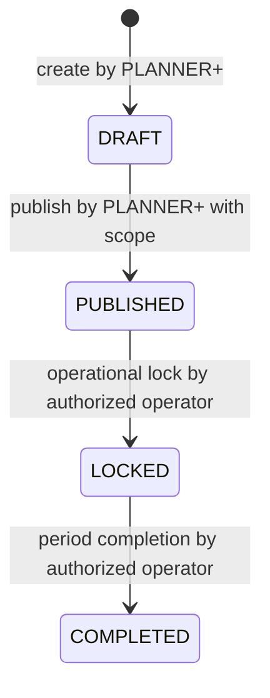

# Scheduling Domain — Anclora ShiftImport

Status: **baseline approved for R3 implementation**

This document is the canonical domain contract for future scheduling. It complements [`DOMAIN-GLOSSARY.md`](../roadmap/shiftimport-mvp-v2/R0/DOMAIN-GLOSSARY.md) and the state separation defined in [`STATE-MODEL.md`](../roadmap/shiftimport-mvp-v2/R0/STATE-MODEL.md).

## Purpose and boundary

Scheduling represents future operational planning that can be reviewed and published. It is distinct from Safe Import's confirmed historical or operational turns.

Scheduling is deliberately limited to:

- a weekly planning container;
- versioned drafts;
- employee-to-shift assignments;
- explicit publication into the existing `shifts` source of truth.

It does not introduce attendance, approval workflows, configurable rules, teams, work centers, or reporting lines. Those belong to later roadmap phases.

## Core entities

### Schedule — Cuadrante / Planificación

`Schedule` is the logical container for one organization's planning period and optional area.

- Tenant owner: exactly one `Organization`.
- Optional area: `area_id = NULL` means organization-wide planning; otherwise the schedule is for that active area.
- Period: one defined week, represented by an explicit period start/date contract in R3-M01.
- Lifecycle: no state of its own. Operational state belongs to `ScheduleVersion`.
- Relationship: one `Schedule` has one or more sequential `ScheduleVersion` records over time.

### ScheduleVersion — Versión de planificación

`ScheduleVersion` is the immutable-after-publication versioned unit of the plan.

- Belongs to one `Schedule`.
- Has a monotonically increasing `version_number` within that schedule.
- Contains the current editable draft or a historical published version.
- At most one version for a schedule may be `DRAFT` at a time; this invariant is enforced in the database in R3-M02.
- A published version remains available as history. A subsequent edit creates the next draft version; it does not mutate the published version.

### ShiftAssignment — Asignación de turno

`ShiftAssignment` is the planned statement that employee X works a shift on date Z inside a particular `ScheduleVersion`.

- Belongs to one `ScheduleVersion` and one `Employee`.
- Stores the planned date, start/end times, and optional location.
- Is editable only while its parent version is `DRAFT`.
- Is retained after publication as the historical record of what was planned in that version.
- Has no independent lifecycle. It follows the lifecycle and editability rules of its parent version.

## Relationship to `shifts`

`ShiftAssignment` and `Shift` intentionally remain separate concepts:

```text
Organization
└── Schedule (period + optional area)
    └── ScheduleVersion (DRAFT → PUBLISHED → LOCKED → COMPLETED)
        └── ShiftAssignment (planned employee/date/time)
             └── publication materializes one Shift in `shifts`
```

When a version is published, each eligible assignment is materialized as a row in the existing `shifts` table with:

- `origin = 'schedule'`;
- `schedule_version_id` pointing to the source version;
- the same organization and employee ownership guarantees as every other shift.

The materialization is atomic. A partial publication is not a valid outcome. Existing imported and manually-created shifts remain unchanged; their `schedule_version_id` is `NULL` and their current origins are preserved.

`ShiftAssignment` is not deleted after publication. The assignment is the planning/audit record; the materialized `Shift` is the operational turn consumed by existing dashboard and employee-facing reads. A parallel `published_shifts` table is deliberately not introduced because it would create two competing sources of truth for turns.

## ScheduleVersion state machine



| Transition | Actor | Preconditions | Effect |
|---|---|---|---|
| create → `DRAFT` | `OWNER`, `ADMIN`, or `PLANNER` | Active membership; organization/area scope; no other draft for the schedule | Creates the first or next version. |
| `DRAFT` → `PUBLISHED` | `OWNER`, `ADMIN`, or `PLANNER` | Scope passes; version is still draft; assignments pass server-side validation; publication confirmation is explicit | Atomically freezes the version and materializes eligible assignments into `shifts`. |
| `PUBLISHED` → `LOCKED` | Authorized organization operator | Published version is selected for operational locking | Prevents further publication-era changes. Operational endpoint is deferred until needed. |
| `LOCKED` → `COMPLETED` | Authorized organization operator | Planning period is complete | Marks the historical version complete. Operational endpoint is deferred until needed. |

No transition goes backwards. There is no `CHANGE_REQUESTED` state on a schedule version or shift; R4/R5 model acknowledgement and change requests as independent state machines/resources.

`LOCKED` and `COMPLETED` are part of the domain enum from the beginning so the schema does not need a breaking redesign later. Their operational transitions are intentionally deferred until a real MVP need is demonstrated; R3-M10/M11 must still ensure that non-draft versions cannot be edited.

## Authorization contract

Scheduling consumes the R2 RBAC contract server-side:

- `OWNER` and `ADMIN`: organization scope, including schedules in any area.
- `PLANNER`: organization scope when `scoped_area_id` is null, or area scope when assigned to an area.
- `EMPLOYEE`: self scope for published turns only; no draft mutation or publication.

The UI may hide unavailable controls, but every read and mutation must re-check authentication, organization membership, role, scope, resource ownership, and version state in the API.

## English/Spanish vocabulary

| English | Spanish | Contract |
|---|---|---|
| Schedule | Cuadrante / Planificación | Logical period container |
| Schedule version | Versión de planificación | Versioned planning unit |
| Draft | Borrador | Editable version state |
| Published | Publicado | Explicitly released version state |
| Locked | Bloqueado | Operationally frozen version state |
| Completed | Completado | Finished historical version state |
| Shift assignment | Asignación de turno | Planned employee/date/time record |
| Publish | Publicar | Explicit action that materializes assignments into `shifts` |
| Planning period | Periodo de planificación | Weekly period owned by a schedule |

Use `Schedule`/`ScheduleVersion`/`ShiftAssignment` in code and API names. In user-facing Spanish copy, prefer “cuadrante” for the schedule container and “asignación de turno” for an individual assignment. Do not use “Importación” as a synonym for future planning.

## Deferred decisions

The following are intentionally left to their scheduled microphases:

- exact date/week representation and uniqueness (`R3-M01`);
- version creation and numbering (`R3-M02`);
- assignment columns and database constraints (`R3-M03`);
- overlap and rest validation (`R3-M06`/`R3-M07`);
- planner UI and accessible table alternative (`R3-M08`/`R3-M09`);
- publication materialization columns and transaction (`R3-M10`);
- future-import routing into drafts (`R3-M14`).
