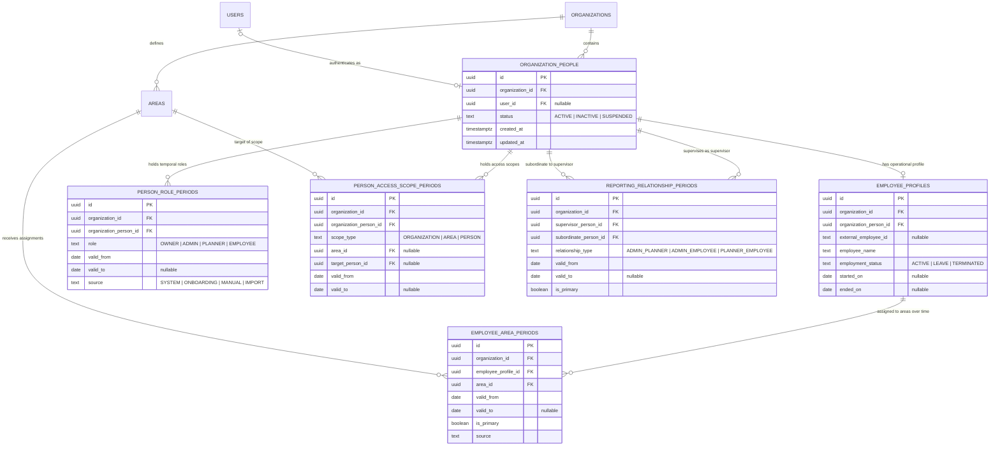

# Modelo Organizativo Temporal y Normalizado — Fase 1

**Documento Canónico**: `docs/product/TEMPORAL_ORGANIZATIONAL_MODEL.md`  
**Estado**: APROBADO / FUNDACIONAL (Fase 1 completada)  
**Fecha**: 2026-09-12  
**Alcance**: Anclora ShiftImport — Núcleo de Personas, Empleados, Asignaciones, Alcances y Relaciones Temporales Multi-Tenant

---

## 1. Visión y Objetivos

El modelo organizativo de **Anclora ShiftImport** evoluciona desde un esquema estático basado en membresías fijas (`memberships`) y empleados ligados rígidamente a un único área (`employees.area_id`), hacia una arquitectura normalizada, desacoplada y temporalmente versionada.

### Objetivos Clave de la Fase 1
1. **Desacoplar Identidad Personal de Identidad de Acceso**:
   - Una **Persona** (`organization_people`) representa al individuo dentro de la organización.
   - Un **Usuario** (`users`) es una credencial de autenticación opcional (puede o no existir).
   - Un **Perfil de Empleado** (`employee_profiles`) es una ficha laboral con su propio ciclo de vida e histórico.
2. **Vigencia Temporal Estricta**:
   - Toda asignación de rol, pertenencia a áreas, alcance de supervisión o jerarquía cuenta con `valid_from` (inclusivo) y `valid_to` (inclusivo o `NULL` para periodos abiertos/indefinidos).
   - Integridad temporal garantizada en base de datos mediante extensiones `btree_gist` y restricciones de exclusión `EXCLUDE USING gist` sobre rangos discretos `daterange(valid_from, valid_to, '[]')`.
3. **Separación de Responsabilidades Operativas**:
   - **Pertenencia Funcional** (`employee_area_periods`): dónde trabaja el empleado y a qué centro de coste/cuadrante pertenece.
   - **Autorización y Alcances** (`person_access_scope_periods`): sobre qué áreas o personas tiene potestad de visualización o planificación un planificador/administrador.
   - **Supervisión y Aprobación** (`reporting_relationship_periods`): quién aprueba solicitudes, supervisa operativamente o recibe escalados.
4. **Garantía Multi-Tenant en Catálogo PostgreSQL**:
   - Claves foráneas compuestas que incluyen siempre `(id, organization_id)` impiden estructuralmente cualquier enlace cruzado entre organizaciones, incluso ante errores en capas superiores de software.
5. **Coexistencia y Compatibilidad Retroactiva**:
   - Las tablas legacy (`memberships`, `employees`, `operational_assignments`, `area_responsibles`) continúan operativas durante la transición.
   - Migración 0036 aditiva con backfill determinista e idempotente.
   - Vistas canónicas (`current_*`) que resuelven la fotografía operativa del día actual sin coste de migración destructiva.

---

## 2. Diagrama Entidad-Relación (Mermaid ERD)



---

## 3. Definición Formal de Entidades y Cardinalidades

### 3.1. `organization_people`
Representa el nodo raíz de cualquier persona adscrita a la organización, independientemente de que posea credenciales o contrato laboral.
- **Campos**:
  - `id` (UUID PK)
  - `organization_id` (UUID NOT NULL, FK `organizations.id` ON DELETE CASCADE)
  - `user_id` (UUID NULLABLE, FK `users.id` ON DELETE SET NULL): Referencia a credencial de acceso.
  - `status` (TEXT NOT NULL DEFAULT 'ACTIVE'): `ACTIVE`, `INACTIVE`, `SUSPENDED`, `PENDING_INVITATION`.
    - *Invariante de producto*: Los empleados legacy sin cuenta de usuario (`user_id IS NULL`) se crean con estado `PENDING_INVITATION`, indicando que son sujetos de cuadrante pendientes de invitación/vinculación de credenciales.
  - `created_at`, `updated_at` (TIMESTAMPTZ NOT NULL DEFAULT NOW())
- **Restricciones**:
  - `UNIQUE (id, organization_id)`: Permite claves compuestas multi-tenant dependientes.
  - `UNIQUE (organization_id, user_id)`: Un usuario solo puede estar vinculado a una persona por organización.

### 3.2. `employee_profiles`
Ficha laboral operativa del trabajador.
- **Campos**:
  - `id` (UUID PK): Coincide con `employees.id` legacy para mantener compatibilidad transparente con `shifts.employee_id`.
  - `organization_id` (UUID NOT NULL)
  - `organization_person_id` (UUID NOT NULL): Vincula la ficha laboral con la persona.
  - `external_employee_id` (TEXT NULLABLE): Matrícula, nómina o código de cuadrante externo.
  - `employee_name` (TEXT NOT NULL)
  - `employment_status` (TEXT NOT NULL DEFAULT 'ACTIVE'): `ACTIVE`, `INACTIVE`, `ON_LEAVE`, `TERMINATED`.
  - `started_on` (DATE NULLABLE), `ended_on` (DATE NULLABLE)
- **Restricciones**:
  - `UNIQUE (id, organization_id)`
  - `UNIQUE (organization_person_id, organization_id)`: 1:1 en Fase 1 entre Persona y Perfil de Empleado dentro de la organización.
  - FK compuesta `(organization_person_id, organization_id) REFERENCES organization_people (id, organization_id) ON DELETE CASCADE`.

### 3.3. `person_role_periods`
Vigencia temporal del rol de una persona dentro de la organización.
- **Campos**:
  - `id` (UUID PK)
  - `organization_id` (UUID NOT NULL)
  - `organization_person_id` (UUID NOT NULL)
  - `role` (TEXT NOT NULL): `OWNER`, `ADMIN`, `PLANNER`, `EMPLOYEE`.
  - `valid_from` (DATE NOT NULL), `valid_to` (DATE NULLABLE)
  - `source` (TEXT NOT NULL DEFAULT 'SYSTEM')
- **Restricciones**:
  - CHECK `valid_to IS NULL OR valid_to >= valid_from`.
  - `EXCLUDE USING gist`: Impide que la misma persona tenga dos periodos de rol superpuestos en el tiempo:
    ```sql
    EXCLUDE USING gist (
      organization_person_id WITH =,
      daterange(valid_from, valid_to, '[]') WITH &&
    )
    ```
  - `EXCLUDE USING gist`: Garantiza a nivel de base de datos la **unicidad temporal de OWNER**: no pueden existir dos OWNER simultáneos dentro de la misma organización:
    ```sql
    EXCLUDE USING gist (
      organization_id WITH =,
      daterange(valid_from, valid_to, '[]') WITH &&
    ) WHERE (role = 'OWNER')
    ```
  - Transición atómica mediante helper `transferOwnershipTemporal(sql, params)`.

### 3.4. `employee_area_periods`
Asignación de un empleado a una o varias áreas operativas a lo largo del tiempo.
- **Campos**:
  - `id` (UUID PK)
  - `organization_id` (UUID NOT NULL)
  - `employee_profile_id` (UUID NOT NULL)
  - `area_id` (UUID NOT NULL)
  - `valid_from` (DATE NOT NULL), `valid_to` (DATE NULLABLE)
  - `is_primary` (BOOLEAN NOT NULL DEFAULT false): Indica si es el área principal/por defecto.
  - `source` (TEXT NOT NULL DEFAULT 'SYSTEM')
- **Restricciones**:
  - FK `(employee_profile_id, organization_id) REFERENCES employee_profiles (id, organization_id) ON DELETE CASCADE`.
  - FK `(area_id, organization_id) REFERENCES areas (id, organization_id) ON DELETE NO ACTION DEFERRABLE INITIALLY DEFERRED`. (Protege el histórico impidiendo el borrado directo de áreas activas o pasadas, permitiendo al mismo tiempo el borrado ordenado en cascada si se destruye la organización completa).
  - CHECK `valid_to IS NULL OR valid_to >= valid_from`.
  - `EXCLUDE USING gist`: Impide asignar dos veces al mismo empleado al **mismo área** en fechas superpuestas:
    ```sql
    EXCLUDE USING gist (
      employee_profile_id WITH =,
      area_id WITH =,
      daterange(valid_from, valid_to, '[]') WITH &&
    )
    ```
  - `EXCLUDE USING gist`: Garantiza a lo sumo **un único área principal** (`is_primary = true`) simultánea para el empleado:
    ```sql
    EXCLUDE USING gist (
      employee_profile_id WITH =,
      daterange(valid_from, valid_to, '[]') WITH &&
    ) WHERE (is_primary = true)
    ```

### 3.5. `person_access_scope_periods`
Alcance temporal de autorización de una persona (para `ADMIN` o `PLANNER`).
- **Campos**:
  - `id` (UUID PK)
  - `organization_id` (UUID NOT NULL)
  - `organization_person_id` (UUID NOT NULL)
  - `scope_type` (TEXT NOT NULL): `ORGANIZATION`, `AREA`, `PERSON`.
  - `area_id` (UUID NULLABLE)
  - `target_person_id` (UUID NULLABLE)
  - `valid_from` (DATE NOT NULL), `valid_to` (DATE NULLABLE)
- **Restricciones**:
  - CHECK de consistencia de destino:
    - `scope_type = 'ORGANIZATION'` ⇒ `area_id IS NULL AND target_person_id IS NULL`.
    - `scope_type = 'AREA'` ⇒ `area_id IS NOT NULL AND target_person_id IS NULL`.
    - `scope_type = 'PERSON'` ⇒ `target_person_id IS NOT NULL AND area_id IS NULL`.
  - FK multi-tenant hacia `organization_people` y `areas`.
  - `EXCLUDE USING gist`: Impide duplicar el mismo alcance idéntico en fechas superpuestas.

### 3.6. `reporting_relationship_periods`
Líneas de reporte, aprobación y supervisión temporal.
- **Campos**:
  - `id` (UUID PK)
  - `organization_id` (UUID NOT NULL)
  - `supervisor_person_id` (UUID NOT NULL)
  - `subordinate_person_id` (UUID NOT NULL)
  - `relationship_type` (TEXT NOT NULL): `ADMIN_PLANNER`, `ADMIN_EMPLOYEE`, `PLANNER_EMPLOYEE`.
  - `valid_from` (DATE NOT NULL), `valid_to` (DATE NULLABLE)
  - `is_primary` (BOOLEAN NOT NULL DEFAULT false)
- **Restricciones**:
  - CHECK `supervisor_person_id <> subordinate_person_id` (impide auto-supervisión).
  - FK multi-tenant compuestas hacia `organization_people`.
  - `EXCLUDE USING gist`: Impide duplicar exactamente la misma relación en el mismo intervalo.
  - `EXCLUDE USING gist`: A lo sumo **un único supervisor principal** para el mismo subordinado y tipo de relación:
    ```sql
    EXCLUDE USING gist (
      subordinate_person_id WITH =,
      relationship_type WITH =,
      daterange(valid_from, valid_to, '[]') WITH &&
    ) WHERE (is_primary = true)
    ```
  - **Trigger Function `check_reporting_relationship_validity()`**:
    - Anti-auto-supervisión inmediata.
    - Exige obligatoriamente `employee_profiles` para subordinados de tipo `ADMIN_EMPLOYEE` y `PLANNER_EMPLOYEE`.
    - Compatibilidad de roles cruzada en `person_role_periods` activa en el intervalo de la relación (`ADMIN_PLANNER`: supervisor OWNER/ADMIN, subordinado PLANNER; `ADMIN_EMPLOYEE`: supervisor OWNER/ADMIN; `PLANNER_EMPLOYEE`: supervisor PLANNER).
    - **Detección de ciclos temporales por intersección recursiva de trayectorias**: un ciclo solo se diagnostica si la intersección de los rangos de vigencia a lo largo de todo el camino dirigido es no vacía. Permite la alternancia y reutilización recíproca en periodos disjuntos (p. ej. A supervisa a B en 2025 y B supervisa a A en 2026).
    - **Cobertura temporal estricta de roles y perfiles (`@>`)**: el trigger `check_reporting_relationship_validity()` exige que el rango de la relación de supervisión esté **completamente cubierto** (`@>`) por el periodo de rol de supervisor (`ADMIN` o `PLANNER`), por el rol de subordinado (en `ADMIN_PLANNER`), y por la vigencia contractual del empleado en `employee_profiles` (`started_on`/`ended_on` en `ADMIN_EMPLOYEE` y `PLANNER_EMPLOYEE`). No basta con una intersección parcial (`&&`).
    - **Garantía transaccional de enlace empleado-persona**: los triggers `trg_check_employee_profile_person_link` y `trg_check_organization_person_employee_link` garantizan invariablemente que ningún perfil de empleado quede vinculado a una persona con `user_id IS NULL` cuyo estado no sea estrictamente `PENDING_INVITATION`.

---

## 4. Semántica Temporal

### 4.1. Por qué `daterange(valid_from, valid_to, '[]')`
1. **Discretización Calendárica**:
   - Los turnos, contratos, bajas y planificaciones en el ámbito laboral operan en días naturales (`YYYY-MM-DD`). Los sellos de tiempo (`timestamptz`) introducen anomalías de huso horario (`00:00Z` vs `23:00 local`).
   - El constructor `daterange(from, to, '[]')` genera un rango cerrado en ambos extremos: el día `valid_from` y el día `valid_to` están **incluidos**.
2. **Periodos Abiertos (`valid_to IS NULL`)**:
   - Cuando `valid_to` es `NULL`, PostgreSQL interpreta el límite superior como infinito (`[from, )`). Esto permite modelar asignaciones activas indefinidas sin necesidad de fechas artificiales como `9999-12-31`.
3. **Detección Estricta de Solapamiento (`&&`)**:
   - Dos periodos `[2026-01-01, 2026-06-30]` y `[2026-07-01, 2026-12-31]` son **adyacentes y disjuntos**. No colisionan.
   - Si un segundo periodo inicia el `2026-06-30`, el operador `&&` detecta la colisión el día `30` y PostgreSQL rechaza la inserción mediante la exclusión GiST.

### 4.2. Consulta de "Fotos Históricas" (Point-in-Time)
Para conocer el estado exacto de una asignación en una fecha fija `$target_date`:
```sql
SELECT *
FROM employee_area_periods
WHERE employee_profile_id = $1
  AND daterange(valid_from, valid_to, '[]') @> $target_date::date;
```
El operador `@>` (contiene elemento) evalúa en $O(\log N)$ gracias a los índices especializados `(organization_id, valid_from, valid_to)`.

---

## 5. Garantía Multi-Tenant

Para evitar cualquier posibilidad de fuga de datos entre organizaciones (incluso por errores de inyección o IDs forjados en APIs), todas las tablas del modelo temporal implementan:

1. **Clave Foránea Compuesta a Nivel de Catálogo**:
   - `areas` posee `UNIQUE (id, organization_id)`.
   - `organization_people` posee `UNIQUE (id, organization_id)`.
   - `employee_profiles` posee `UNIQUE (id, organization_id)`.
2. **Validación Automática de Pertenencia**:
   - Al insertar en `employee_area_periods`, PostgreSQL exige que `(area_id, organization_id)` coincida exactamente con un registro en `areas`. Si un atacante envía un `area_id` de la Organización B operando en la Organización A, la base de datos aborta con violación de clave foránea.

---

## 6. Coexistencia con el Modelo Legacy y Backfill

### 6.1. Tablas Legacy Mantenidas en Fase 1
* `memberships`: Permanece como fuente de autenticación y roles para endpoints legacy.
* `employees`: Sigue recibiendo escrituras y consultas directas; cada `employees.id` equivale a `employee_profiles.id`.
* `shifts`: Sigue enlazando a `shifts.employee_id`.

### 6.2. Estrategia de Backfill Normalizado de Áreas
La migración `0036_temporal_organizational_model.sql` implementa una estrategia de normalización determinista e idempotente para `employee_area_periods` basada en un pipeline CTE riguroso:
1. **Recorte a vigencia laboral (clamping)**: en el CTE `clamped_oa`, toda asignación de `operational_assignments` se interseca con `daterange(ep.started_on, ep.ended_on, '[]')` y se descartan intersecciones vacías (`NOT isempty(...)`).
2. **Normalización robusta de solapamientos en la misma área (NULL como infinito)**: mediante `COALESCE(valid_to, 'infinity'::date)`, el agrupamiento por islas fusiona unívocamente:
   - Periodo abierto seguido de cerrado para la misma área (resultado: único periodo abierto).
   - Periodo cerrado contenido dentro de un periodo abierto (resultado: único periodo abierto).
   - Periodos cerrados consecutivos (día inmediatamente posterior) o solapados (resultado: único periodo continuo).
   - Duplicados legacy exactos (resultado: único periodo deduplicado).
   Todo ello sin generar duplicados secundarios ni conflictos de exclusión GiST.
3. **Discretización en cortes temporales elementales (slices)**: proyecta todas las fechas límite de asignaciones explícitas y ciclo del empleado (`valid_from`, `valid_to + 1`, `started_on`, `ended_on + 1`), acotando los cortes estrictamente entre `started_on` y `ended_on`.
4. **Determinación estricta de área primaria por corte**:
   - Si coincide con `employees.area_id`, tiene prioridad como primaria.
   - Si no, se elige la asignación con fecha de inicio más temprana (`valid_from`).
   - Desempate determinista por fecha de creación (`created_at`) y UUID de área (`area_id`).
   - Exactamente **como máximo un área primaria** en cualquier fecha.
5. **Marcado de áreas concurrentes como secundarias**: todas las asignaciones explícitas adicionales que solapan en el mismo corte se registran como `is_primary = false`.
6. **Fallback de `employees.area_id` en huecos temporales sin extensión tras la baja**: los cortes donde el empleado carece de asignaciones en `operational_assignments` se cubren con `employees.area_id` (`is_primary = true`, `source = 'LEGACY_EMPLOYEE_AREA_FALLBACK'`). Si el empleado está inactivo o tiene `deactivated_at`, el fallback no se extiende al infinito y termina estrictamente en `ended_on` / `deactivated_at`.
7. **Fusión final de segmentos contiguos**: los cortes consecutivos con idéntica tupla `(area_id, is_primary, source)` se colapsan en un único rango continuo `[valid_from, valid_to]`.
8. **Restricción de vigencia laboral mediante Trigger**: el trigger de constraint `trg_check_employee_area_period_labor_validity` valida en inserciones y actualizaciones que todo `employee_area_periods` esté 100% contenido en `[started_on, ended_on]` del perfil, rechazando periodos fuera de contrato o asignaciones abiertas en empleados dados de baja.

---

## 7. Vistas Canónicas de Lectura Directa

Para simplificar el consumo en servicios de backend y frontend sin necesidad de construir manualmente rangos GiST en cada SELECT, la migración 0036 publica 4 vistas canónicas que resuelven el estado vigente hoy (`CURRENT_DATE`):

1. `current_person_roles`:
   - Roles activos en la fecha actual (`role`, `valid_from`, `valid_to`).
2. `current_employee_areas`:
   - Asignaciones de área activas hoy, con `area_name`, `is_primary`, `employment_status`.
3. `current_person_access_scopes`:
   - Alcances vigentes hoy (`ORGANIZATION`, `AREA`, `PERSON`).
4. `current_reporting_relationships`:
   - Relaciones de reporte activas hoy con nombres de supervisor y subordinado.

---

## 8. Matriz de Combinaciones Válidas

| Tipo de Sujeto | `user_id` en Persona | Estado Persona | Perfil Empleado | Rol en `person_role_periods` | Casos de Uso Reales |
|---|:---:|:---:|:---:|:---:|---|
| **Operario de Planta / Turno (Sin acceso)** | `NULL` | `PENDING_INVITATION` | Sí (`ACTIVE`) | Ninguno / Pendiente | Empleado detectado en cuadrante/importación sin cuenta portal. |
| **Operario con Portal Móvil** | UUID | `ACTIVE` | Sí (`ACTIVE`) | `EMPLOYEE` | Empleado que consulta cuadrantes y solicita cambios en autoservicio. |
| **Planificador de Turnos** | UUID | `ACTIVE` | No / Opcional | `PLANNER` | Administrativo de tráfico que planifica turnos de un área sin realizarlos él mismo. |
| **Planificador con Turnos** | UUID | `ACTIVE` | Sí (`ACTIVE`) | `PLANNER` | Jefe de equipo o supervisor de rampa que realiza turnos y a la vez planifica a sus pares. |
| **Administrador / RRHH** | UUID | `ACTIVE` | No / Opcional | `ADMIN` | Gestor global sin turnos asignados. |
| **Propietario / Owner** | UUID | `ACTIVE` | No / Opcional | `OWNER` | Dueño de la organización (exactamente uno simultáneo). |
| **Ex-empleado / Baja** | UUID o `NULL` | `INACTIVE` | Sí (`TERMINATED`) | Inactivo / Histórico | Histórico archivado preservando turnos y trazabilidad. |

---

## 9. Servicio de Transferencia Temporal de Propiedad (`transferOwnershipTemporal`)

La función `transferOwnershipTemporal` (`api/_lib/temporal-org-model.js`) delega la operación en la función PostgreSQL transaccional `transfer_organization_ownership_temporal(...)` introducida en la migración `0037_temporal_ownership_transfer_and_labor_integrity.sql`:
1. **Compatible al 100% con el driver HTTP Serverless de Neon**: ejecuta una única invocación `SELECT * FROM transfer_organization_ownership_temporal(...)`, eliminando la dependencia de `sql.transaction(async (txn) => ...)` (incompatible con el cliente HTTP stateless de `@neondatabase/serverless`).
2. **Bloqueo exclusivo inmediato contra TOCTOU**: dentro de la función PL/pgSQL, adquiere inmediatamente el bloqueo `SELECT id FROM organizations WHERE id = p_organization_id FOR UPDATE`, antes de cualquier lectura o validación. Esto serializa estrictamente cualquier invocación concurrente garantizando que una sola gane y la otra reciba un conflicto controlado con rollback atómico garantizado por el motor.
3. **Validaciones integradas en PostgreSQL**:
   - Existencia de la organización y coincidencia de propietario actual.
   - Requisitos del nuevo propietario: pertenencia a la organización, presencia obligatoria de `user_id`, estado `ACTIVE` y membresía existente en `memberships`.
   - Fecha efectiva válida y verificación de ausencia de periodos incompatibles en o después de la fecha efectiva.
4. **Cero `DELETE` y sincronización retroactiva atómica**:
   - Cierra el periodo de rol de owner anterior en `effectiveDate - 1`.
   - Inserta el nuevo rol degradado para el owner anterior desde `effectiveDate`.
   - Cierra el rol previo del nuevo owner e inserta su periodo `OWNER` desde `effectiveDate`.
   - Sincroniza atómicamente la tabla legacy `memberships`.
   - En caso de error o violación de invariantes, se lanza una excepción y PostgreSQL revierte cualquier mutación parcial.

---

## 10. Integridad Bidireccional de la Vigencia Laboral (Migración 0037)

Para garantizar la consistencia relacional completa entre el contrato laboral y las asignaciones de área:
1. **Trigger de inserción/actualización de área (`trg_check_employee_area_period_labor_tenure`)**: impide crear o modificar `employee_area_periods` fuera del rango `[started_on, ended_on]` del perfil del empleado.
2. **Trigger inverso sobre perfil (`trg_check_employee_profile_labor_tenure`)**: trigger `DEFERRABLE INITIALLY DEFERRED` sobre `employee_profiles` ante `UPDATE OF started_on, ended_on`.
   - Si se acorta `ended_on` dejando una asignación de área existente que finaliza después o es abierta (`valid_to IS NULL`), rechaza la modificación.
   - Si se retrasa `started_on` dejando una asignación de área existente que comienza antes, rechaza la modificación.
   - Si se actualizan `started_on` o `ended_on` manteniendo todas las asignaciones dentro del nuevo rango, la operación prospera.
   - Permite **cierre coordinado en la misma transacción**: gracias a `DEFERRABLE INITIALLY DEFERRED`, dentro de un bloque `BEGIN ... COMMIT` se puede actualizar primero `ended_on` del perfil y seguidamente `valid_to` del área antes del commit sin que salte el trigger intermedio.

---

## 11. Harness de Integración Reproducible y Seguro

El script `scripts/run-temporal-org-model-integration.mjs` incorpora garantías integrales contra mutaciones accidentales:
1. **Prohibición de URLs genéricas**: ignora estrictamente `DATABASE_URL` y `POSTGRES_URL`.
2. **Resolución obligatoria de rama por endpoint (Neon API)**: si se especifica `TEMPORAL_MODEL_DATABASE_URL`, el runner mapea obligatoriamente el host contra los endpoints del proyecto Neon (`/projects/:id/endpoints`), localiza la rama real asociada y rechaza cualquier rama `main`, default, protegida, staging, production, development o sin prefijo temporal inequívoco (`tmp-`, `test-`, `ephemeral-`), fallando cerrado antes de cualquier conexión.
3. **Aislamiento en rama efímera**: en modo por defecto, provisiona una rama hija temporal (`tmp-temporal-*`) de `main`, ejecuta semillas legacy (incluyendo los casos de misma área y vigencia laboral), migraciones 0036 y 0037, verificaciones y pruebas exclusivamente allí.
4. **Destrucción garantizada en `finally`**: destruye la rama efímera tanto si las pruebas pasan como si fallan. Si la destrucción falla, reporta `FAIL` y expone el ID de rama para limpieza manual.
5. **Validación incondicional en pruebas directas**: `db/temporal-org-model.integration.test.mjs` valida incondicionalmente contra la API de Neon (`assertSafeTemporalDatabaseUrl`) antes de `Client.connect()`, sin banderas booleanas de bypass. Comprueba `TEMPORAL_RUNNER_BRANCH_ID` cuando es invocado desde el harness para verificar correspondencia exacta con la rama efímera.
6. **Contabilización dinámica real**: extrae el número de escenarios ejecutados directamente del informe estructurado JSON de Vitest. Si el informe no existe, es ilegible o devuelve `<= 0` pruebas pasadas, el harness falla cerrado.

---

## 12. Próximos Pasos (Fases 2 y 3)

* **Fase 2 (Doble Escritura y Capa de Dominio)**:
  - Los endpoints de onboarding, gestión de miembros y asignación de turnos escribirán simultáneamente en el modelo legacy y en el modelo temporal.
  - La resolución de turnos y validación de permisos consumirá `api/_lib/temporal-org-model.js`.
* **Fase 3 (Deprecación Legacy)**:
  - Retirada de columnas redundantes `employees.area_id` y `memberships.role`.
  - Migración completa de los cuadrantes hacia `employee_profiles`.
