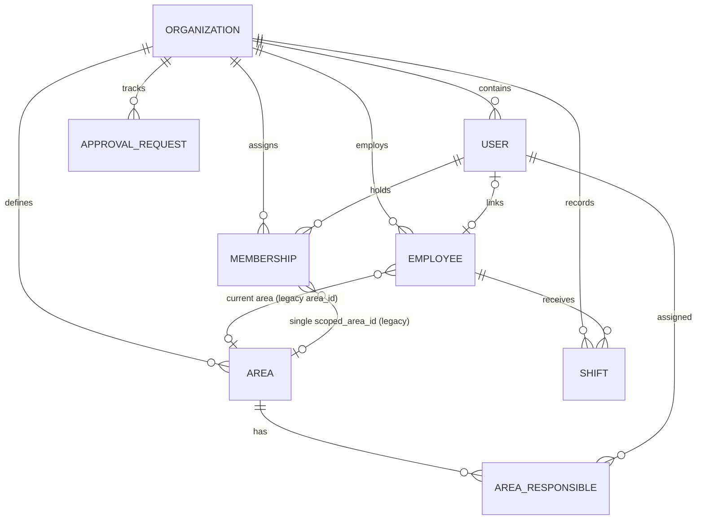

# P5.7-M00 — Baseline & Spec Rebaseline Report

**Microphase**: P5.7-M00  
**Status**: GATE PASS  
**Date**: 2026-09-07  
**Git Baseline HEAD**: `ca3a50c` (`fix(requests): wire associated shift navigation`)  
**Target Branch**: `development`  

---

## 1. Repository Audit

A thorough audit of the repository was executed covering existing database schema (migrations `0001` through `0034`), backend data access patterns (`api/_lib/data.js`, `api/_lib/auth.js`), API endpoints (`api/memberships`, `api/employees`, `api/areas`, `api/approval-requests`), frontend state and navigation (`AppShell.tsx`, `App.tsx`), and current modals (`MembersModal.tsx`, `AreasModal.tsx`, `ApprovalInboxModal.tsx`).

### Key Findings
1. **Schema**:
   - `users`: Authentication credentials and user profiles.
   - `employees`: Rota identities (`external_employee_id`, `name`), with optional `user_id` and `area_id`.
   - `memberships`: Role definition (`OWNER`, `ADMIN`, `PLANNER`, `EMPLOYEE`) and single area scope `scoped_area_id`.
   - `areas`: Optional organization areas (`id`, `name`, `code`, `active`).
   - `area_responsibles`: N:N admin-to-area approval mapping.
   - Missing: Native temporal validity (`valid_from`, `valid_to`) on operational assignments, and multi-area or employee-set scopes for Planners.
2. **Authorization**:
   - `api/_lib/auth.js` enforces role rank (`OWNER > ADMIN > PLANNER > EMPLOYEE`) and basic scope resolution (`ORGANIZATION`, `AREA`, `SELF`).
   - Anti-self-approval rule was missing formalization for cases where an Owner/Admin has an associated Employee and creates a request on their own shift.
3. **Navigation & UI**:
   - Navigation in `AppShell.tsx` was fragmented into separate "Usuarios" and "Áreas" items for admins, while "Aprobaciones" was used as the manager inbox label.
   - Modals in desktop (1440×900) suffered from inconsistent height control and outer modal scrolling in complex views.

---

## 2. Current Entity Map



---

## 3. Current RBAC Map

| Role | Scope | Permitted Actions | Excluded Actions |
|---|---|---|---|
| **OWNER** | Organization | Full tenant management, user management, imports, schedules, requests | Cannot demote self if sole owner |
| **ADMIN** | Organization | User management, employee management, area management, imports, schedules, requests | Transfer ownership, demote/delete Owner |
| **PLANNER** | Area (single) or Org (if 0 areas) | Manage shifts, imports, schedules in assigned area | User management, area creation, cross-area planning |
| **EMPLOYEE** | Self | View own shifts, import personal shifts, submit requests | Direct shift editing, viewing others, management |

---

## 4. Current Navigation Map

### Current Sidebar (Pre-P5.7)
- **Employee**:
  - Operación: Calendario, Importar turnos (self), Añadir turno (historical), Solicitudes (employee)
- **Manager (Owner / Admin)**:
  - Operación: Importar turnos, Añadir turno, Historial, Planificar, Aprobaciones
  - Gestión: Usuarios de la organización, Áreas, Formatos aprendidos, Ajustes

### Target Navigation Map (P5.7 Canonical)
- **Operación**:
  - Calendario
  - Planificar (Owner, Admin, Planner)
  - Importar turnos
  - Añadir turno
  - Solicitudes (All roles: "Tus solicitudes" for Employee; "Solicitudes pendientes" for Manager)
- **Gestión**:
  - Equipo (Unified Personas, Roles & Access, Areas, Assignments)
  - Historial de importaciones
  - Formatos aprendidos
- **Configuración**:
  - Ajustes (Owner, Admin)

---

## 5. Spec Conflict Report & Resolutions

| Conflict | Baseline State | P5.7 Target Resolution |
|---|---|---|
| **Planner Scope** | Single area (`scoped_area_id`). If 1+ area exists and planner has no area, blocked with `SCOPE_UNAVAILABLE` (PD D-05). | Planner can have scope: (1) Organization, (2) One or more Areas, or (3) Explicit Employees set. |
| **Assignment History** | Changing employee area or planner area overwrote previous foreign key directly. | Effective-dated assignments (`operational_assignments`) preserve historical continuity with `valid_from` and `valid_to`. |
| **Ownership Change** | Handled by editing role in `memberships` table, leading to potential lockout or multiple owners. | Dedicated, audited `TRANSFER_OWNERSHIP` flow with single-owner invariant enforced. |
| **Manager Request Self-Approval** | No explicit block preventing an Admin/Owner from approving their own employee shift change request. | Strict server-side anti-self-approval rule enforced in request evaluation. |
| **Terminology** | "Aprobaciones" used in navigation and inbox header. | Replaced with "Solicitudes" / "Solicitudes pendientes" to reflect that requests can be approved or rejected. |

---

## 6. Architecture Decisions & Matrix References

- **ADR Document**: [`sdd/decisions/ADR-2026-09-07-P5.7-team-roles-scopes.md`](file:///Users/michaelmcmullen/developer/anclora/anclora-shiftimport/sdd/decisions/ADR-2026-09-07-P5.7-team-roles-scopes.md) (Decisions D1 to D12)
- **RBAC Matrix**: [`docs/product/RBAC_SCOPE_MATRIX.md`](file:///Users/michaelmcmullen/developer/anclora/anclora-shiftimport/docs/product/RBAC_SCOPE_MATRIX.md)
- **Master Specification**: [`docs/specs/P5.7-MASTER-SPEC.md`](file:///Users/michaelmcmullen/developer/anclora/anclora-shiftimport/docs/specs/P5.7-MASTER-SPEC.md)

---

## 7. Validation Checkpoint & Gate Result

```text
VALIDATION LEVEL: 2 (Docs & Specification Rebaseline)
CHECKS RUN:
- Verified all document cross-links and invariants against codebase.
- Verified git status (docs-only diff).
CHECKS SKIPPED:
- Full build, full lint, full test suite (Docs-only change rule per prompt §35).
REASON:
- Strictly followed prompt section 35 "DOCS-ONLY CHANGE RULE: Si sólo se modifica documentación: NO ejecutar tests, lint, typecheck, build."
```

**GATE RESULT**: **PASS**
